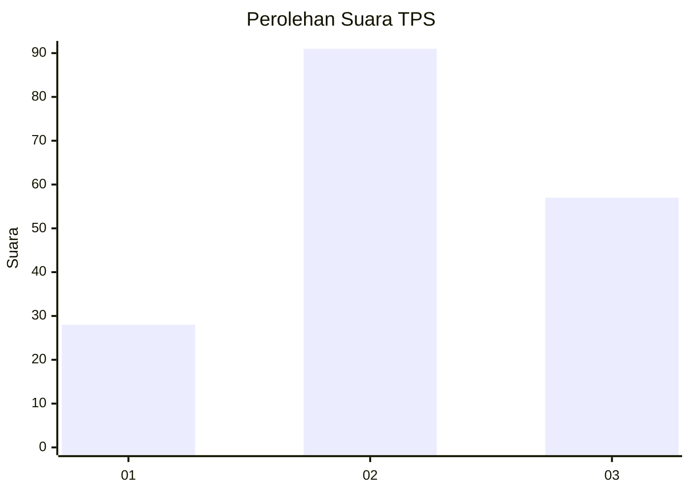
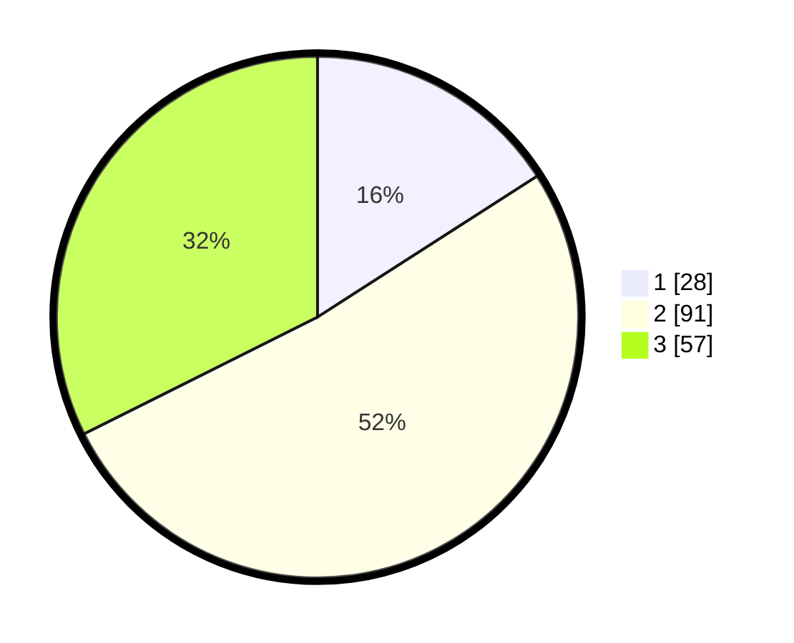

# Hasil

## Grafik

## Tabel

| No. | Nama Paslon    | Suara | Suara (raw) | Persentase |
|:--- |:-------------- | -----:| -----------:| ----------:|
| 1   | ANIES MUHAIMIN | 28    | [28][p-1]   | 15,91      |
| 2   | PRABOWO GIBRAN | 91    | [91][p-2]   | 51,70      |
| 3   | GANJAR MAHFUD  | 57    | [57][p-3]   | 32,39      |

[p-1]: https://github.com/gigit-pemilu/pemilu-2024-34-di-yogyakarta/blob/main/pilpres/hitung-suara/sub/34-di-yogyakarta/sub/03-gunungkidul/sub/12-semin/sub/2004-sumberejo/sub/002-tps/sub/paslon-1.txt
[p-2]: https://github.com/gigit-pemilu/pemilu-2024-34-di-yogyakarta/blob/main/pilpres/hitung-suara/sub/34-di-yogyakarta/sub/03-gunungkidul/sub/12-semin/sub/2004-sumberejo/sub/002-tps/sub/paslon-2.txt
[p-3]: https://github.com/gigit-pemilu/pemilu-2024-34-di-yogyakarta/blob/main/pilpres/hitung-suara/sub/34-di-yogyakarta/sub/03-gunungkidul/sub/12-semin/sub/2004-sumberejo/sub/002-tps/sub/paslon-3.txt

## Foto C Plano

https://sirekap-obj-formc.kpu.go.id/12b5/pemilu/ppwp/34/03/12/20/04/3403122004002-20240214-233149--818ae45f-3342-4cfc-b0d6-ef11974acd7d.jpg

https://sirekap-obj-formc.kpu.go.id/12b5/pemilu/ppwp/34/03/12/20/04/3403122004002-20240214-233156--7a85179c-0490-47bb-a69c-68e93e100c6e.jpg

https://sirekap-obj-formc.kpu.go.id/12b5/pemilu/ppwp/34/03/12/20/04/3403122004002-20240226-220112--d40e8f1f-e890-4d20-b476-4e72d8d08aef.jpg

## Metadata

| Key        | Value               |
| ---------- | ------------------- |
| Time Stamp | 2024-02-26 23:00:00 |

