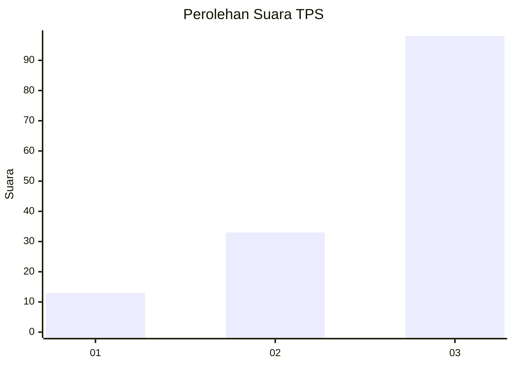
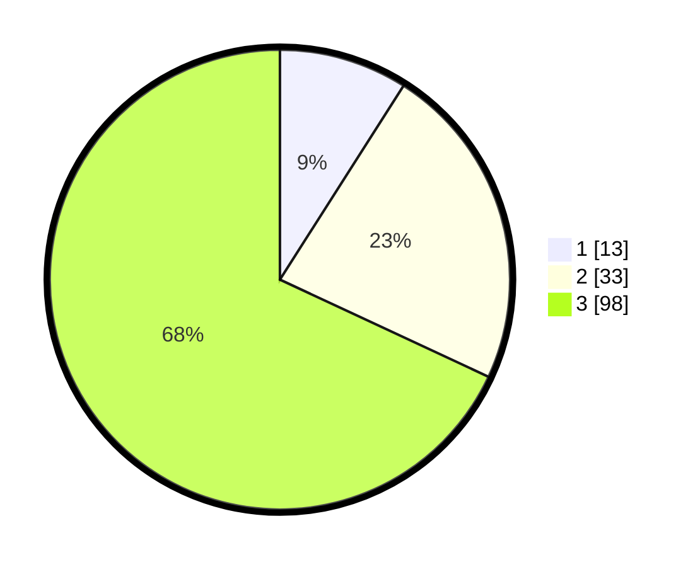

# Hasil

## Grafik

## Tabel

| No. | Nama Paslon    | Suara | Suara (raw) | Persentase |
|:--- |:-------------- | -----:| -----------:| ----------:|
| 1   | ANIES MUHAIMIN | 13    | [13][p-1]   | 9,03       |
| 2   | PRABOWO GIBRAN | 33    | [33][p-2]   | 22,92      |
| 3   | GANJAR MAHFUD  | 98    | [98][p-3]   | 68,06      |

[p-1]: https://github.com/gigit-pemilu/pemilu-2024-34-di-yogyakarta/blob/main/pilpres/hitung-suara/sub/34-di-yogyakarta/sub/03-gunungkidul/sub/12-semin/sub/2004-sumberejo/sub/004-tps/sub/paslon-1.txt
[p-2]: https://github.com/gigit-pemilu/pemilu-2024-34-di-yogyakarta/blob/main/pilpres/hitung-suara/sub/34-di-yogyakarta/sub/03-gunungkidul/sub/12-semin/sub/2004-sumberejo/sub/004-tps/sub/paslon-2.txt
[p-3]: https://github.com/gigit-pemilu/pemilu-2024-34-di-yogyakarta/blob/main/pilpres/hitung-suara/sub/34-di-yogyakarta/sub/03-gunungkidul/sub/12-semin/sub/2004-sumberejo/sub/004-tps/sub/paslon-3.txt

## Foto C Plano

https://sirekap-obj-formc.kpu.go.id/f480/pemilu/ppwp/34/03/12/20/04/3403122004004-20240214-185105--2572c6a2-6c13-4c40-b8c4-4883f692c481.jpg

https://sirekap-obj-formc.kpu.go.id/f480/pemilu/ppwp/34/03/12/20/04/3403122004004-20240214-185122--c77af5f9-181e-4f39-b4f3-d025fb16752c.jpg

https://sirekap-obj-formc.kpu.go.id/f480/pemilu/ppwp/34/03/12/20/04/3403122004004-20240214-185240--0feaaef1-6dcd-4730-a1ea-d19f2d548109.jpg

## Metadata

| Key        | Value               |
| ---------- | ------------------- |
| Time Stamp | 2024-02-15 19:30:26 |

