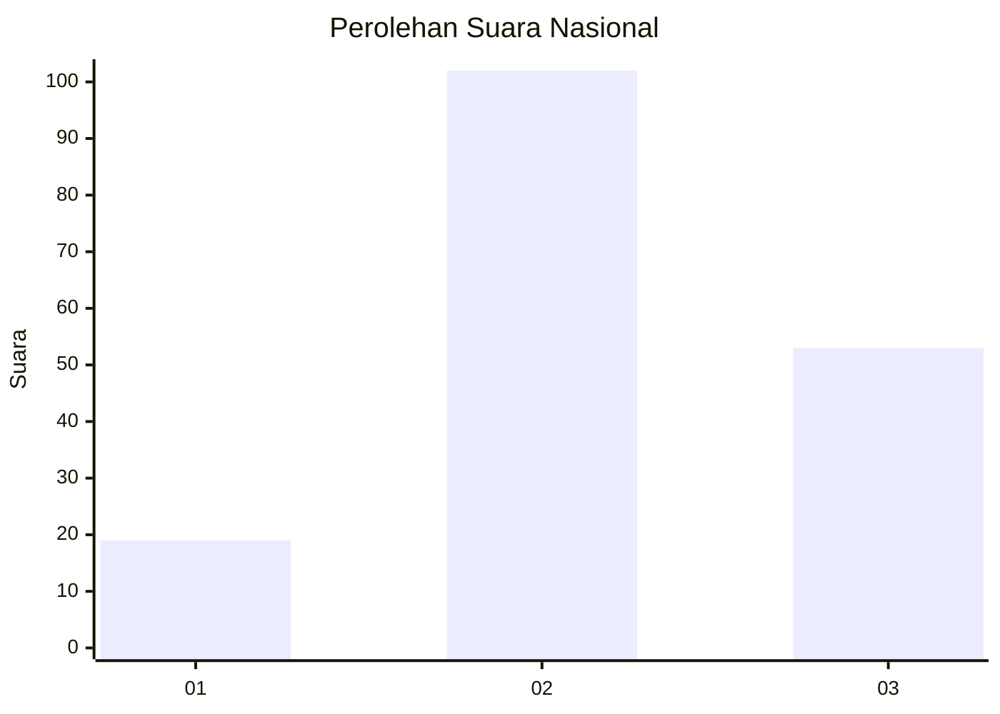
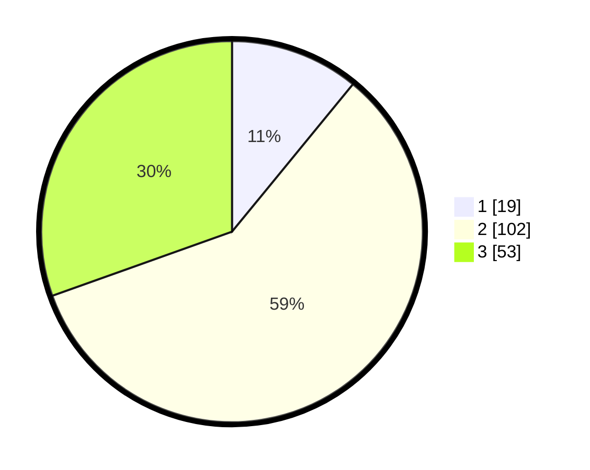

# Hasil

## Grafik

## Tabel

| No. | Nama Paslon    | Suara | Suara (raw) | Persentase |
|:--- |:-------------- | -----:| -----------:| ----------:|
| 1   | ANIES MUHAIMIN | 19    | [19][p-1]   | 10,92      |
| 2   | PRABOWO GIBRAN | 102   | [102][p-2]  | 58,62      |
| 3   | GANJAR MAHFUD  | 53    | [53][p-3]   | 30,46      |

[p-1]: https://github.com/gigit-pemilu/pemilu-2024/blob/main/pilpres/hitung-suara/sub/34-di-yogyakarta/sub/03-gunungkidul/sub/12-semin/sub/2004-sumberejo/sub/013-tps/sub/paslon-1.txt
[p-2]: https://github.com/gigit-pemilu/pemilu-2024/blob/main/pilpres/hitung-suara/sub/34-di-yogyakarta/sub/03-gunungkidul/sub/12-semin/sub/2004-sumberejo/sub/013-tps/sub/paslon-2.txt
[p-3]: https://github.com/gigit-pemilu/pemilu-2024/blob/main/pilpres/hitung-suara/sub/34-di-yogyakarta/sub/03-gunungkidul/sub/12-semin/sub/2004-sumberejo/sub/013-tps/sub/paslon-3.txt

## Foto C Plano

https://sirekap-obj-formc.kpu.go.id/69fa/pemilu/ppwp/34/03/12/20/04/3403122004013-20240215-173959--6d4e9ceb-0913-42c7-86f4-e9b1fa280b35.jpg

https://sirekap-obj-formc.kpu.go.id/69fa/pemilu/ppwp/34/03/12/20/04/3403122004013-20240214-155204--2a0cb75c-2575-4b55-897f-752469cb7825.jpg

https://sirekap-obj-formc.kpu.go.id/69fa/pemilu/ppwp/34/03/12/20/04/3403122004013-20240215-174250--7c9581c3-9537-4340-b792-eaa262502870.jpg

## Metadata

| Key        | Value               |
| ---------- | ------------------- |
| Time Stamp | 2024-02-15 19:30:26 |

