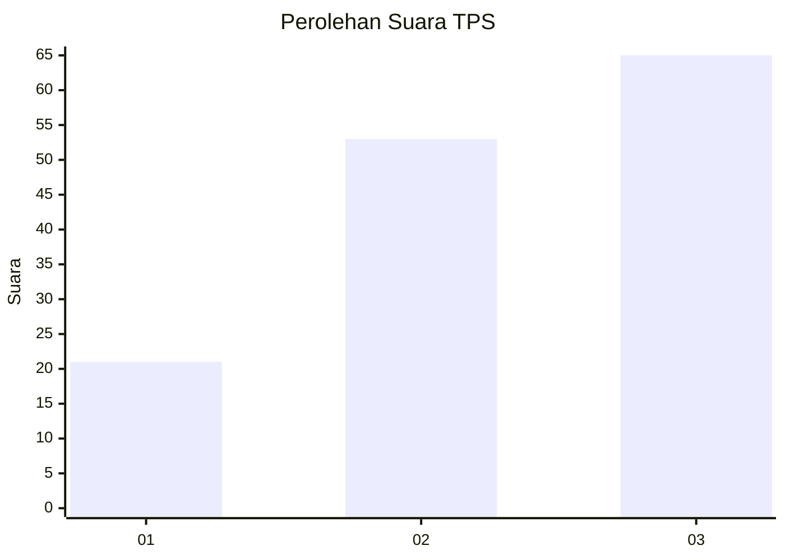
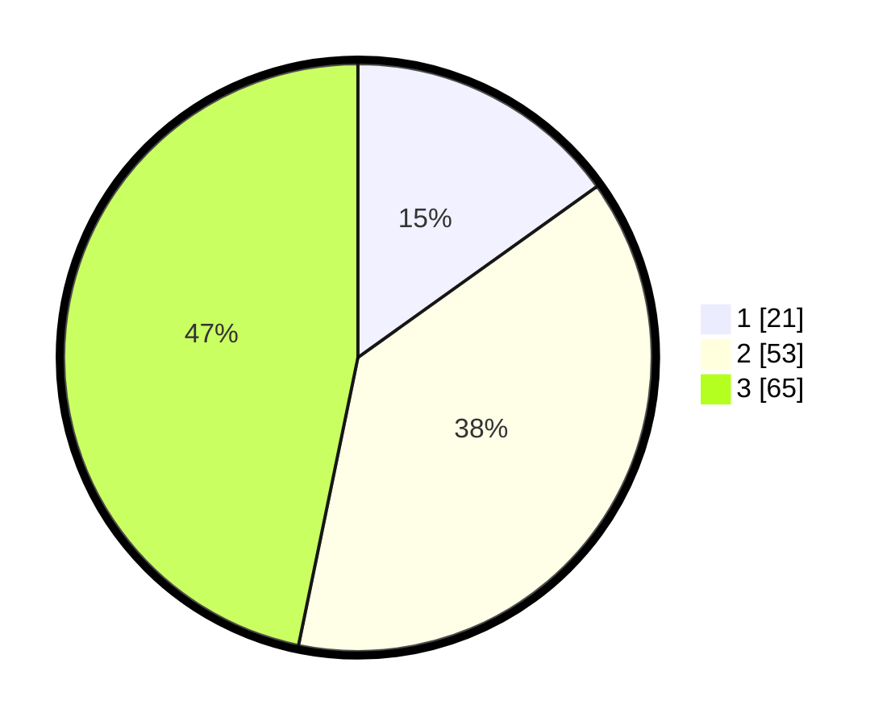

# Hasil

## Grafik

## Tabel

| No. | Nama Paslon    | Suara | Suara (raw) | Persentase |
|:--- |:-------------- | -----:| -----------:| ----------:|
| 1   | ANIES MUHAIMIN | 21    | [21][p-1]   | 15,11      |
| 2   | PRABOWO GIBRAN | 53    | [53][p-2]   | 38,13      |
| 3   | GANJAR MAHFUD  | 65    | [65][p-3]   | 46,76      |

[p-1]: https://github.com/gigit-pemilu/pemilu-2024-34-di-yogyakarta/blob/main/pilpres/hitung-suara/sub/34-di-yogyakarta/sub/03-gunungkidul/sub/12-semin/sub/2004-sumberejo/sub/022-tps/sub/paslon-1.txt
[p-2]: https://github.com/gigit-pemilu/pemilu-2024-34-di-yogyakarta/blob/main/pilpres/hitung-suara/sub/34-di-yogyakarta/sub/03-gunungkidul/sub/12-semin/sub/2004-sumberejo/sub/022-tps/sub/paslon-2.txt
[p-3]: https://github.com/gigit-pemilu/pemilu-2024-34-di-yogyakarta/blob/main/pilpres/hitung-suara/sub/34-di-yogyakarta/sub/03-gunungkidul/sub/12-semin/sub/2004-sumberejo/sub/022-tps/sub/paslon-3.txt

## Foto C Plano

https://sirekap-obj-formc.kpu.go.id/c715/pemilu/ppwp/34/03/12/20/04/3403122004022-20240214-214922--3f0eb351-c868-48fd-b3db-f6e114d609e5.jpg

https://sirekap-obj-formc.kpu.go.id/c715/pemilu/ppwp/34/03/12/20/04/3403122004022-20240214-160115--5c853f24-bcd9-4a2a-8ee5-99c33988127a.jpg

https://sirekap-obj-formc.kpu.go.id/c715/pemilu/ppwp/34/03/12/20/04/3403122004022-20240214-160057--0851fcb8-c381-4052-8379-ec92c44bc18e.jpg

## Metadata

| Key        | Value               |
| ---------- | ------------------- |
| Time Stamp | 2024-02-15 15:00:29 |

