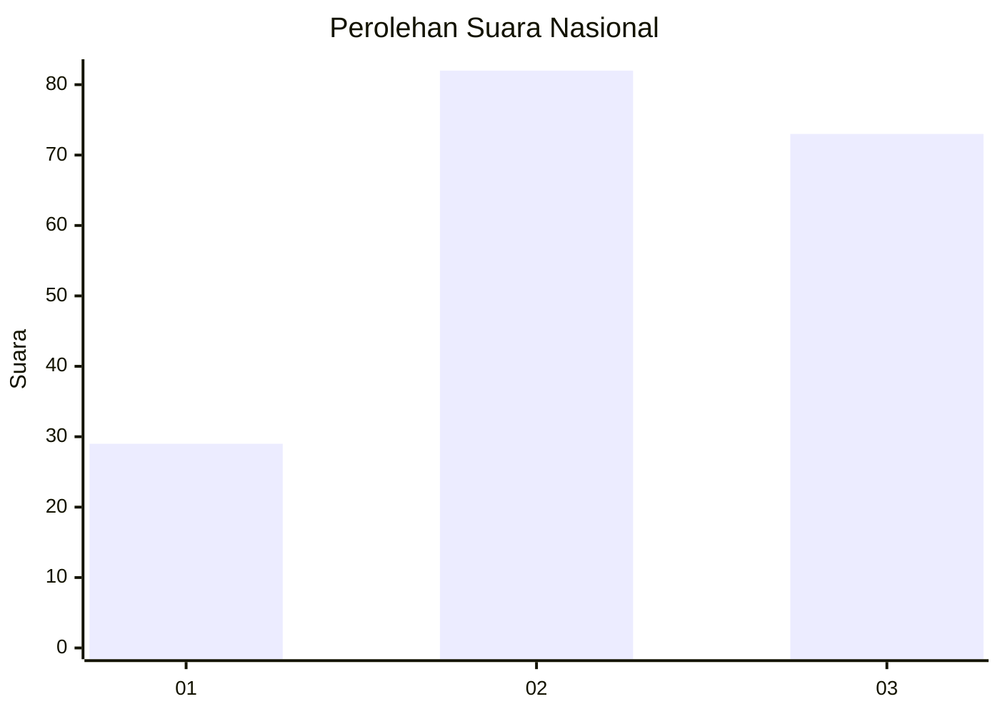
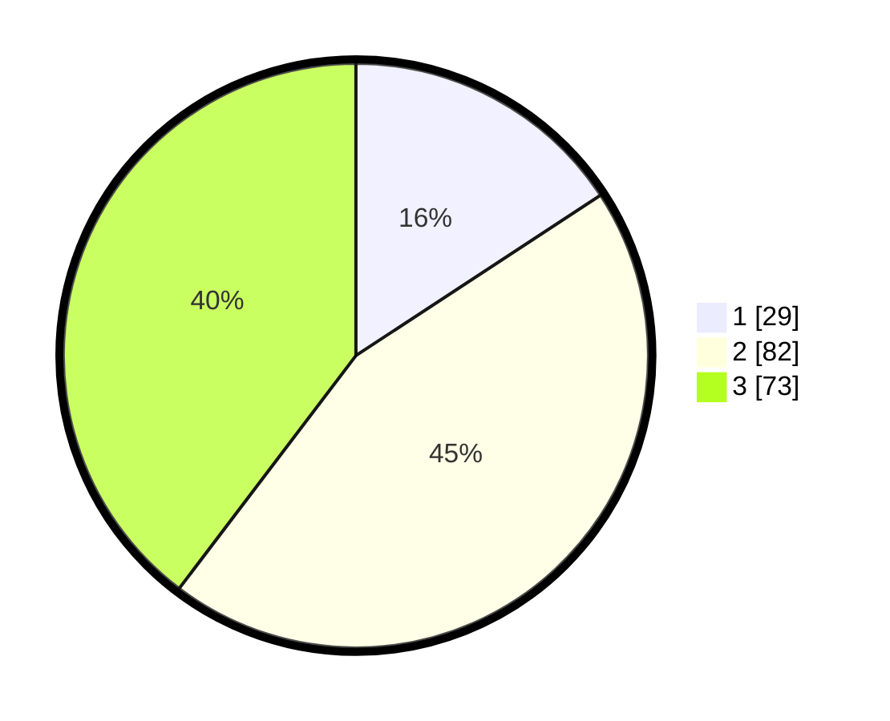

# Hasil

## Grafik

## Tabel

| No. | Nama Paslon    | Suara | Suara (raw) | Persentase |
|:--- |:-------------- | -----:| -----------:| ----------:|
| 1   | ANIES MUHAIMIN | 29    | [29][p-1]   | 15,76      |
| 2   | PRABOWO GIBRAN | 82    | [82][p-2]   | 44,57      |
| 3   | GANJAR MAHFUD  | 73    | [73][p-3]   | 39,67      |

[p-1]: https://github.com/gigit-pemilu/pemilu-2024/blob/main/pilpres/hitung-suara/sub/34-di-yogyakarta/sub/03-gunungkidul/sub/12-semin/sub/2005-bendung/sub/001-tps/sub/paslon-1.txt
[p-2]: https://github.com/gigit-pemilu/pemilu-2024/blob/main/pilpres/hitung-suara/sub/34-di-yogyakarta/sub/03-gunungkidul/sub/12-semin/sub/2005-bendung/sub/001-tps/sub/paslon-2.txt
[p-3]: https://github.com/gigit-pemilu/pemilu-2024/blob/main/pilpres/hitung-suara/sub/34-di-yogyakarta/sub/03-gunungkidul/sub/12-semin/sub/2005-bendung/sub/001-tps/sub/paslon-3.txt

## Foto C Plano

https://sirekap-obj-formc.kpu.go.id/5c5c/pemilu/ppwp/34/03/12/20/05/3403122005001-20240220-202118--7639cc48-4646-4c55-9269-7ab39276ae4e.jpg

https://sirekap-obj-formc.kpu.go.id/5c5c/pemilu/ppwp/34/03/12/20/05/3403122005001-20240214-193842--11c5fdba-a145-4ff4-8960-43f5e85e41d6.jpg

https://sirekap-obj-formc.kpu.go.id/5c5c/pemilu/ppwp/34/03/12/20/05/3403122005001-20240214-194055--98b3a8e5-c7f2-4cd6-b854-f77850976591.jpg

## Metadata

| Key        | Value               |
| ---------- | ------------------- |
| Time Stamp | 2024-02-20 21:00:00 |

