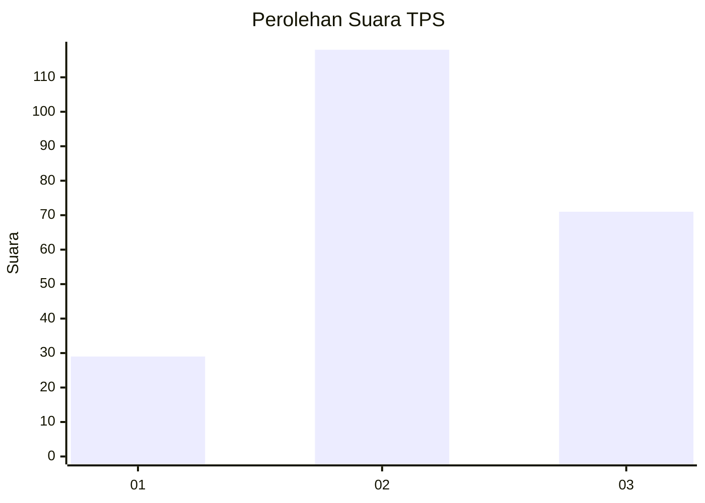
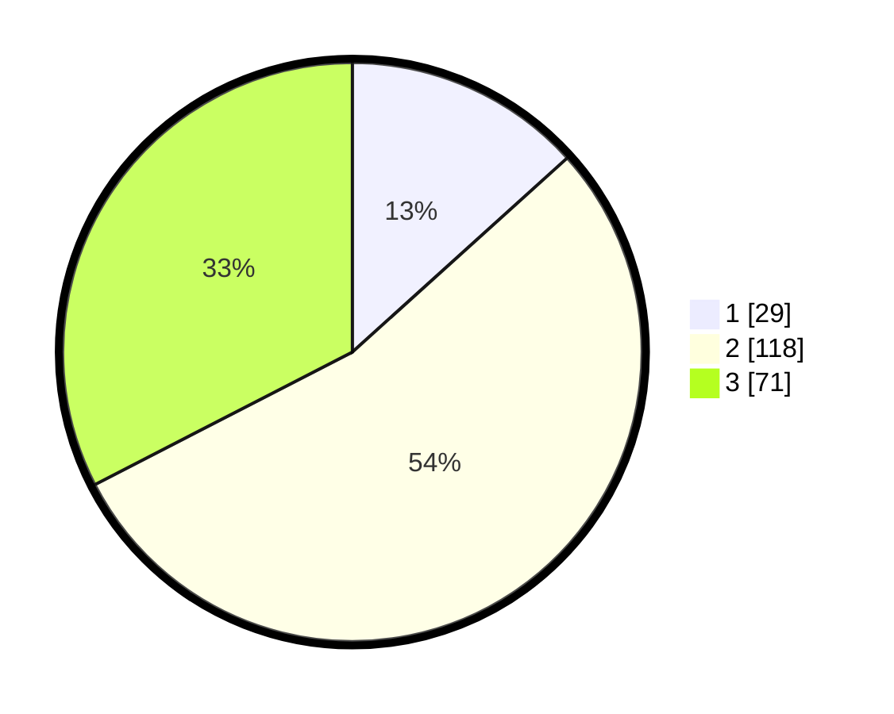

# Hasil

## Grafik

## Tabel

| No. | Nama Paslon    | Suara | Suara (raw) | Persentase |
|:--- |:-------------- | -----:| -----------:| ----------:|
| 1   | ANIES MUHAIMIN | 29    | [29][p-1]   | 13,30      |
| 2   | PRABOWO GIBRAN | 118   | [118][p-2]  | 54,13      |
| 3   | GANJAR MAHFUD  | 71    | [71][p-3]   | 32,57      |

[p-1]: https://github.com/gigit-pemilu/pemilu-2024-34-di-yogyakarta/blob/main/pilpres/hitung-suara/sub/34-di-yogyakarta/sub/03-gunungkidul/sub/12-semin/sub/2005-bendung/sub/003-tps/sub/paslon-1.txt
[p-2]: https://github.com/gigit-pemilu/pemilu-2024-34-di-yogyakarta/blob/main/pilpres/hitung-suara/sub/34-di-yogyakarta/sub/03-gunungkidul/sub/12-semin/sub/2005-bendung/sub/003-tps/sub/paslon-2.txt
[p-3]: https://github.com/gigit-pemilu/pemilu-2024-34-di-yogyakarta/blob/main/pilpres/hitung-suara/sub/34-di-yogyakarta/sub/03-gunungkidul/sub/12-semin/sub/2005-bendung/sub/003-tps/sub/paslon-3.txt

## Foto C Plano

https://sirekap-obj-formc.kpu.go.id/618e/pemilu/ppwp/34/03/12/20/05/3403122005003-20240214-215844--6799cfc9-de3a-4a20-a2f7-d00dcdc908f9.jpg

https://sirekap-obj-formc.kpu.go.id/618e/pemilu/ppwp/34/03/12/20/05/3403122005003-20240214-215946--9071c821-e8e5-4ad9-8d22-93c1511d3619.jpg

https://sirekap-obj-formc.kpu.go.id/618e/pemilu/ppwp/34/03/12/20/05/3403122005003-20240214-220040--784fc39f-1a33-409e-b634-d3543087353a.jpg

## Metadata

| Key        | Value               |
| ---------- | ------------------- |
| Time Stamp | 2024-02-17 19:30:00 |

