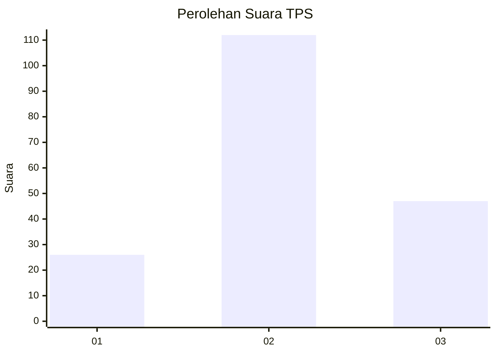
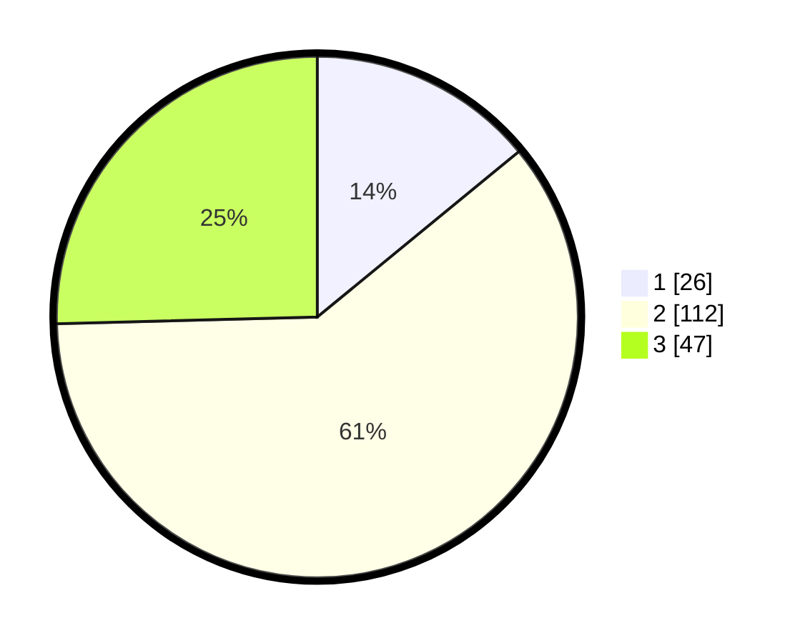

# Hasil

## Grafik

## Tabel

| No. | Nama Paslon    | Suara | Suara (raw) | Persentase |
|:--- |:-------------- | -----:| -----------:| ----------:|
| 1   | ANIES MUHAIMIN | 26    | [26][p-1]   | 14,05      |
| 2   | PRABOWO GIBRAN | 112   | [112][p-2]  | 60,54      |
| 3   | GANJAR MAHFUD  | 47    | [47][p-3]   | 25,41      |

[p-1]: https://github.com/gigit-pemilu/pemilu-2024-34-di-yogyakarta/blob/main/pilpres/hitung-suara/sub/34-di-yogyakarta/sub/03-gunungkidul/sub/12-semin/sub/2005-bendung/sub/010-tps/sub/paslon-1.txt
[p-2]: https://github.com/gigit-pemilu/pemilu-2024-34-di-yogyakarta/blob/main/pilpres/hitung-suara/sub/34-di-yogyakarta/sub/03-gunungkidul/sub/12-semin/sub/2005-bendung/sub/010-tps/sub/paslon-2.txt
[p-3]: https://github.com/gigit-pemilu/pemilu-2024-34-di-yogyakarta/blob/main/pilpres/hitung-suara/sub/34-di-yogyakarta/sub/03-gunungkidul/sub/12-semin/sub/2005-bendung/sub/010-tps/sub/paslon-3.txt

## Foto C Plano

https://sirekap-obj-formc.kpu.go.id/0865/pemilu/ppwp/34/03/12/20/05/3403122005010-20240215-083630--57162558-43e4-406c-9456-4cecb0e12d46.jpg

https://sirekap-obj-formc.kpu.go.id/0865/pemilu/ppwp/34/03/12/20/05/3403122005010-20240214-141013--554c8eee-79df-4802-b9a7-2e2a6525362f.jpg

https://sirekap-obj-formc.kpu.go.id/0865/pemilu/ppwp/34/03/12/20/05/3403122005010-20240214-141336--155cc412-401f-44a3-a944-e01e86568b14.jpg

## Metadata

| Key        | Value               |
| ---------- | ------------------- |
| Time Stamp | 2024-02-15 19:30:26 |

