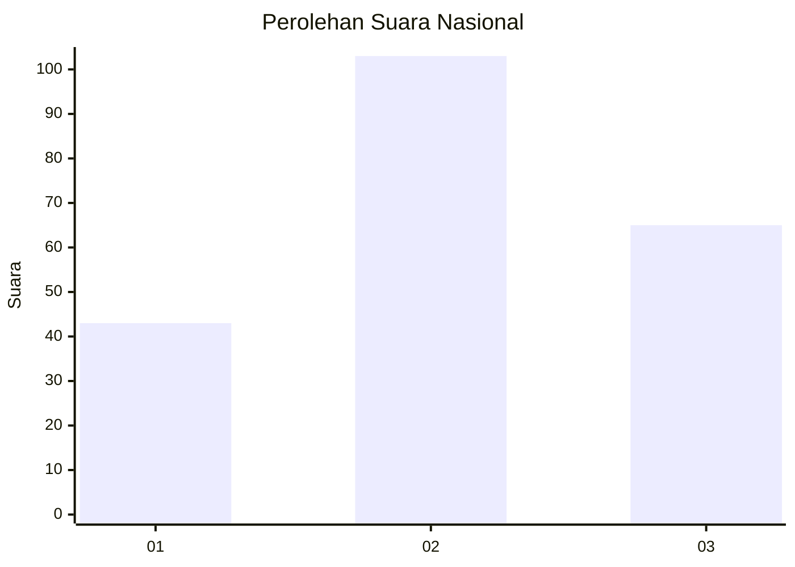
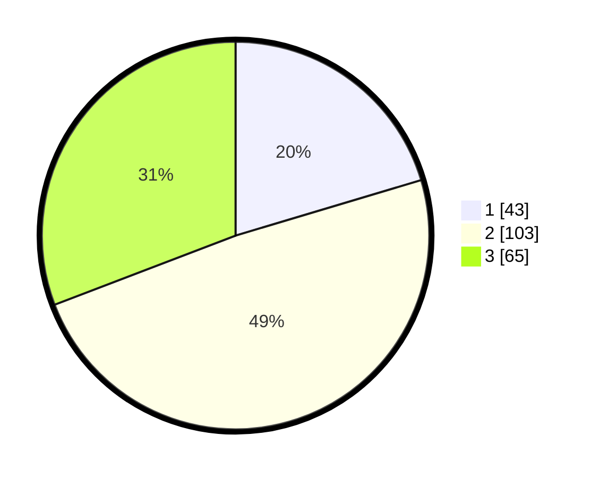

# Hasil

## Grafik

## Tabel

| No. | Nama Paslon    | Suara | Suara (raw) | Persentase |
|:--- |:-------------- | -----:| -----------:| ----------:|
| 1   | ANIES MUHAIMIN | 43    | [43][p-1]   | 20,38      |
| 2   | PRABOWO GIBRAN | 103   | [103][p-2]  | 48,82      |
| 3   | GANJAR MAHFUD  | 65    | [65][p-3]   | 30,81      |

[p-1]: https://github.com/gigit-pemilu/pemilu-2024/blob/main/pilpres/hitung-suara/sub/34-di-yogyakarta/sub/03-gunungkidul/sub/12-semin/sub/2005-bendung/sub/013-tps/sub/paslon-1.txt
[p-2]: https://github.com/gigit-pemilu/pemilu-2024/blob/main/pilpres/hitung-suara/sub/34-di-yogyakarta/sub/03-gunungkidul/sub/12-semin/sub/2005-bendung/sub/013-tps/sub/paslon-2.txt
[p-3]: https://github.com/gigit-pemilu/pemilu-2024/blob/main/pilpres/hitung-suara/sub/34-di-yogyakarta/sub/03-gunungkidul/sub/12-semin/sub/2005-bendung/sub/013-tps/sub/paslon-3.txt

## Foto C Plano

https://sirekap-obj-formc.kpu.go.id/a173/pemilu/ppwp/34/03/12/20/05/3403122005013-20240219-161559--22501c1b-5192-4b7c-8cd7-e5ee12f105b9.jpg

https://sirekap-obj-formc.kpu.go.id/a173/pemilu/ppwp/34/03/12/20/05/3403122005013-20240219-161741--63823d66-6461-4444-8fee-ef57751b5ac9.jpg

https://sirekap-obj-formc.kpu.go.id/a173/pemilu/ppwp/34/03/12/20/05/3403122005013-20240219-161939--48fdc2eb-3ea4-477c-b0d2-f712b31cea8a.jpg

## Metadata

| Key        | Value               |
| ---------- | ------------------- |
| Time Stamp | 2024-02-20 11:00:00 |

