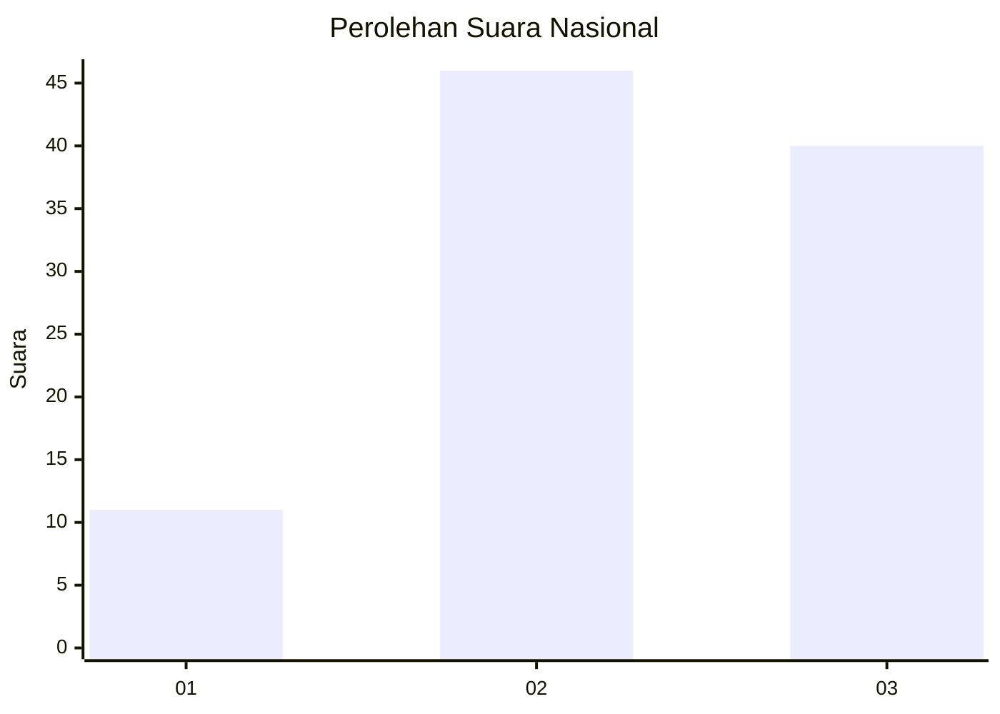
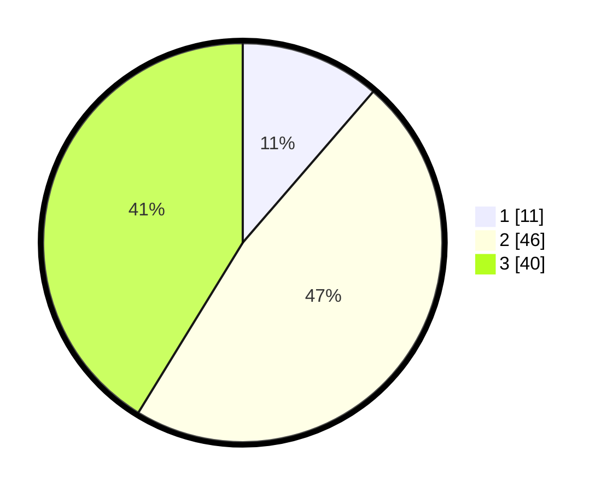

# Hasil

## Grafik

## Tabel

| No. | Nama Paslon    | Suara | Suara (raw) | Persentase |
|:--- |:-------------- | -----:| -----------:| ----------:|
| 1   | ANIES MUHAIMIN | 11    | [11][p-1]   | 11,34      |
| 2   | PRABOWO GIBRAN | 46    | [46][p-2]   | 47,42      |
| 3   | GANJAR MAHFUD  | 40    | [40][p-3]   | 41,24      |

[p-1]: https://github.com/gigit-pemilu/pemilu-2024/blob/main/pilpres/hitung-suara/sub/34-di-yogyakarta/sub/03-gunungkidul/sub/12-semin/sub/2006-candirejo/sub/025-tps/sub/paslon-1.txt
[p-2]: https://github.com/gigit-pemilu/pemilu-2024/blob/main/pilpres/hitung-suara/sub/34-di-yogyakarta/sub/03-gunungkidul/sub/12-semin/sub/2006-candirejo/sub/025-tps/sub/paslon-2.txt
[p-3]: https://github.com/gigit-pemilu/pemilu-2024/blob/main/pilpres/hitung-suara/sub/34-di-yogyakarta/sub/03-gunungkidul/sub/12-semin/sub/2006-candirejo/sub/025-tps/sub/paslon-3.txt

## Foto C Plano

https://sirekap-obj-formc.kpu.go.id/a669/pemilu/ppwp/34/03/12/20/06/3403122006025-20240216-025014--bb82ae4b-8526-4ba6-9459-f6f75095e2d0.jpg

https://sirekap-obj-formc.kpu.go.id/a669/pemilu/ppwp/34/03/12/20/06/3403122006025-20240216-025015--0d37151a-4aab-4f12-b295-c6aa2df67a55.jpg

https://sirekap-obj-formc.kpu.go.id/a669/pemilu/ppwp/34/03/12/20/06/3403122006025-20240216-025014--cfaad0c3-883d-41ed-a1d1-5dea6dac01c1.jpg

## Metadata

| Key        | Value               |
| ---------- | ------------------- |
| Time Stamp | 2024-02-17 16:00:02 |

## DATA PEMILIH TETAP

Jumlah pemilih dalam DPT: **98**.
 * L: **53**.
 * P: **45**.

## DATA PENGGUNA HAK PILIH

Jumlah pengguna hak pilih dalam DPT: **98**.
 * L: **53**.
 * P: **45**.

Jumlah pengguna hak pilih dalam DPTb: **0**.
 * L: **0**.
 * P: **0**.

Jumlah pengguna hak pilih dalam DPK: **0**.
 * L: **0**.
 * P: **0**.

Jumlah pengguna hak pilih: **98**.
 * L: **53**.
 * P: **45**.

## JUMLAH SUARA SAH DAN TIDAK SAH

JUMLAH SELURUH SUARA SAH: **97**.

JUMLAH SUARA TIDAK SAH: **1**.

JUMLAH SELURUH SUARA SAH DAN SUARA TIDAK SAH: **98**.

