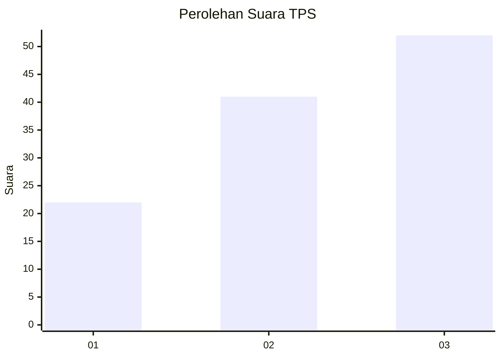
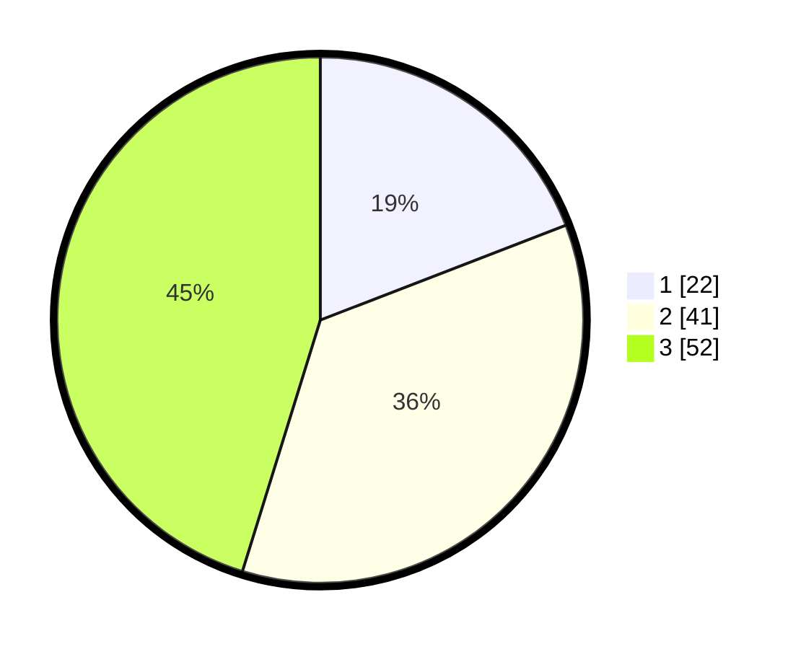

# Hasil

## Grafik

## Tabel

| No. | Nama Paslon    | Suara | Suara (raw) | Persentase |
|:--- |:-------------- | -----:| -----------:| ----------:|
| 1   | ANIES MUHAIMIN | 22    | [22][p-1]   | 19,13      |
| 2   | PRABOWO GIBRAN | 41    | [41][p-2]   | 35,65      |
| 3   | GANJAR MAHFUD  | 52    | [52][p-3]   | 45,22      |

[p-1]: https://github.com/gigit-pemilu/pemilu-2024-34-di-yogyakarta/blob/main/pilpres/hitung-suara/sub/34-di-yogyakarta/sub/03-gunungkidul/sub/12-semin/sub/2007-rejosari/sub/007-tps/sub/paslon-1.txt
[p-2]: https://github.com/gigit-pemilu/pemilu-2024-34-di-yogyakarta/blob/main/pilpres/hitung-suara/sub/34-di-yogyakarta/sub/03-gunungkidul/sub/12-semin/sub/2007-rejosari/sub/007-tps/sub/paslon-2.txt
[p-3]: https://github.com/gigit-pemilu/pemilu-2024-34-di-yogyakarta/blob/main/pilpres/hitung-suara/sub/34-di-yogyakarta/sub/03-gunungkidul/sub/12-semin/sub/2007-rejosari/sub/007-tps/sub/paslon-3.txt

## Foto C Plano

https://sirekap-obj-formc.kpu.go.id/eb6c/pemilu/ppwp/34/03/12/20/07/3403122007007-20240221-103817--f7560878-7761-48b0-b8ec-9b85ef272507.jpg

https://sirekap-obj-formc.kpu.go.id/eb6c/pemilu/ppwp/34/03/12/20/07/3403122007007-20240221-103909--863163a1-fa9c-4f7f-a1d2-58b76c7b8197.jpg

https://sirekap-obj-formc.kpu.go.id/eb6c/pemilu/ppwp/34/03/12/20/07/3403122007007-20240221-104227--c3cd64bc-6a92-4f09-82a3-e731a33d3b19.jpg

## Metadata

| Key        | Value               |
| ---------- | ------------------- |
| Time Stamp | 2024-02-24 22:31:28 |

