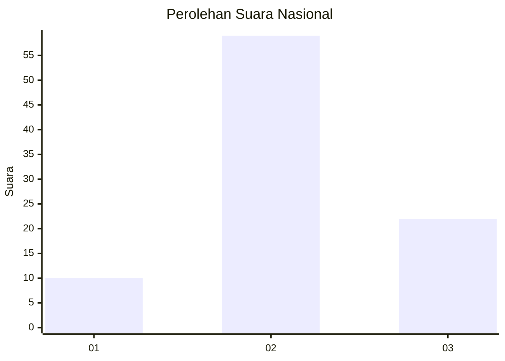
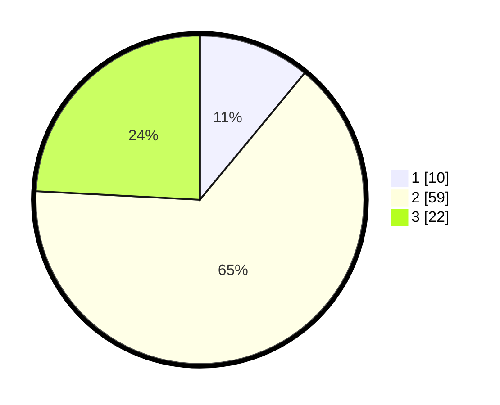

# Hasil

## Grafik

## Tabel

| No. | Nama Paslon    | Suara | Suara (raw) | Persentase |
|:--- |:-------------- | -----:| -----------:| ----------:|
| 1   | ANIES MUHAIMIN | 10    | [10][p-1]   | 10,99      |
| 2   | PRABOWO GIBRAN | 59    | [59][p-2]   | 64,84      |
| 3   | GANJAR MAHFUD  | 22    | [22][p-3]   | 24,18      |

[p-1]: https://github.com/gigit-pemilu/pemilu-2024/blob/main/pilpres/hitung-suara/sub/34-di-yogyakarta/sub/03-gunungkidul/sub/12-semin/sub/2007-rejosari/sub/022-tps/sub/paslon-1.txt
[p-2]: https://github.com/gigit-pemilu/pemilu-2024/blob/main/pilpres/hitung-suara/sub/34-di-yogyakarta/sub/03-gunungkidul/sub/12-semin/sub/2007-rejosari/sub/022-tps/sub/paslon-2.txt
[p-3]: https://github.com/gigit-pemilu/pemilu-2024/blob/main/pilpres/hitung-suara/sub/34-di-yogyakarta/sub/03-gunungkidul/sub/12-semin/sub/2007-rejosari/sub/022-tps/sub/paslon-3.txt

## Foto C Plano

https://sirekap-obj-formc.kpu.go.id/5db8/pemilu/ppwp/34/03/12/20/07/3403122007022-20240214-141433--ef1ea138-dccd-41d2-9539-2b782969caa5.jpg

https://sirekap-obj-formc.kpu.go.id/5db8/pemilu/ppwp/34/03/12/20/07/3403122007022-20240214-141238--6054f572-9a27-43d0-9b65-5c980508b3b1.jpg

https://sirekap-obj-formc.kpu.go.id/5db8/pemilu/ppwp/34/03/12/20/07/3403122007022-20240214-141648--3c3f7ce3-507a-4acb-9218-b63000ec4012.jpg

## Metadata

| Key        | Value               |
| ---------- | ------------------- |
| Time Stamp | 2024-02-15 19:30:26 |

## DATA PEMILIH TETAP

Jumlah pemilih dalam DPT: **115**.
 * L: **57**.
 * P: **58**.

## DATA PENGGUNA HAK PILIH

Jumlah pengguna hak pilih dalam DPT: **89**.
 * L: **39**.
 * P: **50**.

Jumlah pengguna hak pilih dalam DPTb: **2**.
 * L: **0**.
 * P: **2**.

Jumlah pengguna hak pilih dalam DPK: **0**.
 * L: **0**.
 * P: **0**.

Jumlah pengguna hak pilih: **91**.
 * L: **39**.
 * P: **52**.

## JUMLAH SUARA SAH DAN TIDAK SAH

JUMLAH SELURUH SUARA SAH: **91**.

JUMLAH SUARA TIDAK SAH: **0**.

JUMLAH SELURUH SUARA SAH DAN SUARA TIDAK SAH: **91**.

