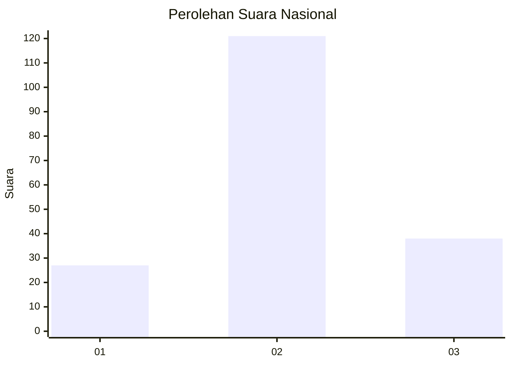
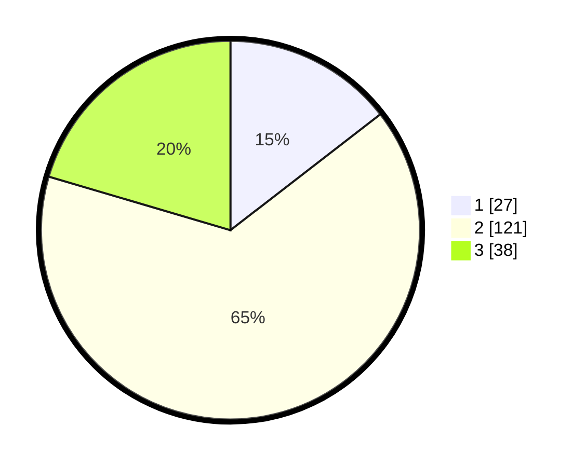

# Hasil

## Grafik

## Tabel

| No. | Nama Paslon    | Suara | Suara (raw) | Persentase |
|:--- |:-------------- | -----:| -----------:| ----------:|
| 1   | ANIES MUHAIMIN | 27    | [27][p-1]   | 14,52      |
| 2   | PRABOWO GIBRAN | 121   | [121][p-2]  | 65,05      |
| 3   | GANJAR MAHFUD  | 38    | [38][p-3]   | 20,43      |

[p-1]: https://github.com/gigit-pemilu/pemilu-2024/blob/main/pilpres/hitung-suara/sub/34-di-yogyakarta/sub/03-gunungkidul/sub/12-semin/sub/2008-karangsari/sub/004-tps/sub/paslon-1.txt
[p-2]: https://github.com/gigit-pemilu/pemilu-2024/blob/main/pilpres/hitung-suara/sub/34-di-yogyakarta/sub/03-gunungkidul/sub/12-semin/sub/2008-karangsari/sub/004-tps/sub/paslon-2.txt
[p-3]: https://github.com/gigit-pemilu/pemilu-2024/blob/main/pilpres/hitung-suara/sub/34-di-yogyakarta/sub/03-gunungkidul/sub/12-semin/sub/2008-karangsari/sub/004-tps/sub/paslon-3.txt

## Foto C Plano

https://sirekap-obj-formc.kpu.go.id/26e7/pemilu/ppwp/34/03/12/20/08/3403122008004-20240216-115458--dec4ef5b-70bb-432d-8396-9333f876a454.jpg

https://sirekap-obj-formc.kpu.go.id/26e7/pemilu/ppwp/34/03/12/20/08/3403122008004-20240217-214729--19c530ac-01fb-487c-8522-ef274bf4281b.jpg

https://sirekap-obj-formc.kpu.go.id/26e7/pemilu/ppwp/34/03/12/20/08/3403122008004-20240217-214737--0f56a6bb-6a54-4306-b1dd-bd66e2e58f3c.jpg

## Metadata

| Key        | Value               |
| ---------- | ------------------- |
| Time Stamp | 2024-02-20 11:00:00 |

