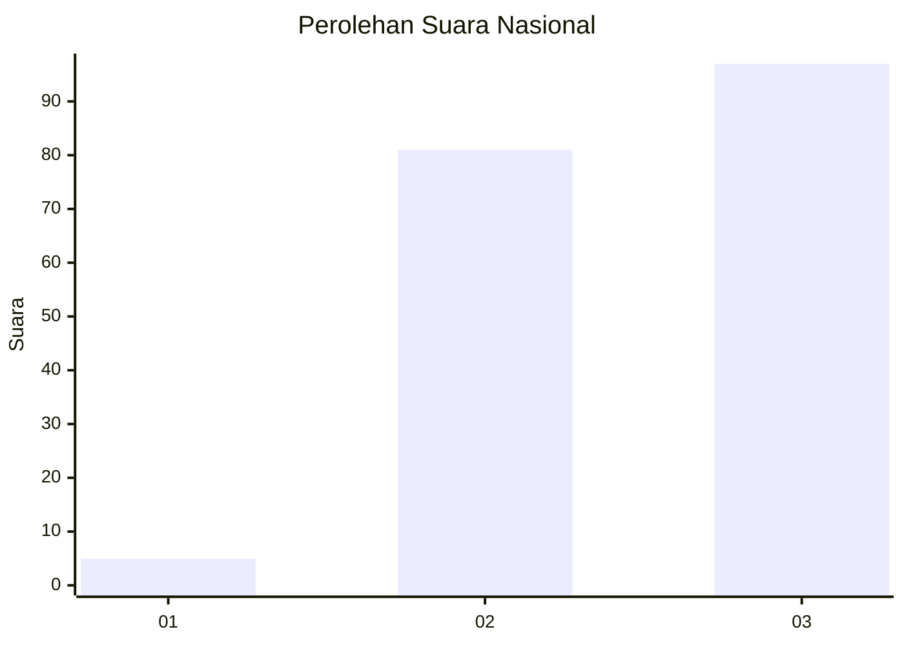
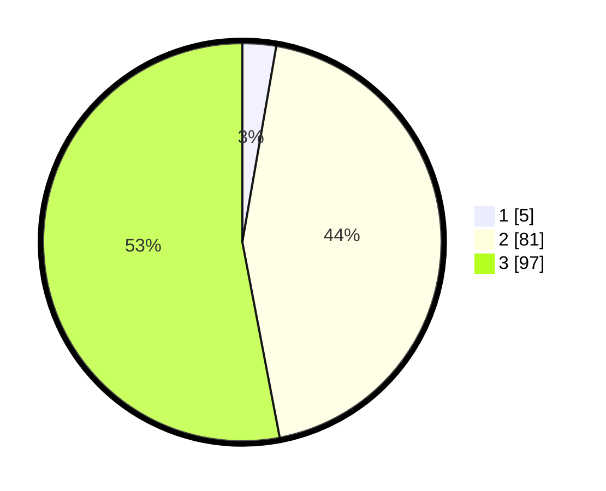

# Hasil

## Grafik

## Tabel

| No. | Nama Paslon    | Suara | Suara (raw) | Persentase |
|:--- |:-------------- | -----:| -----------:| ----------:|
| 1   | ANIES MUHAIMIN | 5     | [5][p-1]    | 2,73       |
| 2   | PRABOWO GIBRAN | 81    | [81][p-2]   | 44,26      |
| 3   | GANJAR MAHFUD  | 97    | [97][p-3]   | 53,01      |

[p-1]: https://github.com/gigit-pemilu/pemilu-2024/blob/main/pilpres/hitung-suara/sub/34-di-yogyakarta/sub/03-gunungkidul/sub/12-semin/sub/2008-karangsari/sub/005-tps/sub/paslon-1.txt
[p-2]: https://github.com/gigit-pemilu/pemilu-2024/blob/main/pilpres/hitung-suara/sub/34-di-yogyakarta/sub/03-gunungkidul/sub/12-semin/sub/2008-karangsari/sub/005-tps/sub/paslon-2.txt
[p-3]: https://github.com/gigit-pemilu/pemilu-2024/blob/main/pilpres/hitung-suara/sub/34-di-yogyakarta/sub/03-gunungkidul/sub/12-semin/sub/2008-karangsari/sub/005-tps/sub/paslon-3.txt

## Foto C Plano

https://sirekap-obj-formc.kpu.go.id/2ea4/pemilu/ppwp/34/03/12/20/08/3403122008005-20240215-085412--9b71f9ec-4563-435b-819c-819cb1a334f5.jpg

https://sirekap-obj-formc.kpu.go.id/2ea4/pemilu/ppwp/34/03/12/20/08/3403122008005-20240215-085455--c4939592-74af-436f-ac40-684cf9107887.jpg

https://sirekap-obj-formc.kpu.go.id/2ea4/pemilu/ppwp/34/03/12/20/08/3403122008005-20240215-085523--858fce3f-e341-4470-b660-5b2bbc2f05c9.jpg

## Metadata

| Key        | Value               |
| ---------- | ------------------- |
| Time Stamp | 2024-02-17 19:30:00 |

