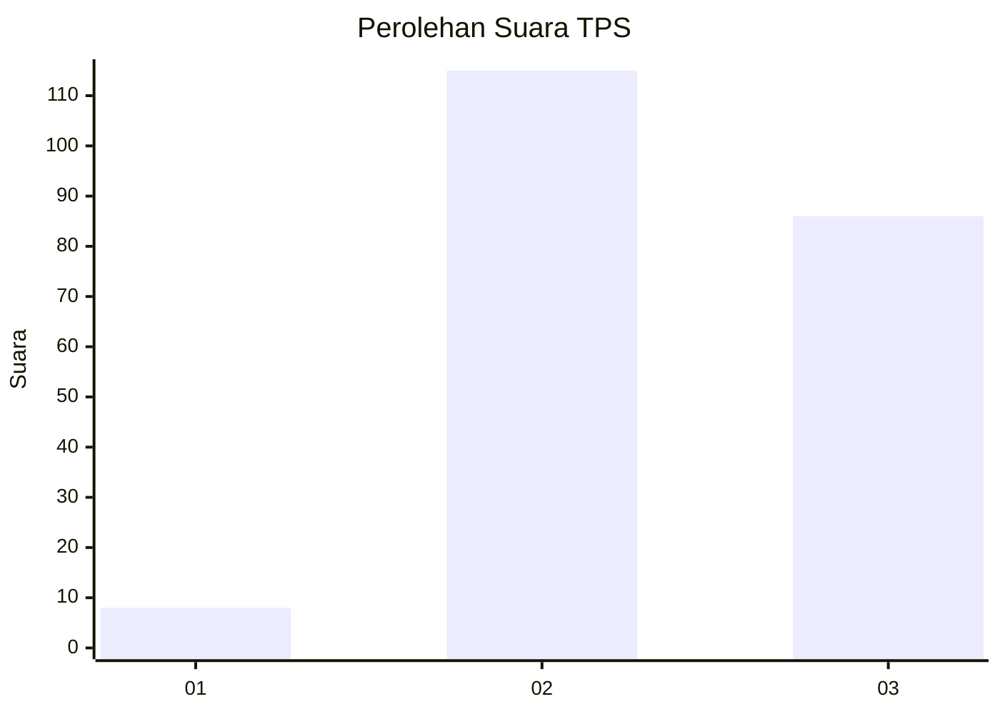
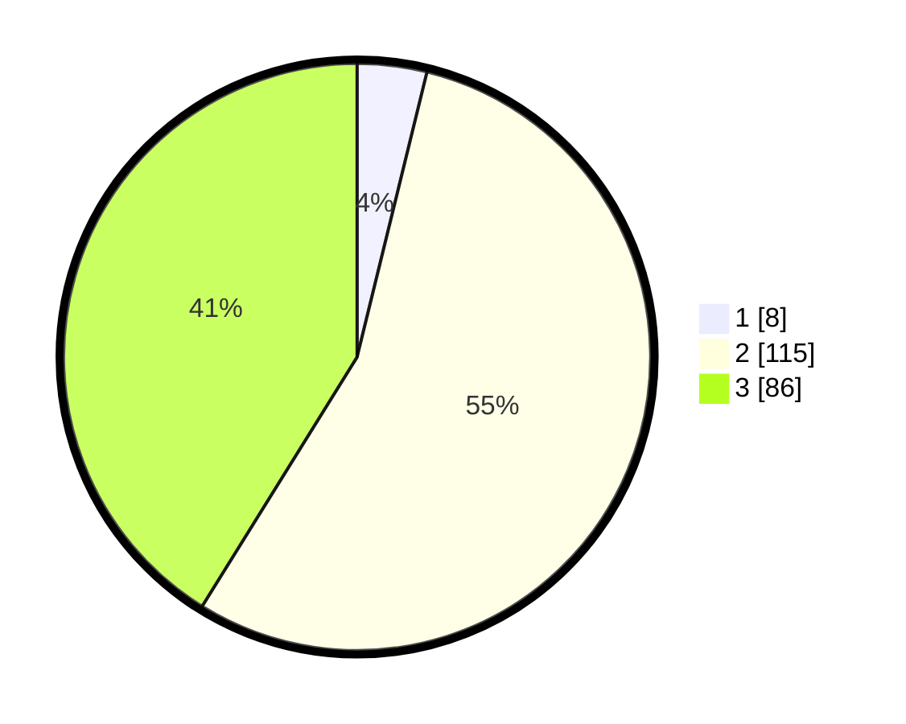

# Hasil

## Grafik

## Tabel

| No. | Nama Paslon    | Suara | Suara (raw) | Persentase |
|:--- |:-------------- | -----:| -----------:| ----------:|
| 1   | ANIES MUHAIMIN | 8     | [8][p-1]    | 3,83       |
| 2   | PRABOWO GIBRAN | 115   | [115][p-2]  | 55,02      |
| 3   | GANJAR MAHFUD  | 86    | [86][p-3]   | 41,15      |

[p-1]: https://github.com/gigit-pemilu/pemilu-2024-34-di-yogyakarta/blob/main/pilpres/hitung-suara/sub/34-di-yogyakarta/sub/03-gunungkidul/sub/12-semin/sub/2008-karangsari/sub/006-tps/sub/paslon-1.txt
[p-2]: https://github.com/gigit-pemilu/pemilu-2024-34-di-yogyakarta/blob/main/pilpres/hitung-suara/sub/34-di-yogyakarta/sub/03-gunungkidul/sub/12-semin/sub/2008-karangsari/sub/006-tps/sub/paslon-2.txt
[p-3]: https://github.com/gigit-pemilu/pemilu-2024-34-di-yogyakarta/blob/main/pilpres/hitung-suara/sub/34-di-yogyakarta/sub/03-gunungkidul/sub/12-semin/sub/2008-karangsari/sub/006-tps/sub/paslon-3.txt

## Foto C Plano

https://sirekap-obj-formc.kpu.go.id/9f80/pemilu/ppwp/34/03/12/20/08/3403122008006-20240214-205630--0c0925ff-188f-46a3-b889-095bd0f45076.jpg

https://sirekap-obj-formc.kpu.go.id/9f80/pemilu/ppwp/34/03/12/20/08/3403122008006-20240214-222410--43cd4b14-55ce-4873-bc74-ba901e5bb121.jpg

https://sirekap-obj-formc.kpu.go.id/9f80/pemilu/ppwp/34/03/12/20/08/3403122008006-20240214-223103--caabe83d-1637-44d7-bb64-0b0196fb5cca.jpg

## Metadata

| Key        | Value               |
| ---------- | ------------------- |
| Time Stamp | 2024-02-15 16:00:26 |

