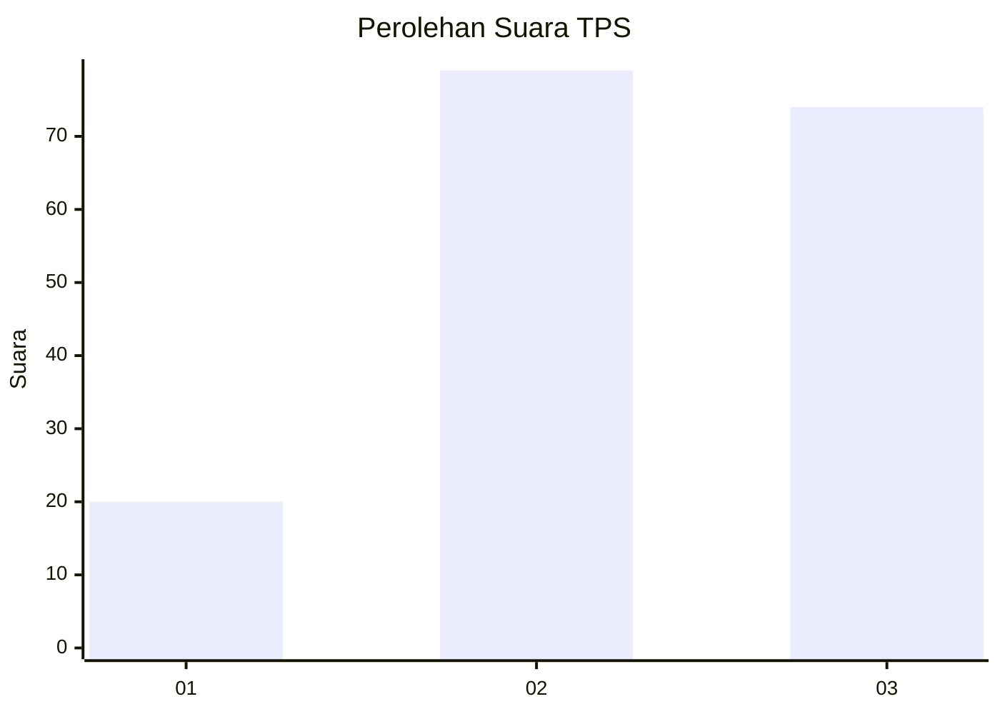
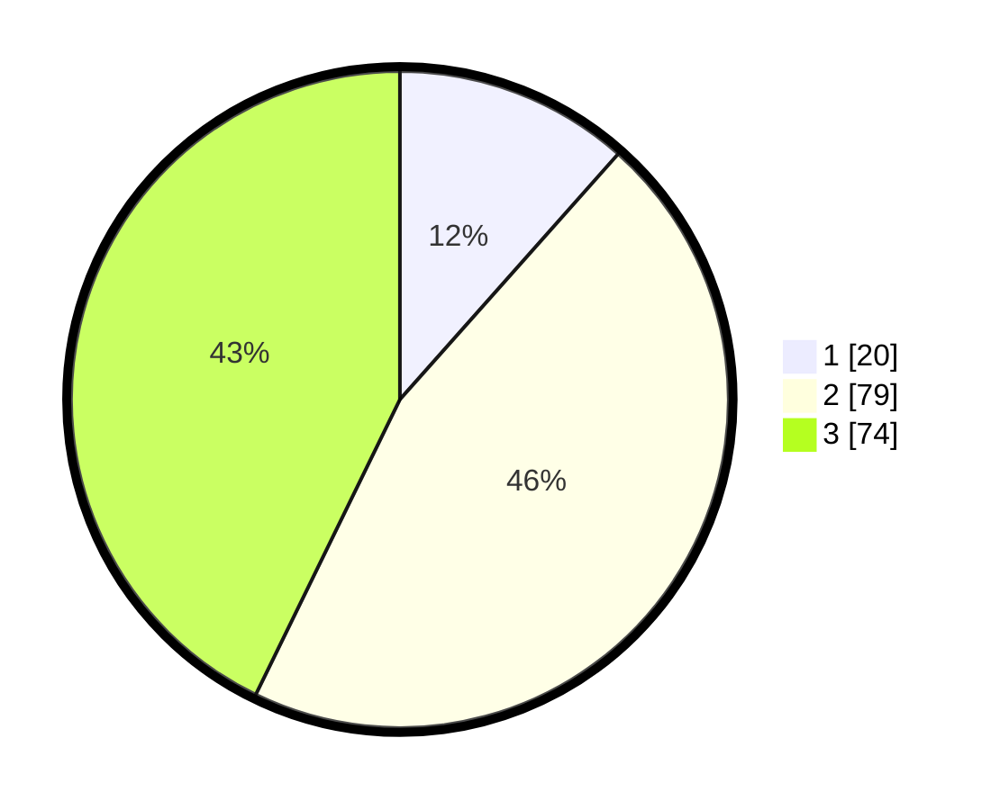

# Hasil

## Grafik

## Tabel

| No. | Nama Paslon    | Suara | Suara (raw) | Persentase |
|:--- |:-------------- | -----:| -----------:| ----------:|
| 1   | ANIES MUHAIMIN | 20    | [20][p-1]   | 11,56      |
| 2   | PRABOWO GIBRAN | 79    | [79][p-2]   | 45,66      |
| 3   | GANJAR MAHFUD  | 74    | [74][p-3]   | 42,77      |

[p-1]: https://github.com/gigit-pemilu/pemilu-2024-34-di-yogyakarta/blob/main/pilpres/hitung-suara/sub/34-di-yogyakarta/sub/03-gunungkidul/sub/12-semin/sub/2008-karangsari/sub/010-tps/sub/paslon-1.txt
[p-2]: https://github.com/gigit-pemilu/pemilu-2024-34-di-yogyakarta/blob/main/pilpres/hitung-suara/sub/34-di-yogyakarta/sub/03-gunungkidul/sub/12-semin/sub/2008-karangsari/sub/010-tps/sub/paslon-2.txt
[p-3]: https://github.com/gigit-pemilu/pemilu-2024-34-di-yogyakarta/blob/main/pilpres/hitung-suara/sub/34-di-yogyakarta/sub/03-gunungkidul/sub/12-semin/sub/2008-karangsari/sub/010-tps/sub/paslon-3.txt

## Foto C Plano

https://sirekap-obj-formc.kpu.go.id/59e0/pemilu/ppwp/34/03/12/20/08/3403122008010-20240215-024537--a9c2c6b2-bb8b-4029-b230-11536eb2110a.jpg

https://sirekap-obj-formc.kpu.go.id/59e0/pemilu/ppwp/34/03/12/20/08/3403122008010-20240215-000608--6247f607-3526-4275-9426-8c34c0f68ee3.jpg

https://sirekap-obj-formc.kpu.go.id/59e0/pemilu/ppwp/34/03/12/20/08/3403122008010-20240215-000834--b523d6a6-9388-4991-8e9e-50ed33344887.jpg

## Metadata

| Key        | Value               |
| ---------- | ------------------- |
| Time Stamp | 2024-02-15 19:30:26 |

