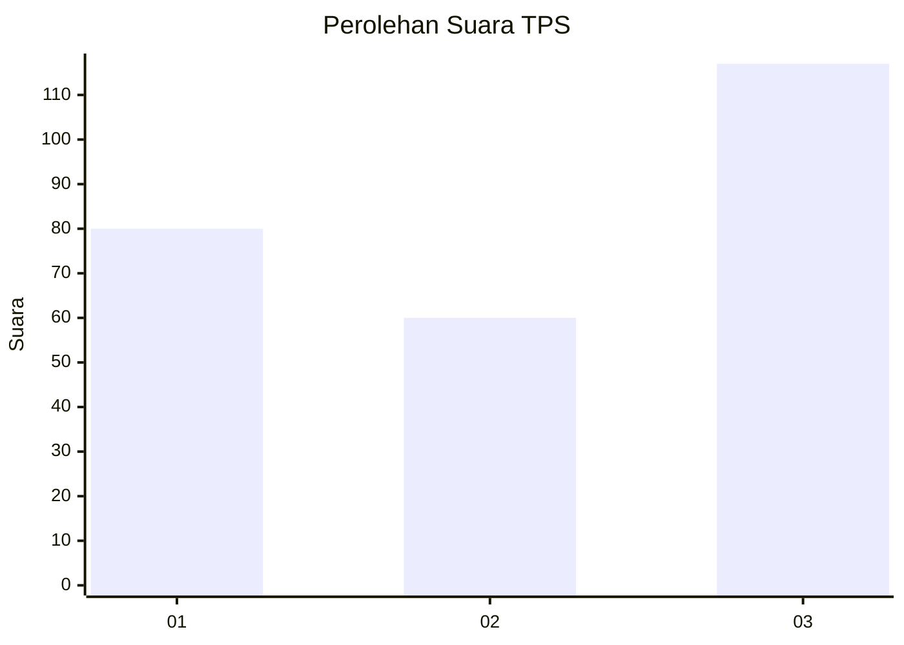
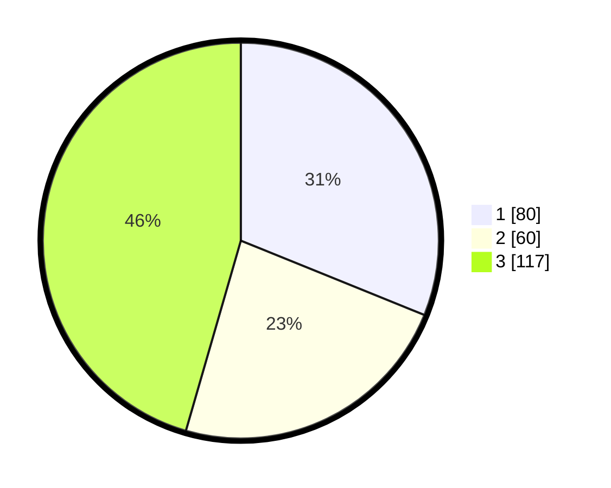

# Hasil

## Grafik

## Tabel

| No. | Nama Paslon    | Suara | Suara (raw) | Persentase |
|:--- |:-------------- | -----:| -----------:| ----------:|
| 1   | ANIES MUHAIMIN | 80    | [80][p-1]   | 31,13      |
| 2   | PRABOWO GIBRAN | 60    | [60][p-2]   | 23,35      |
| 3   | GANJAR MAHFUD  | 117   | [117][p-3]  | 45,53      |

[p-1]: https://github.com/gigit-pemilu/pemilu-2024-34-di-yogyakarta/blob/main/pilpres/hitung-suara/sub/34-di-yogyakarta/sub/03-gunungkidul/sub/12-semin/sub/2008-karangsari/sub/016-tps/sub/paslon-1.txt
[p-2]: https://github.com/gigit-pemilu/pemilu-2024-34-di-yogyakarta/blob/main/pilpres/hitung-suara/sub/34-di-yogyakarta/sub/03-gunungkidul/sub/12-semin/sub/2008-karangsari/sub/016-tps/sub/paslon-2.txt
[p-3]: https://github.com/gigit-pemilu/pemilu-2024-34-di-yogyakarta/blob/main/pilpres/hitung-suara/sub/34-di-yogyakarta/sub/03-gunungkidul/sub/12-semin/sub/2008-karangsari/sub/016-tps/sub/paslon-3.txt

## Foto C Plano

https://sirekap-obj-formc.kpu.go.id/7f90/pemilu/ppwp/34/03/12/20/08/3403122008016-20240215-044730--ca4de6d4-9f4b-4eb6-9523-4a8f0604be7a.jpg

https://sirekap-obj-formc.kpu.go.id/7f90/pemilu/ppwp/34/03/12/20/08/3403122008016-20240214-224831--59f2b1c2-b1d0-4bb2-b85e-42d98a2767df.jpg

https://sirekap-obj-formc.kpu.go.id/7f90/pemilu/ppwp/34/03/12/20/08/3403122008016-20240214-224834--365a3ff2-4f0b-4b14-b0aa-0baea26db101.jpg

## Metadata

| Key        | Value               |
| ---------- | ------------------- |
| Time Stamp | 2024-02-17 19:30:00 |

