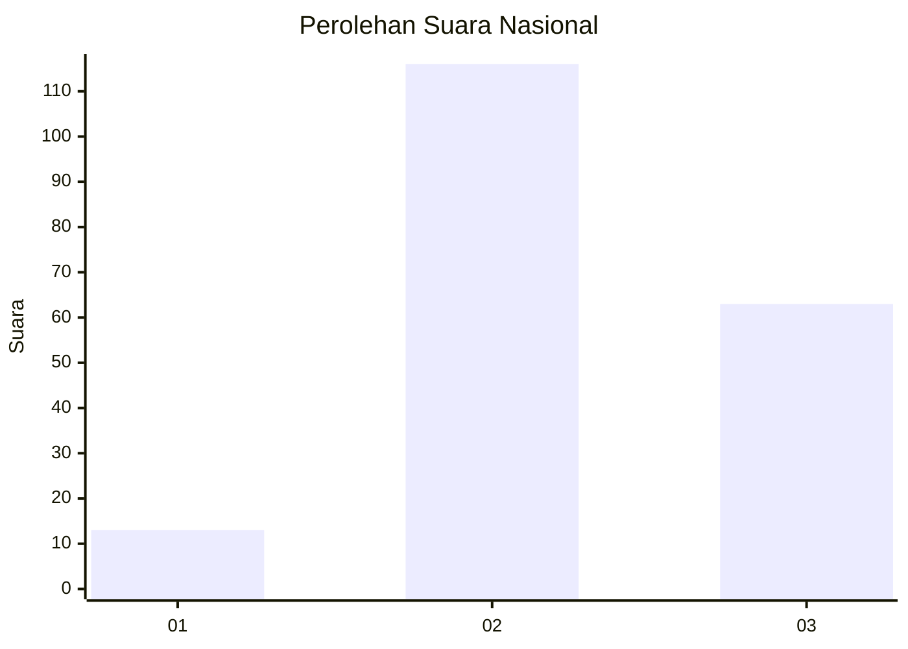
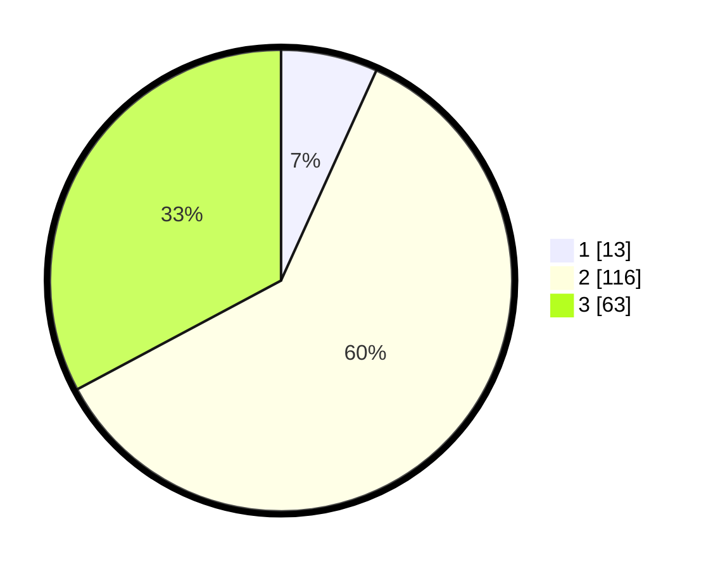

# Hasil

## Grafik

## Tabel

| No. | Nama Paslon    | Suara | Suara (raw) | Persentase |
|:--- |:-------------- | -----:| -----------:| ----------:|
| 1   | ANIES MUHAIMIN | 13    | [13][p-1]   | 6,77       |
| 2   | PRABOWO GIBRAN | 116   | [116][p-2]  | 60,42      |
| 3   | GANJAR MAHFUD  | 63    | [63][p-3]   | 32,81      |

[p-1]: https://github.com/gigit-pemilu/pemilu-2024/blob/main/pilpres/hitung-suara/sub/34-di-yogyakarta/sub/03-gunungkidul/sub/12-semin/sub/2008-karangsari/sub/019-tps/sub/paslon-1.txt
[p-2]: https://github.com/gigit-pemilu/pemilu-2024/blob/main/pilpres/hitung-suara/sub/34-di-yogyakarta/sub/03-gunungkidul/sub/12-semin/sub/2008-karangsari/sub/019-tps/sub/paslon-2.txt
[p-3]: https://github.com/gigit-pemilu/pemilu-2024/blob/main/pilpres/hitung-suara/sub/34-di-yogyakarta/sub/03-gunungkidul/sub/12-semin/sub/2008-karangsari/sub/019-tps/sub/paslon-3.txt

## Foto C Plano

https://sirekap-obj-formc.kpu.go.id/a067/pemilu/ppwp/34/03/12/20/08/3403122008019-20240215-130933--c54d8839-00ac-44fe-a59f-eaf45a690c98.jpg

https://sirekap-obj-formc.kpu.go.id/a067/pemilu/ppwp/34/03/12/20/08/3403122008019-20240215-130947--631e7866-5a9b-4c21-b886-7687b51f0fcb.jpg

https://sirekap-obj-formc.kpu.go.id/a067/pemilu/ppwp/34/03/12/20/08/3403122008019-20240215-131005--45e83db8-735e-433f-94ef-6ce99578528d.jpg

## Metadata

| Key        | Value               |
| ---------- | ------------------- |
| Time Stamp | 2024-02-17 19:30:00 |

