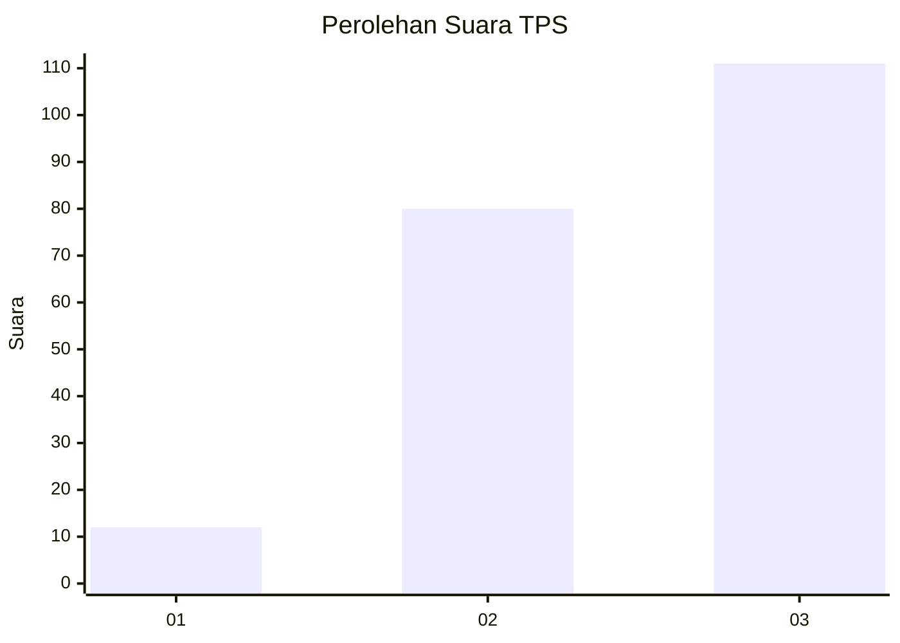
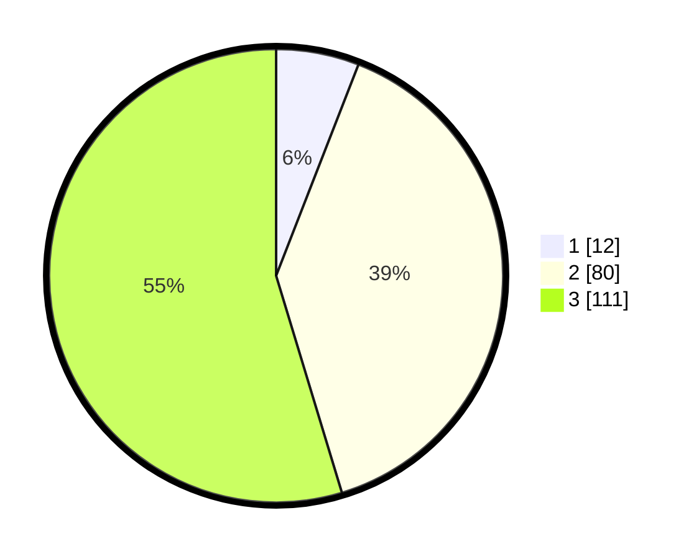

# Hasil

## Grafik

## Tabel

| No. | Nama Paslon    | Suara | Suara (raw) | Persentase |
|:--- |:-------------- | -----:| -----------:| ----------:|
| 1   | ANIES MUHAIMIN | 12    | [12][p-1]   | 5,91       |
| 2   | PRABOWO GIBRAN | 80    | [80][p-2]   | 39,41      |
| 3   | GANJAR MAHFUD  | 111   | [111][p-3]  | 54,68      |

[p-1]: https://github.com/gigit-pemilu/pemilu-2024-34-di-yogyakarta/blob/main/pilpres/hitung-suara/sub/34-di-yogyakarta/sub/03-gunungkidul/sub/12-semin/sub/2008-karangsari/sub/021-tps/sub/paslon-1.txt
[p-2]: https://github.com/gigit-pemilu/pemilu-2024-34-di-yogyakarta/blob/main/pilpres/hitung-suara/sub/34-di-yogyakarta/sub/03-gunungkidul/sub/12-semin/sub/2008-karangsari/sub/021-tps/sub/paslon-2.txt
[p-3]: https://github.com/gigit-pemilu/pemilu-2024-34-di-yogyakarta/blob/main/pilpres/hitung-suara/sub/34-di-yogyakarta/sub/03-gunungkidul/sub/12-semin/sub/2008-karangsari/sub/021-tps/sub/paslon-3.txt

## Foto C Plano

https://sirekap-obj-formc.kpu.go.id/d398/pemilu/ppwp/34/03/12/20/08/3403122008021-20240215-010037--dddcb945-0cf0-4cfe-a6b1-4dd6906a4454.jpg

https://sirekap-obj-formc.kpu.go.id/d398/pemilu/ppwp/34/03/12/20/08/3403122008021-20240215-010202--f5ff0a7a-b31f-481d-8652-a9d4ba14f9d3.jpg

https://sirekap-obj-formc.kpu.go.id/d398/pemilu/ppwp/34/03/12/20/08/3403122008021-20240215-010440--3e6aa17d-87bc-4d6f-b441-eda1c9d53b20.jpg

## Metadata

| Key        | Value               |
| ---------- | ------------------- |
| Time Stamp | 2024-02-15 19:30:26 |

