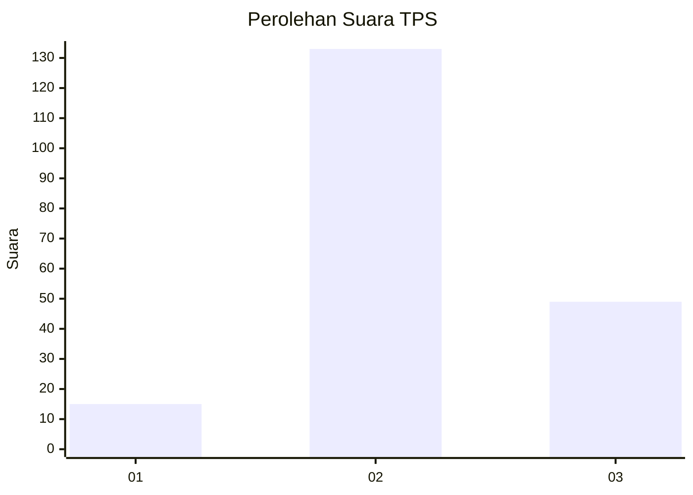
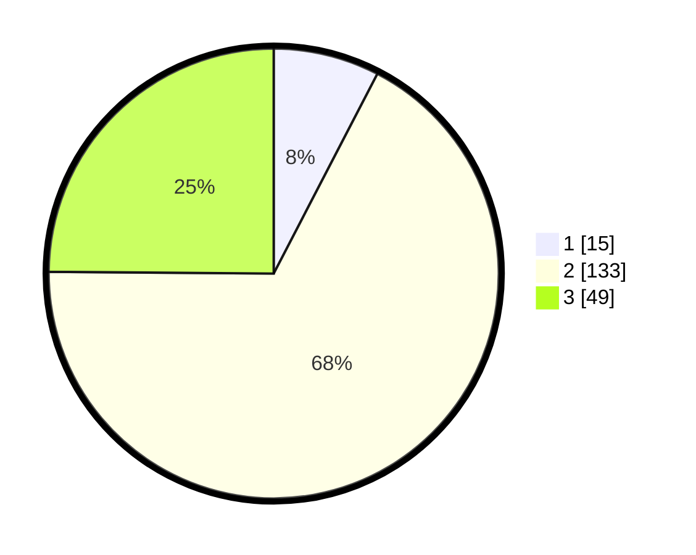

# Hasil

## Grafik

## Tabel

| No. | Nama Paslon    | Suara | Suara (raw) | Persentase |
|:--- |:-------------- | -----:| -----------:| ----------:|
| 1   | ANIES MUHAIMIN | 15    | [15][p-1]   | 7,61       |
| 2   | PRABOWO GIBRAN | 133   | [133][p-2]  | 67,51      |
| 3   | GANJAR MAHFUD  | 49    | [49][p-3]   | 24,87      |

[p-1]: https://github.com/gigit-pemilu/pemilu-2024-34-di-yogyakarta/blob/main/pilpres/hitung-suara/sub/34-di-yogyakarta/sub/03-gunungkidul/sub/12-semin/sub/2009-pundungsari/sub/002-tps/sub/paslon-1.txt
[p-2]: https://github.com/gigit-pemilu/pemilu-2024-34-di-yogyakarta/blob/main/pilpres/hitung-suara/sub/34-di-yogyakarta/sub/03-gunungkidul/sub/12-semin/sub/2009-pundungsari/sub/002-tps/sub/paslon-2.txt
[p-3]: https://github.com/gigit-pemilu/pemilu-2024-34-di-yogyakarta/blob/main/pilpres/hitung-suara/sub/34-di-yogyakarta/sub/03-gunungkidul/sub/12-semin/sub/2009-pundungsari/sub/002-tps/sub/paslon-3.txt

## Foto C Plano

https://sirekap-obj-formc.kpu.go.id/4096/pemilu/ppwp/34/03/12/20/09/3403122009002-20240214-141243--6dbfdd5f-ca63-4cd2-976c-f20c6e23b0b1.jpg

https://sirekap-obj-formc.kpu.go.id/4096/pemilu/ppwp/34/03/12/20/09/3403122009002-20240214-233930--9668a2c4-8849-4525-a925-e1a9e4894dc2.jpg

## Metadata

| Key        | Value               |
| ---------- | ------------------- |
| Time Stamp | 2024-02-15 15:00:29 |

