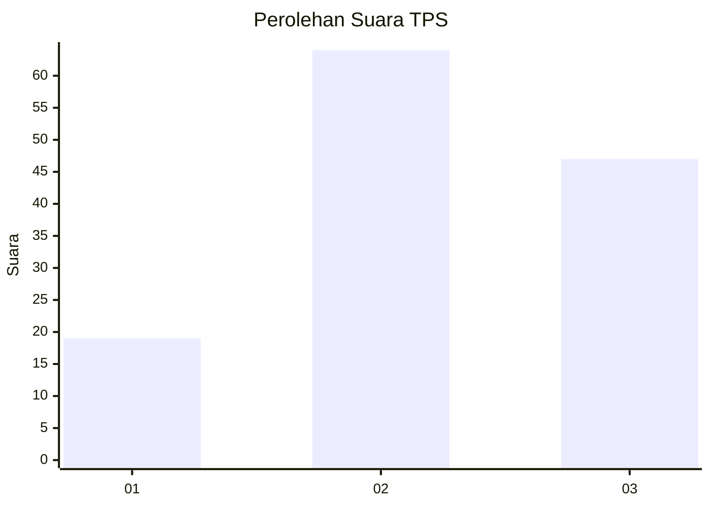
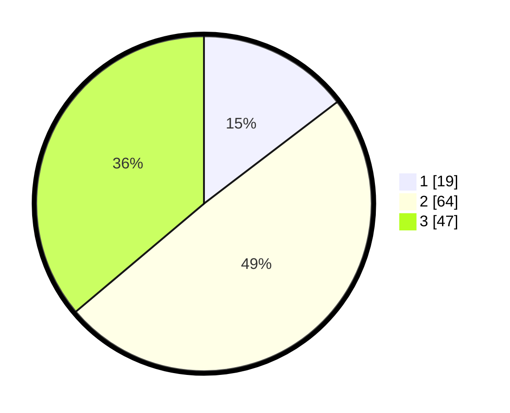

# Hasil

## Grafik

## Tabel

| No. | Nama Paslon    | Suara | Suara (raw) | Persentase |
|:--- |:-------------- | -----:| -----------:| ----------:|
| 1   | ANIES MUHAIMIN | 19    | [19][p-1]   | 14,62      |
| 2   | PRABOWO GIBRAN | 64    | [64][p-2]   | 49,23      |
| 3   | GANJAR MAHFUD  | 47    | [47][p-3]   | 36,15      |

[p-1]: https://github.com/gigit-pemilu/pemilu-2024-34-di-yogyakarta/blob/main/pilpres/hitung-suara/sub/34-di-yogyakarta/sub/03-gunungkidul/sub/12-semin/sub/2009-pundungsari/sub/003-tps/sub/paslon-1.txt
[p-2]: https://github.com/gigit-pemilu/pemilu-2024-34-di-yogyakarta/blob/main/pilpres/hitung-suara/sub/34-di-yogyakarta/sub/03-gunungkidul/sub/12-semin/sub/2009-pundungsari/sub/003-tps/sub/paslon-2.txt
[p-3]: https://github.com/gigit-pemilu/pemilu-2024-34-di-yogyakarta/blob/main/pilpres/hitung-suara/sub/34-di-yogyakarta/sub/03-gunungkidul/sub/12-semin/sub/2009-pundungsari/sub/003-tps/sub/paslon-3.txt

## Foto C Plano

https://sirekap-obj-formc.kpu.go.id/c571/pemilu/ppwp/34/03/12/20/09/3403122009003-20240215-010916--0863b8b0-8a65-4da3-a106-9392fa13b32c.jpg

https://sirekap-obj-formc.kpu.go.id/c571/pemilu/ppwp/34/03/12/20/09/3403122009003-20240215-011036--cb35069c-a192-4917-bccc-99c6fb2765cd.jpg

https://sirekap-obj-formc.kpu.go.id/c571/pemilu/ppwp/34/03/12/20/09/3403122009003-20240215-020231--6f561e82-1aeb-4e49-8be9-a9969b48fb9b.jpg

## Metadata

| Key        | Value               |
| ---------- | ------------------- |
| Time Stamp | 2024-02-15 04:00:24 |

