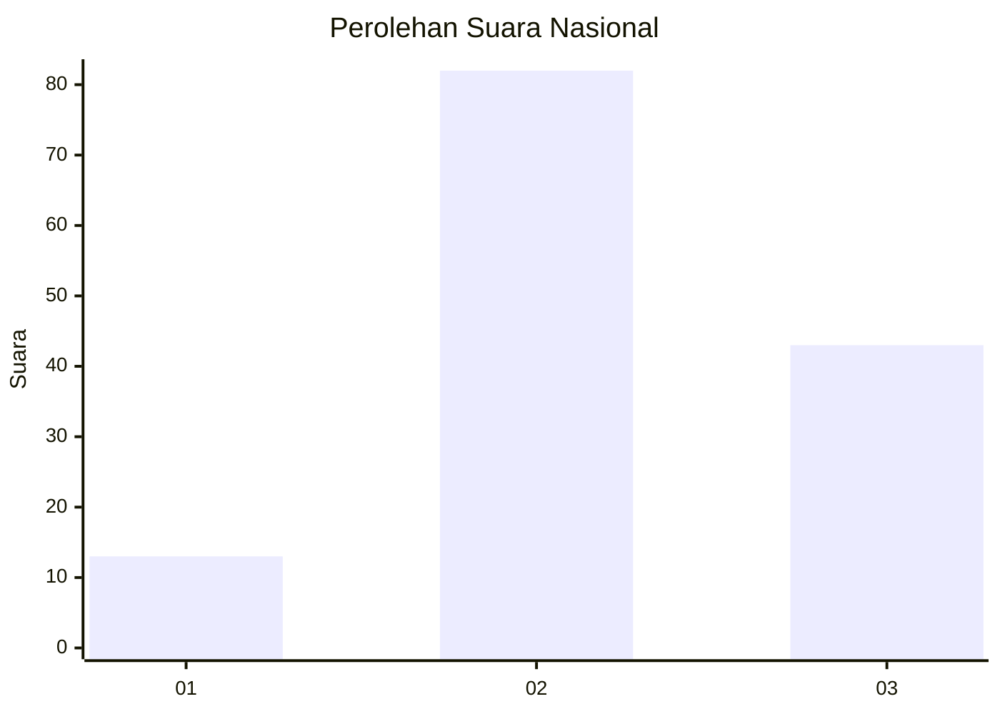
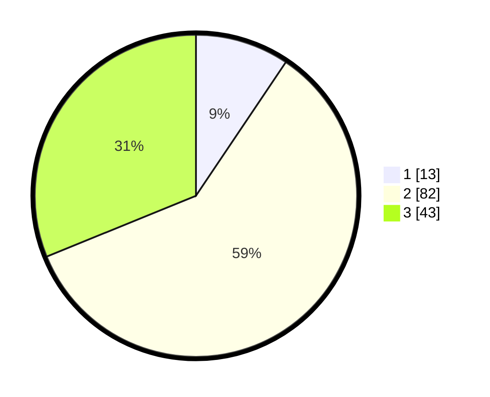

# Hasil

## Grafik

## Tabel

| No. | Nama Paslon    | Suara | Suara (raw) | Persentase |
|:--- |:-------------- | -----:| -----------:| ----------:|
| 1   | ANIES MUHAIMIN | 13    | [13][p-1]   | 9,42       |
| 2   | PRABOWO GIBRAN | 82    | [82][p-2]   | 59,42      |
| 3   | GANJAR MAHFUD  | 43    | [43][p-3]   | 31,16      |

[p-1]: https://github.com/gigit-pemilu/pemilu-2024/blob/main/pilpres/hitung-suara/sub/34-di-yogyakarta/sub/03-gunungkidul/sub/12-semin/sub/2009-pundungsari/sub/013-tps/sub/paslon-1.txt
[p-2]: https://github.com/gigit-pemilu/pemilu-2024/blob/main/pilpres/hitung-suara/sub/34-di-yogyakarta/sub/03-gunungkidul/sub/12-semin/sub/2009-pundungsari/sub/013-tps/sub/paslon-2.txt
[p-3]: https://github.com/gigit-pemilu/pemilu-2024/blob/main/pilpres/hitung-suara/sub/34-di-yogyakarta/sub/03-gunungkidul/sub/12-semin/sub/2009-pundungsari/sub/013-tps/sub/paslon-3.txt

## Foto C Plano

https://sirekap-obj-formc.kpu.go.id/442b/pemilu/ppwp/34/03/12/20/09/3403122009013-20240215-020810--fe246187-ed50-4f0e-9e62-deb927dc1a0c.jpg

https://sirekap-obj-formc.kpu.go.id/442b/pemilu/ppwp/34/03/12/20/09/3403122009013-20240214-234702--ec95c0fc-0246-4f9c-bed9-90472d28aa49.jpg

https://sirekap-obj-formc.kpu.go.id/442b/pemilu/ppwp/34/03/12/20/09/3403122009013-20240215-000607--6bf26121-ae00-48fd-88ba-d67b22218c75.jpg

## Metadata

| Key        | Value               |
| ---------- | ------------------- |
| Time Stamp | 2024-02-19 06:16:00 |

