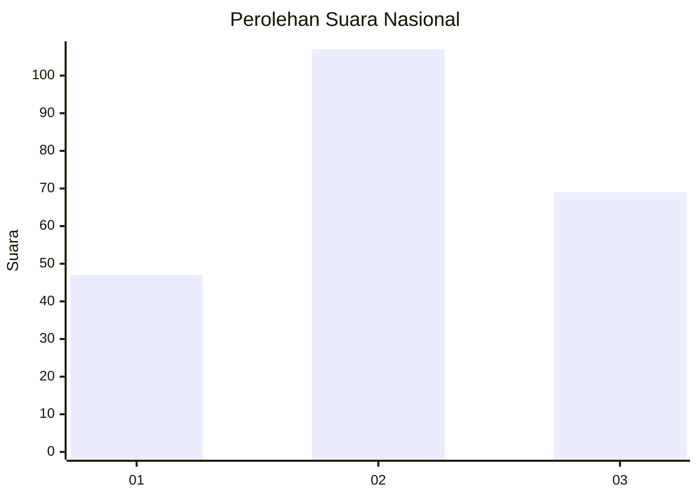
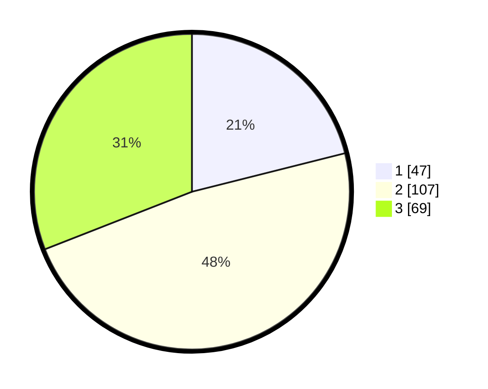

# Hasil

## Grafik

## Tabel

| No. | Nama Paslon    | Suara | Suara (raw) | Persentase |
|:--- |:-------------- | -----:| -----------:| ----------:|
| 1   | ANIES MUHAIMIN | 47    | [47][p-1]   | 21,08      |
| 2   | PRABOWO GIBRAN | 107   | [107][p-2]  | 47,98      |
| 3   | GANJAR MAHFUD  | 69    | [69][p-3]   | 30,94      |

[p-1]: https://github.com/gigit-pemilu/pemilu-2024/blob/main/pilpres/hitung-suara/sub/34-di-yogyakarta/sub/03-gunungkidul/sub/12-semin/sub/2009-pundungsari/sub/017-tps/sub/paslon-1.txt
[p-2]: https://github.com/gigit-pemilu/pemilu-2024/blob/main/pilpres/hitung-suara/sub/34-di-yogyakarta/sub/03-gunungkidul/sub/12-semin/sub/2009-pundungsari/sub/017-tps/sub/paslon-2.txt
[p-3]: https://github.com/gigit-pemilu/pemilu-2024/blob/main/pilpres/hitung-suara/sub/34-di-yogyakarta/sub/03-gunungkidul/sub/12-semin/sub/2009-pundungsari/sub/017-tps/sub/paslon-3.txt

## Foto C Plano

https://sirekap-obj-formc.kpu.go.id/ad5e/pemilu/ppwp/34/03/12/20/09/3403122009017-20240215-005112--db327968-37f5-47c3-92ad-aed32f24cb47.jpg

https://sirekap-obj-formc.kpu.go.id/ad5e/pemilu/ppwp/34/03/12/20/09/3403122009017-20240214-155546--e97638fa-7bd2-4c09-9897-5f035c9f9083.jpg

https://sirekap-obj-formc.kpu.go.id/ad5e/pemilu/ppwp/34/03/12/20/09/3403122009017-20240215-012947--0288e07f-103f-442c-b320-03a1a91340a9.jpg

## Metadata

| Key        | Value               |
| ---------- | ------------------- |
| Time Stamp | 2024-02-15 15:00:29 |

