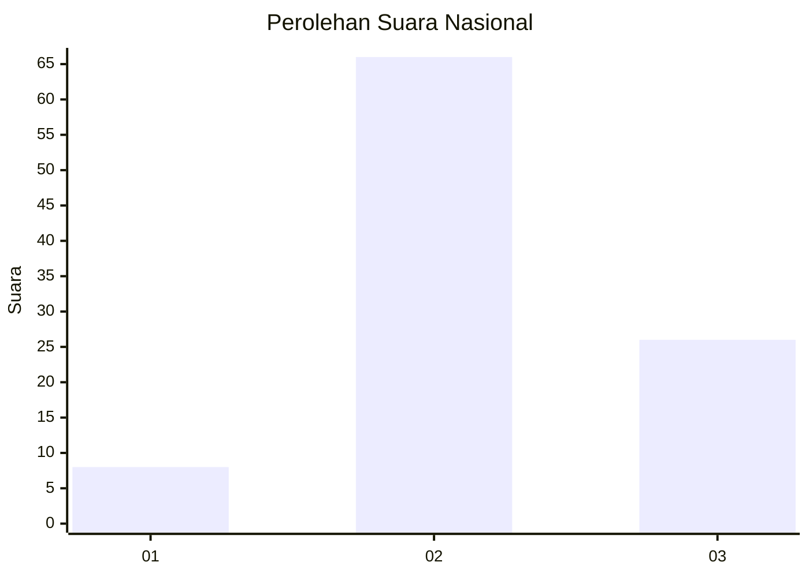
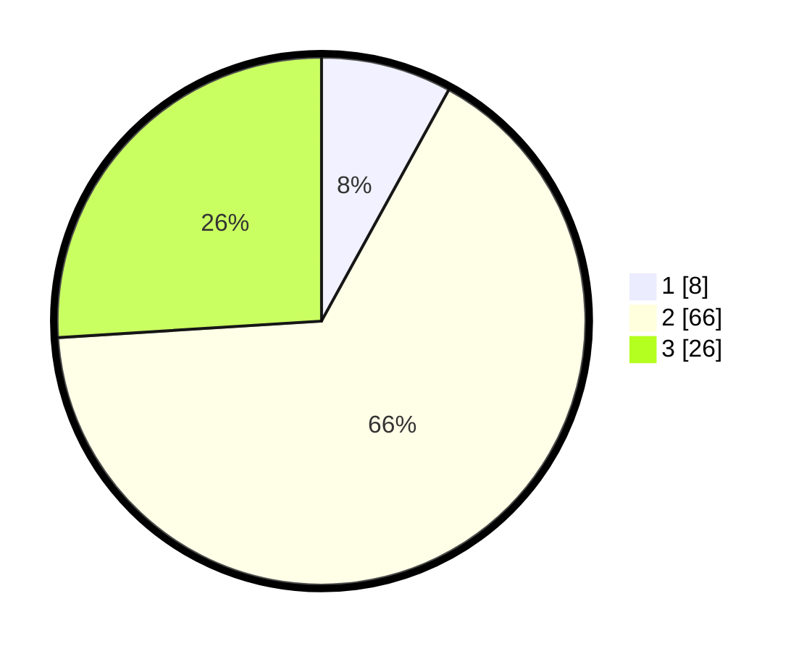

# Hasil

## Grafik

## Tabel

| No. | Nama Paslon    | Suara | Suara (raw) | Persentase |
|:--- |:-------------- | -----:| -----------:| ----------:|
| 1   | ANIES MUHAIMIN | 8     | [8][p-1]    | 8,00       |
| 2   | PRABOWO GIBRAN | 66    | [66][p-2]   | 66,00      |
| 3   | GANJAR MAHFUD  | 26    | [26][p-3]   | 26,00      |

[p-1]: https://github.com/gigit-pemilu/pemilu-2024/blob/main/pilpres/hitung-suara/sub/34-di-yogyakarta/sub/03-gunungkidul/sub/12-semin/sub/2010-semin/sub/003-tps/sub/paslon-1.txt
[p-2]: https://github.com/gigit-pemilu/pemilu-2024/blob/main/pilpres/hitung-suara/sub/34-di-yogyakarta/sub/03-gunungkidul/sub/12-semin/sub/2010-semin/sub/003-tps/sub/paslon-2.txt
[p-3]: https://github.com/gigit-pemilu/pemilu-2024/blob/main/pilpres/hitung-suara/sub/34-di-yogyakarta/sub/03-gunungkidul/sub/12-semin/sub/2010-semin/sub/003-tps/sub/paslon-3.txt

## Foto C Plano

https://sirekap-obj-formc.kpu.go.id/6e23/pemilu/ppwp/34/03/12/20/10/3403122010003-20240216-135032--b90d9d5b-8198-4ec5-95dd-ff9a20c50877.jpg

https://sirekap-obj-formc.kpu.go.id/6e23/pemilu/ppwp/34/03/12/20/10/3403122010003-20240216-135033--f7598d46-1ad6-473c-bd00-3a78ab8744d2.jpg

https://sirekap-obj-formc.kpu.go.id/6e23/pemilu/ppwp/34/03/12/20/10/3403122010003-20240216-135032--e1d2d239-147c-4f71-a072-a442f1f112b9.jpg

## Metadata

| Key        | Value               |
| ---------- | ------------------- |
| Time Stamp | 2024-02-17 16:36:25 |

## DATA PEMILIH TETAP

Jumlah pemilih dalam DPT: **128**.
 * L: **68**.
 * P: **60**.

## DATA PENGGUNA HAK PILIH

Jumlah pengguna hak pilih dalam DPT: **100**.
 * L: **52**.
 * P: **48**.

Jumlah pengguna hak pilih dalam DPTb: **0**.
 * L: **0**.
 * P: **0**.

Jumlah pengguna hak pilih dalam DPK: **1**.
 * L: **0**.
 * P: **1**.

Jumlah pengguna hak pilih: **101**.
 * L: **52**.
 * P: **49**.

## JUMLAH SUARA SAH DAN TIDAK SAH

JUMLAH SELURUH SUARA SAH: **100**.

JUMLAH SUARA TIDAK SAH: **1**.

JUMLAH SELURUH SUARA SAH DAN SUARA TIDAK SAH: **101**.

