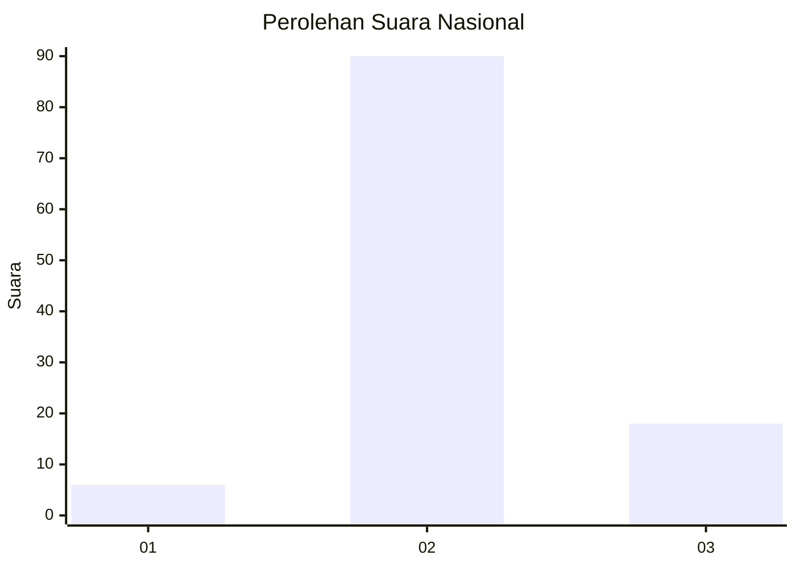
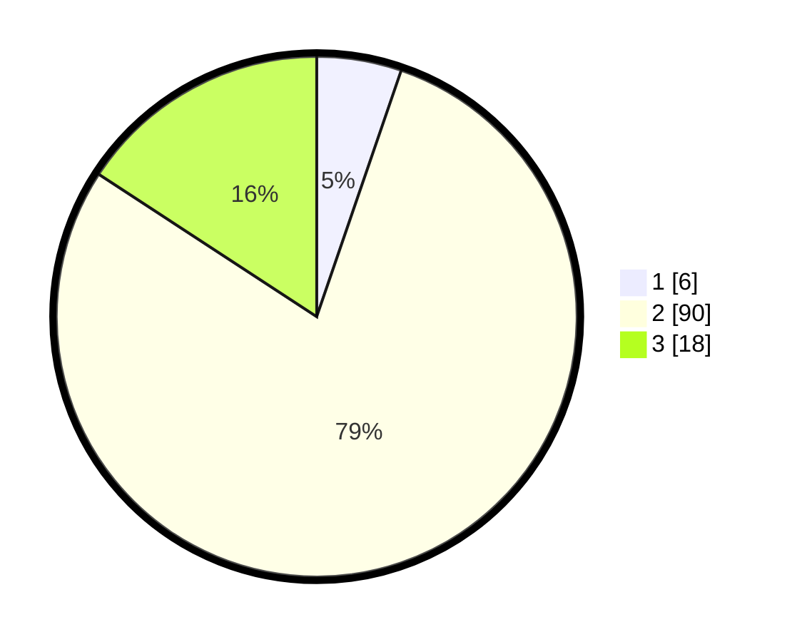

# Hasil

## Grafik

## Tabel

| No. | Nama Paslon    | Suara | Suara (raw) | Persentase |
|:--- |:-------------- | -----:| -----------:| ----------:|
| 1   | ANIES MUHAIMIN | 6     | [6][p-1]    | 5,26       |
| 2   | PRABOWO GIBRAN | 90    | [90][p-2]   | 78,95      |
| 3   | GANJAR MAHFUD  | 18    | [18][p-3]   | 15,79      |

[p-1]: https://github.com/gigit-pemilu/pemilu-2024/blob/main/pilpres/hitung-suara/sub/34-di-yogyakarta/sub/03-gunungkidul/sub/12-semin/sub/2010-semin/sub/007-tps/sub/paslon-1.txt
[p-2]: https://github.com/gigit-pemilu/pemilu-2024/blob/main/pilpres/hitung-suara/sub/34-di-yogyakarta/sub/03-gunungkidul/sub/12-semin/sub/2010-semin/sub/007-tps/sub/paslon-2.txt
[p-3]: https://github.com/gigit-pemilu/pemilu-2024/blob/main/pilpres/hitung-suara/sub/34-di-yogyakarta/sub/03-gunungkidul/sub/12-semin/sub/2010-semin/sub/007-tps/sub/paslon-3.txt

## Foto C Plano

https://sirekap-obj-formc.kpu.go.id/27d4/pemilu/ppwp/34/03/12/20/10/3403122010007-20240214-235256--c0fbcf35-3370-4b32-a0af-600db138ff9c.jpg

https://sirekap-obj-formc.kpu.go.id/27d4/pemilu/ppwp/34/03/12/20/10/3403122010007-20240214-235508--d5b332c3-f5ca-4988-9d60-e5aeeecc0b3f.jpg

## Metadata

| Key        | Value               |
| ---------- | ------------------- |
| Time Stamp | 2024-02-24 22:31:28 |

