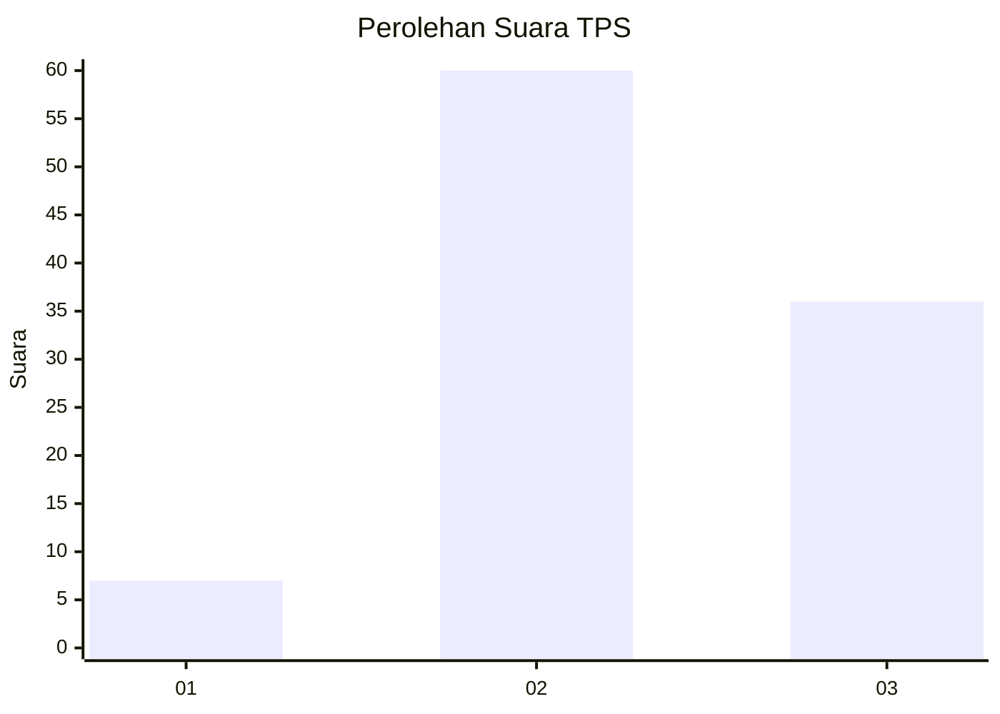
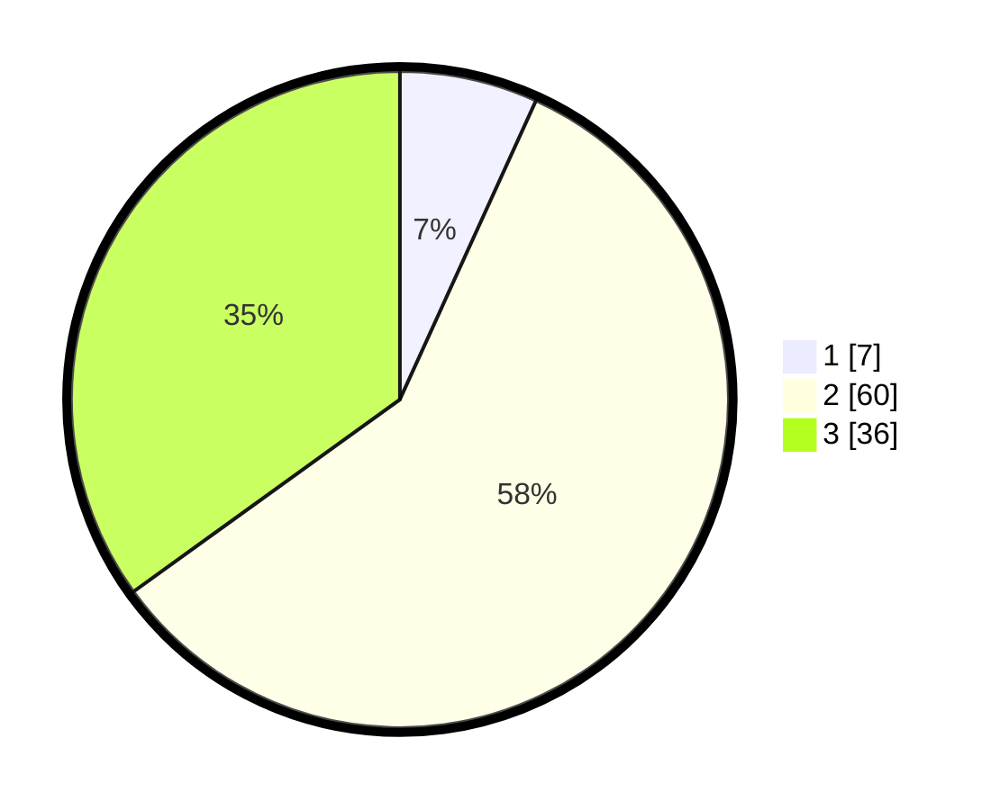

# Hasil

## Grafik

## Tabel

| No. | Nama Paslon    | Suara | Suara (raw) | Persentase |
|:--- |:-------------- | -----:| -----------:| ----------:|
| 1   | ANIES MUHAIMIN | 7     | [7][p-1]    | 6,80       |
| 2   | PRABOWO GIBRAN | 60    | [60][p-2]   | 58,25      |
| 3   | GANJAR MAHFUD  | 36    | [36][p-3]   | 34,95      |

[p-1]: https://github.com/gigit-pemilu/pemilu-2024-34-di-yogyakarta/blob/main/pilpres/hitung-suara/sub/34-di-yogyakarta/sub/03-gunungkidul/sub/12-semin/sub/2010-semin/sub/011-tps/sub/paslon-1.txt
[p-2]: https://github.com/gigit-pemilu/pemilu-2024-34-di-yogyakarta/blob/main/pilpres/hitung-suara/sub/34-di-yogyakarta/sub/03-gunungkidul/sub/12-semin/sub/2010-semin/sub/011-tps/sub/paslon-2.txt
[p-3]: https://github.com/gigit-pemilu/pemilu-2024-34-di-yogyakarta/blob/main/pilpres/hitung-suara/sub/34-di-yogyakarta/sub/03-gunungkidul/sub/12-semin/sub/2010-semin/sub/011-tps/sub/paslon-3.txt

## Foto C Plano

https://sirekap-obj-formc.kpu.go.id/6787/pemilu/ppwp/34/03/12/20/10/3403122010011-20240216-121130--956b9f3c-fa4a-4add-812c-f339c217db00.jpg

https://sirekap-obj-formc.kpu.go.id/6787/pemilu/ppwp/34/03/12/20/10/3403122010011-20240214-233730--95984b31-e661-4808-a29b-b2c347039435.jpg

https://sirekap-obj-formc.kpu.go.id/6787/pemilu/ppwp/34/03/12/20/10/3403122010011-20240214-233823--1407dd3f-5c5e-4cf5-8e22-de4e885968c3.jpg

## Metadata

| Key        | Value               |
| ---------- | ------------------- |
| Time Stamp | 2024-02-16 12:51:22 |

## DATA PEMILIH TETAP

Jumlah pemilih dalam DPT: **128**.
 * L: **65**.
 * P: **63**.

## DATA PENGGUNA HAK PILIH

Jumlah pengguna hak pilih dalam DPT: **104**.
 * L: **54**.
 * P: **50**.

Jumlah pengguna hak pilih dalam DPTb: **0**.
 * L: **0**.
 * P: **0**.

Jumlah pengguna hak pilih dalam DPK: **0**.
 * L: **0**.
 * P: **0**.

Jumlah pengguna hak pilih: **104**.
 * L: **54**.
 * P: **50**.

## JUMLAH SUARA SAH DAN TIDAK SAH

JUMLAH SELURUH SUARA SAH: **103**.

JUMLAH SUARA TIDAK SAH: **1**.

JUMLAH SELURUH SUARA SAH DAN SUARA TIDAK SAH: **104**.

