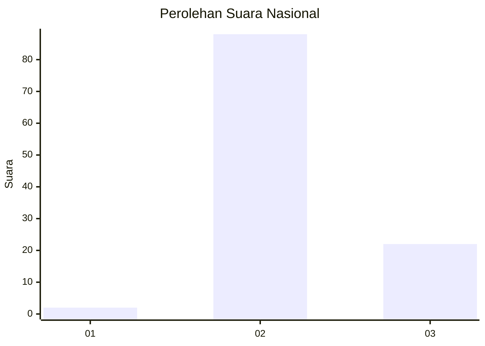
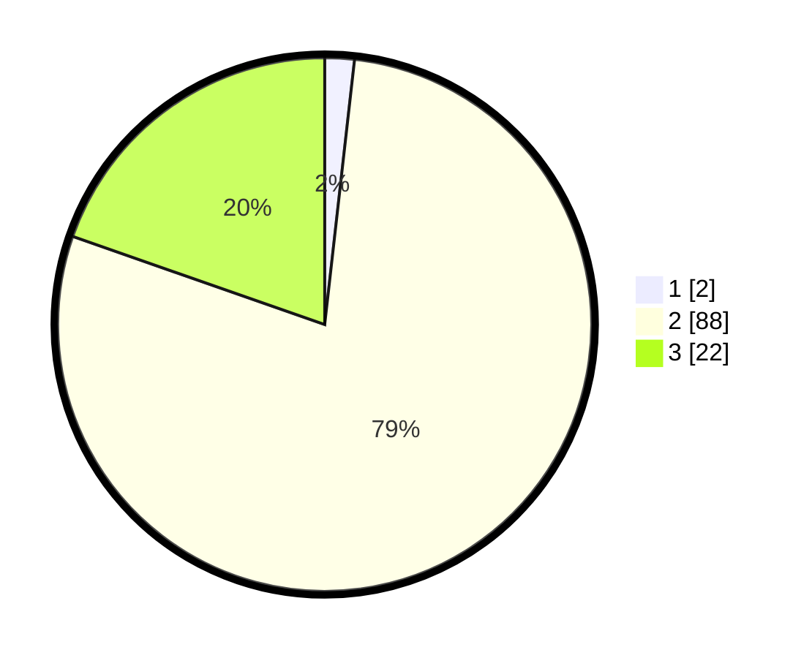

# Hasil

## Grafik

## Tabel

| No. | Nama Paslon    | Suara | Suara (raw) | Persentase |
|:--- |:-------------- | -----:| -----------:| ----------:|
| 1   | ANIES MUHAIMIN | 2     | [2][p-1]    | 1,79       |
| 2   | PRABOWO GIBRAN | 88    | [88][p-2]   | 78,57      |
| 3   | GANJAR MAHFUD  | 22    | [22][p-3]   | 19,64      |

[p-1]: https://github.com/gigit-pemilu/pemilu-2024/blob/main/pilpres/hitung-suara/sub/34-di-yogyakarta/sub/03-gunungkidul/sub/12-semin/sub/2010-semin/sub/013-tps/sub/paslon-1.txt
[p-2]: https://github.com/gigit-pemilu/pemilu-2024/blob/main/pilpres/hitung-suara/sub/34-di-yogyakarta/sub/03-gunungkidul/sub/12-semin/sub/2010-semin/sub/013-tps/sub/paslon-2.txt
[p-3]: https://github.com/gigit-pemilu/pemilu-2024/blob/main/pilpres/hitung-suara/sub/34-di-yogyakarta/sub/03-gunungkidul/sub/12-semin/sub/2010-semin/sub/013-tps/sub/paslon-3.txt

## Foto C Plano

https://sirekap-obj-formc.kpu.go.id/4746/pemilu/ppwp/34/03/12/20/10/3403122010013-20240216-135442--b3399aa3-1ded-4cf3-986e-343ff04565b6.jpg

https://sirekap-obj-formc.kpu.go.id/4746/pemilu/ppwp/34/03/12/20/10/3403122010013-20240216-135443--1d9825ea-939e-43d3-b14b-bb0e31611656.jpg

https://sirekap-obj-formc.kpu.go.id/4746/pemilu/ppwp/34/03/12/20/10/3403122010013-20240216-135442--4ce40746-1725-4e84-b2c8-568d0f794f05.jpg

## Metadata

| Key        | Value               |
| ---------- | ------------------- |
| Time Stamp | 2024-02-17 16:36:25 |

## DATA PEMILIH TETAP

Jumlah pemilih dalam DPT: **128**.
 * L: **65**.
 * P: **63**.

## DATA PENGGUNA HAK PILIH

Jumlah pengguna hak pilih dalam DPT: **110**.
 * L: **54**.
 * P: **56**.

Jumlah pengguna hak pilih dalam DPTb: **4**.
 * L: **4**.
 * P: **0**.

Jumlah pengguna hak pilih dalam DPK: **0**.
 * L: **0**.
 * P: **0**.

Jumlah pengguna hak pilih: **114**.
 * L: **58**.
 * P: **56**.

## JUMLAH SUARA SAH DAN TIDAK SAH

JUMLAH SELURUH SUARA SAH: **112**.

JUMLAH SUARA TIDAK SAH: **2**.

JUMLAH SELURUH SUARA SAH DAN SUARA TIDAK SAH: **114**.

