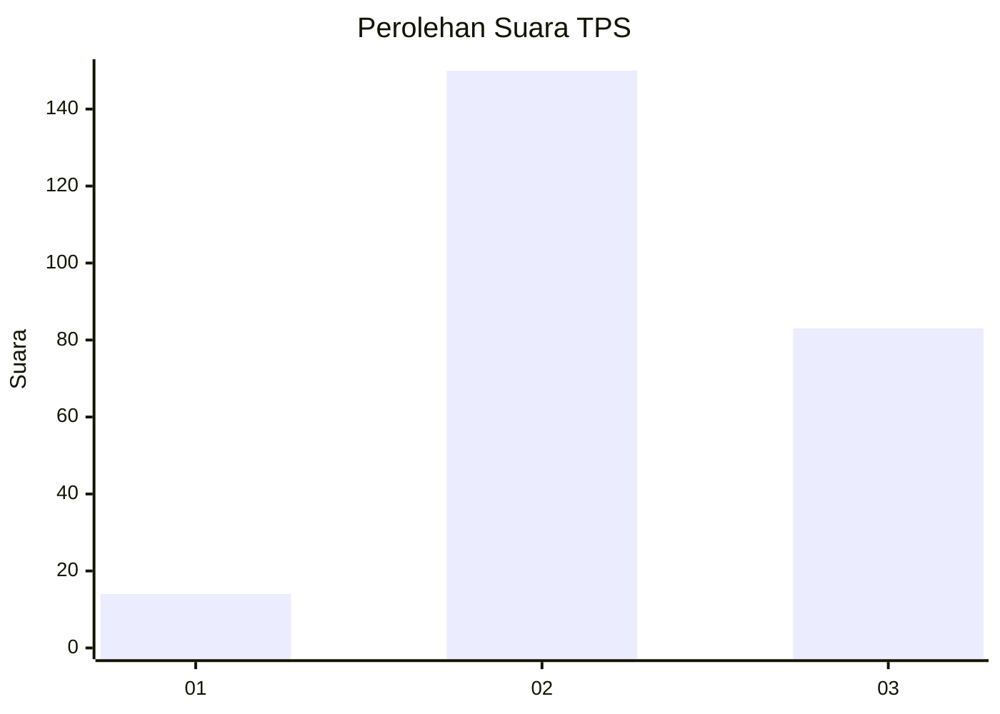
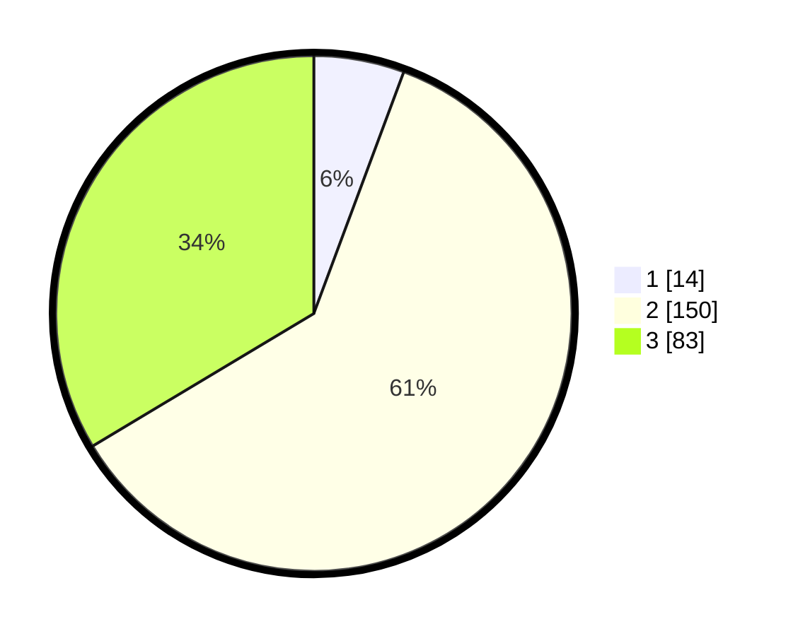

# Hasil

## Grafik

## Tabel

| No. | Nama Paslon    | Suara | Suara (raw) | Persentase |
|:--- |:-------------- | -----:| -----------:| ----------:|
| 1   | ANIES MUHAIMIN | 14    | [14][p-1]   | 5,67       |
| 2   | PRABOWO GIBRAN | 150   | [150][p-2]  | 60,73      |
| 3   | GANJAR MAHFUD  | 83    | [83][p-3]   | 33,60      |

[p-1]: https://github.com/gigit-pemilu/pemilu-2024-34-di-yogyakarta/blob/main/pilpres/hitung-suara/sub/34-di-yogyakarta/sub/03-gunungkidul/sub/12-semin/sub/2010-semin/sub/018-tps/sub/paslon-1.txt
[p-2]: https://github.com/gigit-pemilu/pemilu-2024-34-di-yogyakarta/blob/main/pilpres/hitung-suara/sub/34-di-yogyakarta/sub/03-gunungkidul/sub/12-semin/sub/2010-semin/sub/018-tps/sub/paslon-2.txt
[p-3]: https://github.com/gigit-pemilu/pemilu-2024-34-di-yogyakarta/blob/main/pilpres/hitung-suara/sub/34-di-yogyakarta/sub/03-gunungkidul/sub/12-semin/sub/2010-semin/sub/018-tps/sub/paslon-3.txt

## Foto C Plano

https://sirekap-obj-formc.kpu.go.id/8b41/pemilu/ppwp/34/03/12/20/10/3403122010018-20240214-235130--fe6b624f-2314-4a59-bcf6-cce51c9247aa.jpg

https://sirekap-obj-formc.kpu.go.id/8b41/pemilu/ppwp/34/03/12/20/10/3403122010018-20240214-235229--de5fe1ae-8785-4818-9854-89f30a56a7a1.jpg

https://sirekap-obj-formc.kpu.go.id/8b41/pemilu/ppwp/34/03/12/20/10/3403122010018-20240214-235534--5c11f09a-b06a-43e2-b5cf-85f66c314f78.jpg

## Metadata

| Key        | Value               |
| ---------- | ------------------- |
| Time Stamp | 2024-02-15 16:00:26 |

