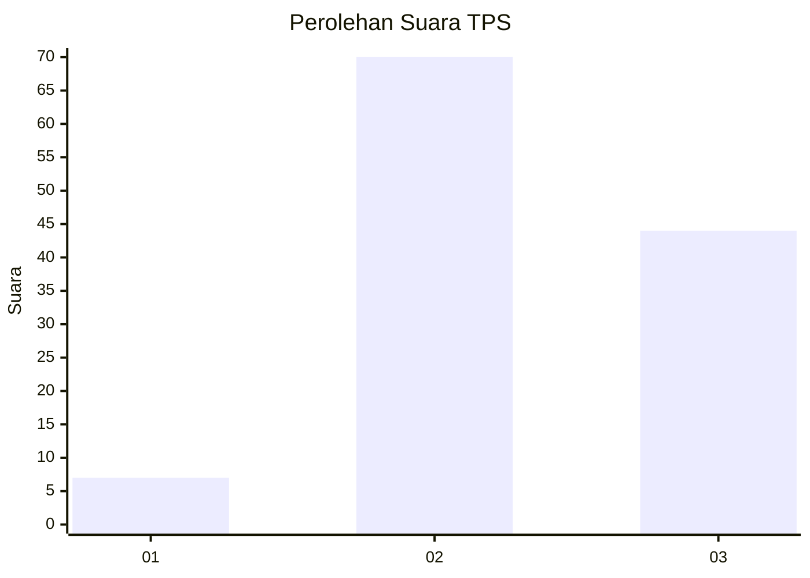
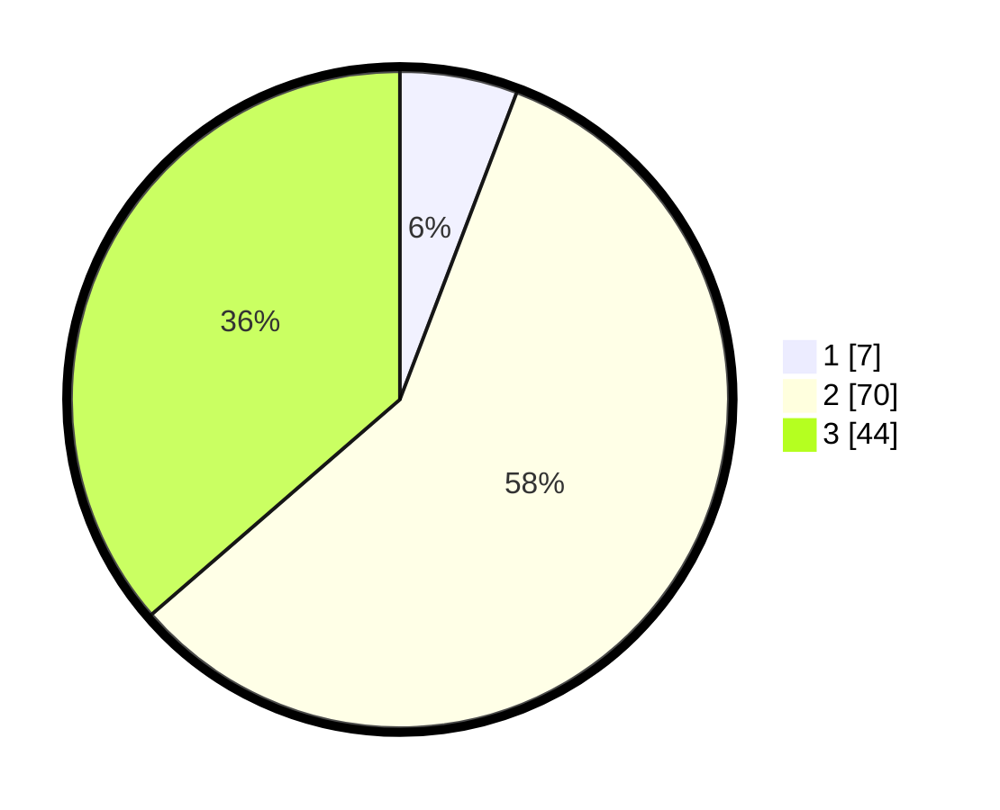

# Hasil

## Grafik

## Tabel

| No. | Nama Paslon    | Suara | Suara (raw) | Persentase |
|:--- |:-------------- | -----:| -----------:| ----------:|
| 1   | ANIES MUHAIMIN | 7     | [7][p-1]    | 5,79       |
| 2   | PRABOWO GIBRAN | 70    | [70][p-2]   | 57,85      |
| 3   | GANJAR MAHFUD  | 44    | [44][p-3]   | 36,36      |

[p-1]: https://github.com/gigit-pemilu/pemilu-2024-34-di-yogyakarta/blob/main/pilpres/hitung-suara/sub/34-di-yogyakarta/sub/03-gunungkidul/sub/12-semin/sub/2010-semin/sub/021-tps/sub/paslon-1.txt
[p-2]: https://github.com/gigit-pemilu/pemilu-2024-34-di-yogyakarta/blob/main/pilpres/hitung-suara/sub/34-di-yogyakarta/sub/03-gunungkidul/sub/12-semin/sub/2010-semin/sub/021-tps/sub/paslon-2.txt
[p-3]: https://github.com/gigit-pemilu/pemilu-2024-34-di-yogyakarta/blob/main/pilpres/hitung-suara/sub/34-di-yogyakarta/sub/03-gunungkidul/sub/12-semin/sub/2010-semin/sub/021-tps/sub/paslon-3.txt

## Foto C Plano

https://sirekap-obj-formc.kpu.go.id/728b/pemilu/ppwp/34/03/12/20/10/3403122010021-20240214-141249--55db77fb-1da6-44fd-aa07-51c21d6fa5ab.jpg

https://sirekap-obj-formc.kpu.go.id/728b/pemilu/ppwp/34/03/12/20/10/3403122010021-20240214-133403--5046e825-e31c-45de-a7c6-9b3e138c56be.jpg

https://sirekap-obj-formc.kpu.go.id/728b/pemilu/ppwp/34/03/12/20/10/3403122010021-20240214-140957--cf62fbbf-8456-4091-98d6-b95426fd8c4a.jpg

## Metadata

| Key        | Value               |
| ---------- | ------------------- |
| Time Stamp | 2024-02-15 15:00:29 |

