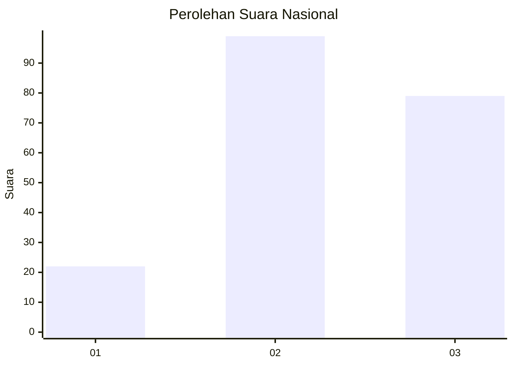
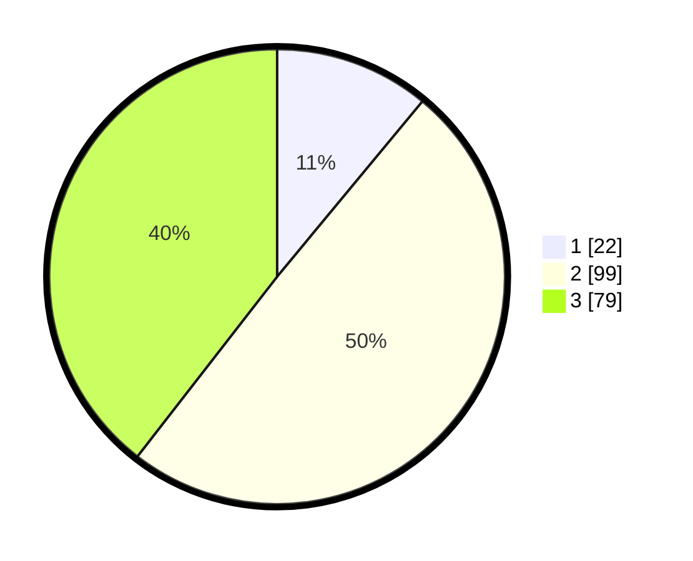

# Hasil

## Grafik

## Tabel

| No. | Nama Paslon    | Suara | Suara (raw) | Persentase |
|:--- |:-------------- | -----:| -----------:| ----------:|
| 1   | ANIES MUHAIMIN | 22    | [22][p-1]   | 11,00      |
| 2   | PRABOWO GIBRAN | 99    | [99][p-2]   | 49,50      |
| 3   | GANJAR MAHFUD  | 79    | [79][p-3]   | 39,50      |

[p-1]: https://github.com/gigit-pemilu/pemilu-2024/blob/main/pilpres/hitung-suara/sub/34-di-yogyakarta/sub/03-gunungkidul/sub/12-semin/sub/2010-semin/sub/031-tps/sub/paslon-1.txt
[p-2]: https://github.com/gigit-pemilu/pemilu-2024/blob/main/pilpres/hitung-suara/sub/34-di-yogyakarta/sub/03-gunungkidul/sub/12-semin/sub/2010-semin/sub/031-tps/sub/paslon-2.txt
[p-3]: https://github.com/gigit-pemilu/pemilu-2024/blob/main/pilpres/hitung-suara/sub/34-di-yogyakarta/sub/03-gunungkidul/sub/12-semin/sub/2010-semin/sub/031-tps/sub/paslon-3.txt

## Foto C Plano

https://sirekap-obj-formc.kpu.go.id/0f34/pemilu/ppwp/34/03/12/20/10/3403122010031-20240214-235528--7f86c62a-4210-47ae-9889-0b1aae194c52.jpg

https://sirekap-obj-formc.kpu.go.id/0f34/pemilu/ppwp/34/03/12/20/10/3403122010031-20240214-211749--fb39a10f-f185-4b42-b419-47a34b44feca.jpg

https://sirekap-obj-formc.kpu.go.id/0f34/pemilu/ppwp/34/03/12/20/10/3403122010031-20240214-211741--0c66250f-2dae-4247-9634-6fc4a5698de1.jpg

## Metadata

| Key        | Value               |
| ---------- | ------------------- |
| Time Stamp | 2024-02-19 06:16:00 |

