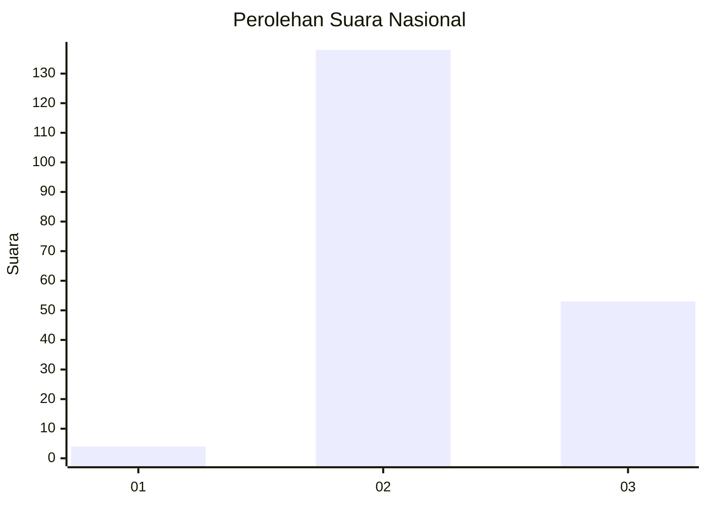
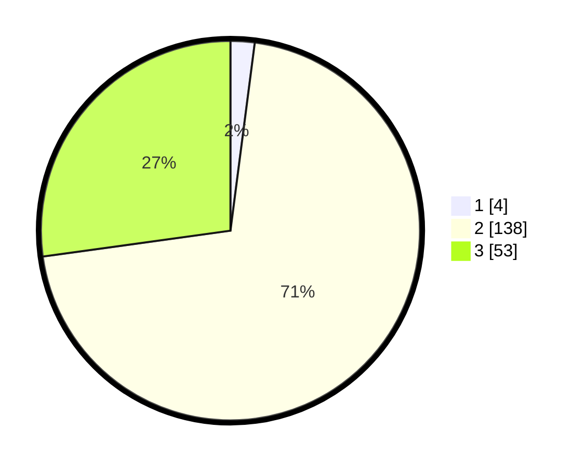

# Hasil

## Grafik

## Tabel

| No. | Nama Paslon    | Suara | Suara (raw) | Persentase |
|:--- |:-------------- | -----:| -----------:| ----------:|
| 1   | ANIES MUHAIMIN | 4     | [4][p-1]    | 2,05       |
| 2   | PRABOWO GIBRAN | 138   | [138][p-2]  | 70,77      |
| 3   | GANJAR MAHFUD  | 53    | [53][p-3]   | 27,18      |

[p-1]: https://github.com/gigit-pemilu/pemilu-2024/blob/main/pilpres/hitung-suara/sub/34-di-yogyakarta/sub/03-gunungkidul/sub/12-semin/sub/2010-semin/sub/037-tps/sub/paslon-1.txt
[p-2]: https://github.com/gigit-pemilu/pemilu-2024/blob/main/pilpres/hitung-suara/sub/34-di-yogyakarta/sub/03-gunungkidul/sub/12-semin/sub/2010-semin/sub/037-tps/sub/paslon-2.txt
[p-3]: https://github.com/gigit-pemilu/pemilu-2024/blob/main/pilpres/hitung-suara/sub/34-di-yogyakarta/sub/03-gunungkidul/sub/12-semin/sub/2010-semin/sub/037-tps/sub/paslon-3.txt

## Foto C Plano

https://sirekap-obj-formc.kpu.go.id/d1bd/pemilu/ppwp/34/03/12/20/10/3403122010037-20240218-133627--9d91322a-af66-4aa0-b826-b4dd91f3932d.jpg

https://sirekap-obj-formc.kpu.go.id/d1bd/pemilu/ppwp/34/03/12/20/10/3403122010037-20240218-133307--52ad3588-23a3-41d9-8b59-e329c557a7b6.jpg

https://sirekap-obj-formc.kpu.go.id/d1bd/pemilu/ppwp/34/03/12/20/10/3403122010037-20240214-225022--7c430044-0b2a-42d4-83c2-853ab157920b.jpg

## Metadata

| Key        | Value               |
| ---------- | ------------------- |
| Time Stamp | 2024-02-20 11:00:00 |

