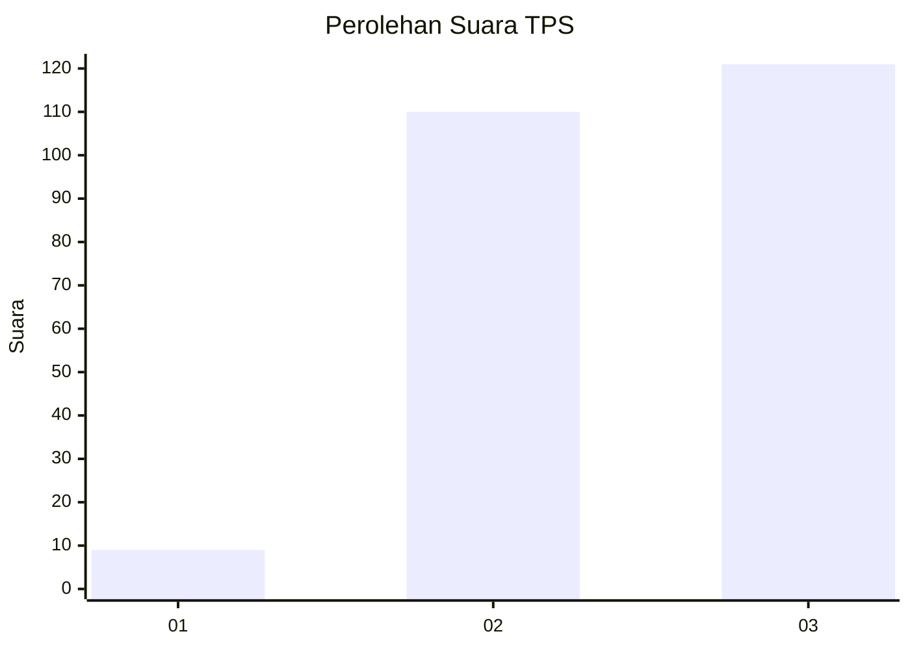
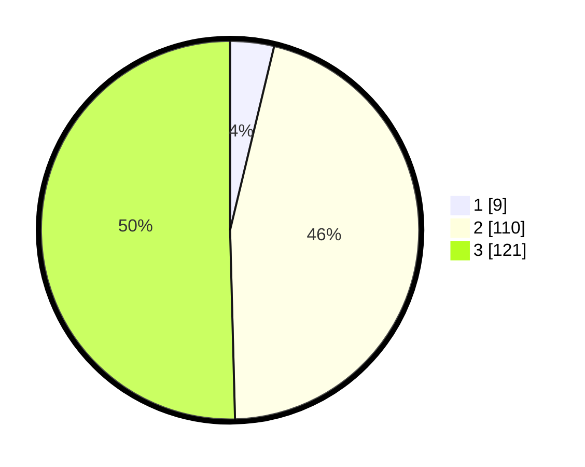

# Hasil

## Grafik

## Tabel

| No. | Nama Paslon    | Suara | Suara (raw) | Persentase |
|:--- |:-------------- | -----:| -----------:| ----------:|
| 1   | ANIES MUHAIMIN | 9     | [9][p-1]    | 3,75       |
| 2   | PRABOWO GIBRAN | 110   | [110][p-2]  | 45,83      |
| 3   | GANJAR MAHFUD  | 121   | [121][p-3]  | 50,42      |

[p-1]: https://github.com/gigit-pemilu/pemilu-2024-34-di-yogyakarta/blob/main/pilpres/hitung-suara/sub/34-di-yogyakarta/sub/03-gunungkidul/sub/13-ngawen/sub/2001-tancep/sub/002-tps/sub/paslon-1.txt
[p-2]: https://github.com/gigit-pemilu/pemilu-2024-34-di-yogyakarta/blob/main/pilpres/hitung-suara/sub/34-di-yogyakarta/sub/03-gunungkidul/sub/13-ngawen/sub/2001-tancep/sub/002-tps/sub/paslon-2.txt
[p-3]: https://github.com/gigit-pemilu/pemilu-2024-34-di-yogyakarta/blob/main/pilpres/hitung-suara/sub/34-di-yogyakarta/sub/03-gunungkidul/sub/13-ngawen/sub/2001-tancep/sub/002-tps/sub/paslon-3.txt

## Foto C Plano

https://sirekap-obj-formc.kpu.go.id/bf1a/pemilu/ppwp/34/03/13/20/01/3403132001002-20240215-071424--bd5d4770-5c84-4c88-bf2b-b8687c5f1b01.jpg

https://sirekap-obj-formc.kpu.go.id/bf1a/pemilu/ppwp/34/03/13/20/01/3403132001002-20240215-015048--fec558f0-2bc4-4c19-9df4-2bd745bc53d0.jpg

https://sirekap-obj-formc.kpu.go.id/bf1a/pemilu/ppwp/34/03/13/20/01/3403132001002-20240215-015130--8fd611c2-de16-4089-8b16-17b21333a794.jpg

## Metadata

| Key        | Value               |
| ---------- | ------------------- |
| Time Stamp | 2024-02-15 16:30:25 |

