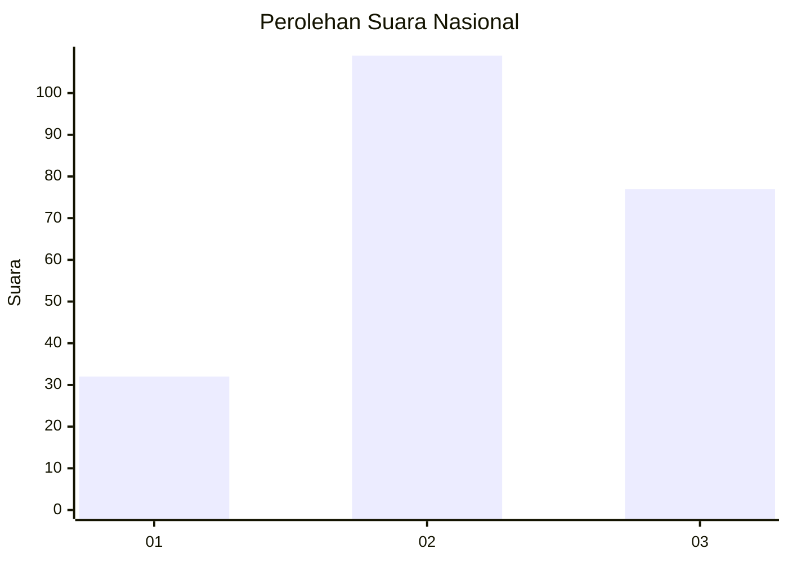
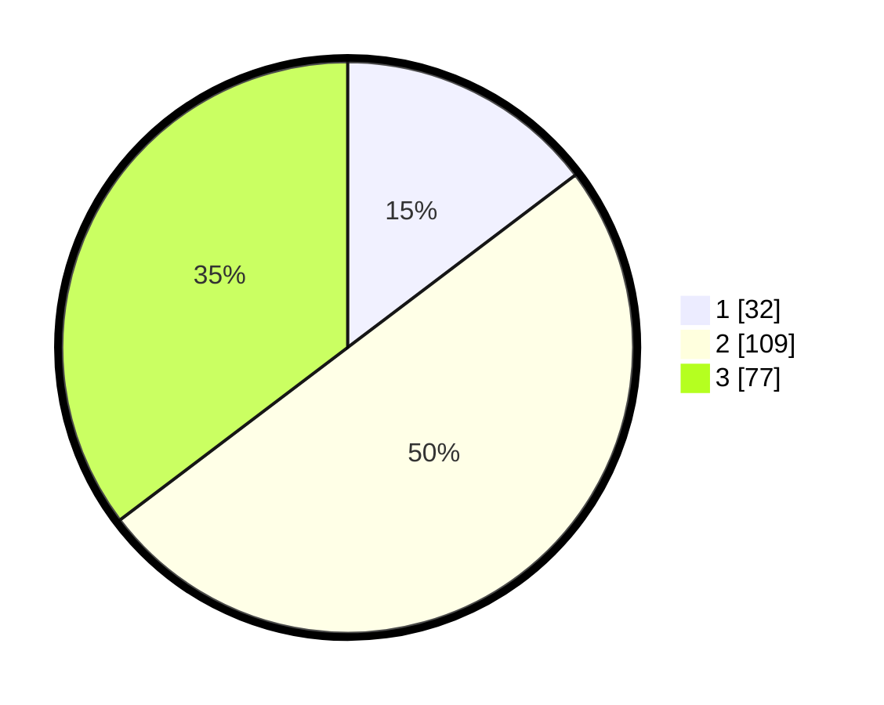

# Hasil

## Grafik

## Tabel

| No. | Nama Paslon    | Suara | Suara (raw) | Persentase |
|:--- |:-------------- | -----:| -----------:| ----------:|
| 1   | ANIES MUHAIMIN | 32    | [32][p-1]   | 14,68      |
| 2   | PRABOWO GIBRAN | 109   | [109][p-2]  | 50,00      |
| 3   | GANJAR MAHFUD  | 77    | [77][p-3]   | 35,32      |

[p-1]: https://github.com/gigit-pemilu/pemilu-2024/blob/main/pilpres/hitung-suara/sub/34-di-yogyakarta/sub/03-gunungkidul/sub/13-ngawen/sub/2001-tancep/sub/004-tps/sub/paslon-1.txt
[p-2]: https://github.com/gigit-pemilu/pemilu-2024/blob/main/pilpres/hitung-suara/sub/34-di-yogyakarta/sub/03-gunungkidul/sub/13-ngawen/sub/2001-tancep/sub/004-tps/sub/paslon-2.txt
[p-3]: https://github.com/gigit-pemilu/pemilu-2024/blob/main/pilpres/hitung-suara/sub/34-di-yogyakarta/sub/03-gunungkidul/sub/13-ngawen/sub/2001-tancep/sub/004-tps/sub/paslon-3.txt

## Foto C Plano

https://sirekap-obj-formc.kpu.go.id/012d/pemilu/ppwp/34/03/13/20/01/3403132001004-20240216-131417--b059e32a-6ac3-4052-99a8-dd82c11ee7d9.jpg

https://sirekap-obj-formc.kpu.go.id/012d/pemilu/ppwp/34/03/13/20/01/3403132001004-20240216-131418--62d73fc2-cebe-47dc-b2ec-29c0389ad185.jpg

https://sirekap-obj-formc.kpu.go.id/012d/pemilu/ppwp/34/03/13/20/01/3403132001004-20240216-131417--a1ef27b3-3de0-4008-9843-84a46059020a.jpg

## Metadata

| Key        | Value               |
| ---------- | ------------------- |
| Time Stamp | 2024-02-16 14:30:33 |

## DATA PEMILIH TETAP

Jumlah pemilih dalam DPT: **250**.
 * L: **117**.
 * P: **133**.

## DATA PENGGUNA HAK PILIH

Jumlah pengguna hak pilih dalam DPT: **220**.
 * L: **100**.
 * P: **120**.

Jumlah pengguna hak pilih dalam DPTb: **0**.
 * L: **0**.
 * P: **0**.

Jumlah pengguna hak pilih dalam DPK: **0**.
 * L: **0**.
 * P: **0**.

Jumlah pengguna hak pilih: **220**.
 * L: **100**.
 * P: **120**.

## JUMLAH SUARA SAH DAN TIDAK SAH

JUMLAH SELURUH SUARA SAH: **218**.

JUMLAH SUARA TIDAK SAH: **2**.

JUMLAH SELURUH SUARA SAH DAN SUARA TIDAK SAH: **220**.

