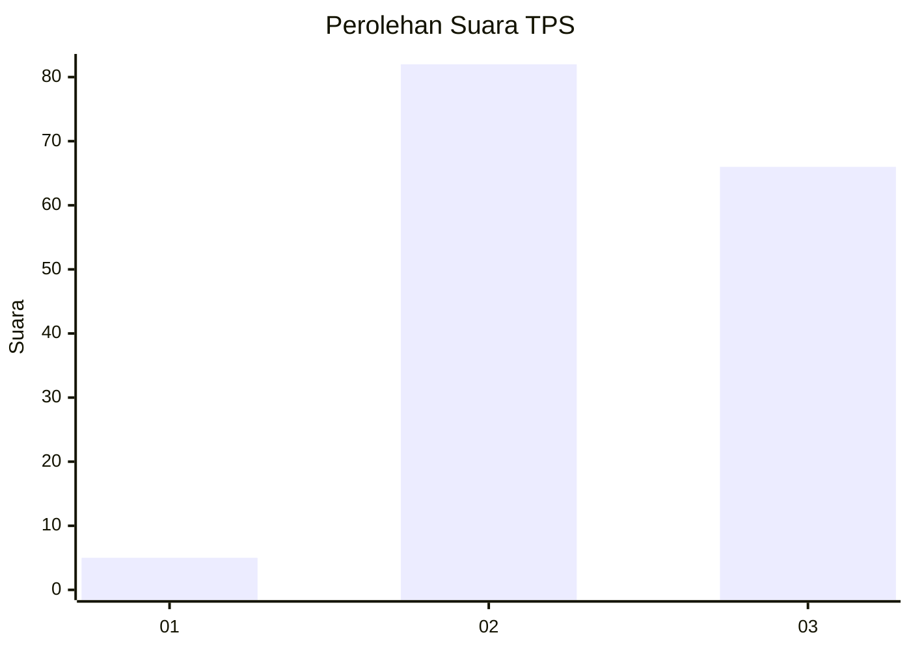
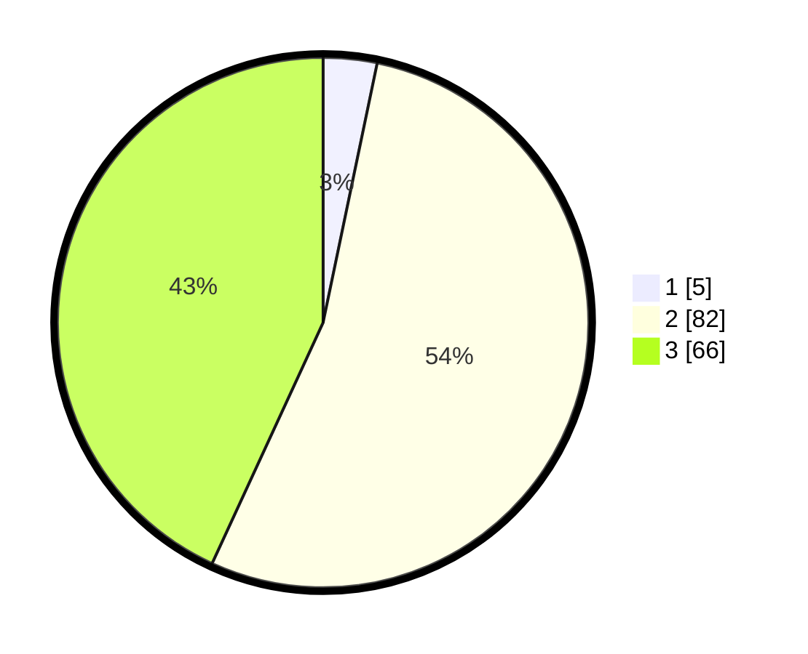

# Hasil

## Grafik

## Tabel

| No. | Nama Paslon    | Suara | Suara (raw) | Persentase |
|:--- |:-------------- | -----:| -----------:| ----------:|
| 1   | ANIES MUHAIMIN | 5     | [5][p-1]    | 3,27       |
| 2   | PRABOWO GIBRAN | 82    | [82][p-2]   | 53,59      |
| 3   | GANJAR MAHFUD  | 66    | [66][p-3]   | 43,14      |

[p-1]: https://github.com/gigit-pemilu/pemilu-2024-34-di-yogyakarta/blob/main/pilpres/hitung-suara/sub/34-di-yogyakarta/sub/03-gunungkidul/sub/13-ngawen/sub/2001-tancep/sub/007-tps/sub/paslon-1.txt
[p-2]: https://github.com/gigit-pemilu/pemilu-2024-34-di-yogyakarta/blob/main/pilpres/hitung-suara/sub/34-di-yogyakarta/sub/03-gunungkidul/sub/13-ngawen/sub/2001-tancep/sub/007-tps/sub/paslon-2.txt
[p-3]: https://github.com/gigit-pemilu/pemilu-2024-34-di-yogyakarta/blob/main/pilpres/hitung-suara/sub/34-di-yogyakarta/sub/03-gunungkidul/sub/13-ngawen/sub/2001-tancep/sub/007-tps/sub/paslon-3.txt

## Foto C Plano

https://sirekap-obj-formc.kpu.go.id/5dc3/pemilu/ppwp/34/03/13/20/01/3403132001007-20240218-205512--da529072-13b8-443f-bb7a-97f3c725f6ad.jpg

https://sirekap-obj-formc.kpu.go.id/5dc3/pemilu/ppwp/34/03/13/20/01/3403132001007-20240218-205513--be19bf92-8baa-443a-bcc7-e00a7c641333.jpg

https://sirekap-obj-formc.kpu.go.id/5dc3/pemilu/ppwp/34/03/13/20/01/3403132001007-20240218-205512--b582e022-425d-4da5-9c5e-04695ac76d99.jpg

## Metadata

| Key        | Value               |
| ---------- | ------------------- |
| Time Stamp | 2024-02-24 22:31:28 |

## DATA PEMILIH TETAP

Jumlah pemilih dalam DPT: **171**.
 * L: **86**.
 * P: **85**.

## DATA PENGGUNA HAK PILIH

Jumlah pengguna hak pilih dalam DPT: **153**.
 * L: **74**.
 * P: **79**.

Jumlah pengguna hak pilih dalam DPTb: **1**.
 * L: **0**.
 * P: **1**.

Jumlah pengguna hak pilih dalam DPK: **0**.
 * L: **0**.
 * P: **0**.

Jumlah pengguna hak pilih: **154**.
 * L: **74**.
 * P: **80**.

## JUMLAH SUARA SAH DAN TIDAK SAH

JUMLAH SELURUH SUARA SAH: **153**.

JUMLAH SUARA TIDAK SAH: **1**.

JUMLAH SELURUH SUARA SAH DAN SUARA TIDAK SAH: **154**.

