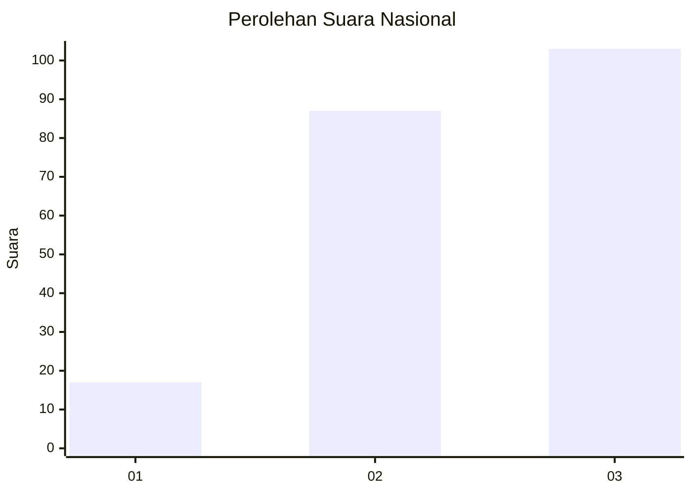
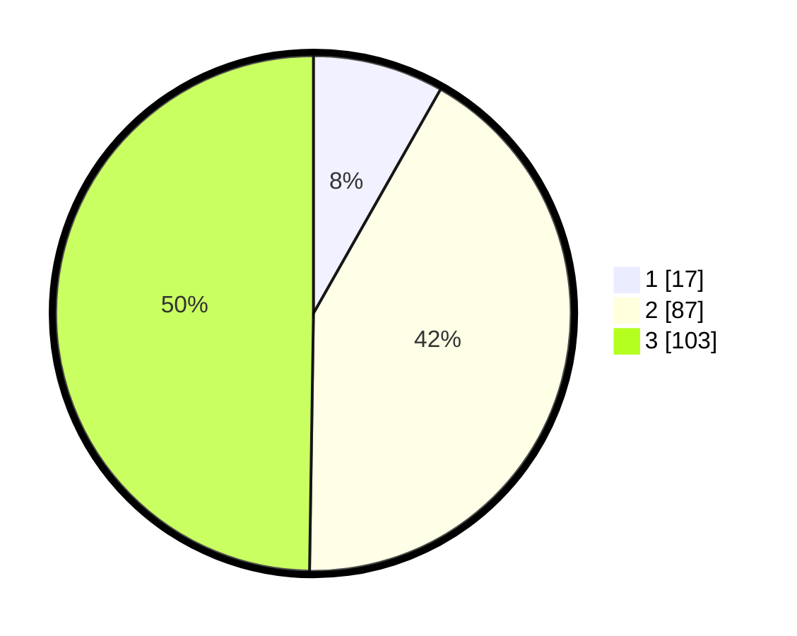

# Hasil

## Grafik

## Tabel

| No. | Nama Paslon    | Suara | Suara (raw) | Persentase |
|:--- |:-------------- | -----:| -----------:| ----------:|
| 1   | ANIES MUHAIMIN | 17    | [17][p-1]   | 8,21       |
| 2   | PRABOWO GIBRAN | 87    | [87][p-2]   | 42,03      |
| 3   | GANJAR MAHFUD  | 103   | [103][p-3]  | 49,76      |

[p-1]: https://github.com/gigit-pemilu/pemilu-2024/blob/main/pilpres/hitung-suara/sub/34-di-yogyakarta/sub/03-gunungkidul/sub/13-ngawen/sub/2001-tancep/sub/009-tps/sub/paslon-1.txt
[p-2]: https://github.com/gigit-pemilu/pemilu-2024/blob/main/pilpres/hitung-suara/sub/34-di-yogyakarta/sub/03-gunungkidul/sub/13-ngawen/sub/2001-tancep/sub/009-tps/sub/paslon-2.txt
[p-3]: https://github.com/gigit-pemilu/pemilu-2024/blob/main/pilpres/hitung-suara/sub/34-di-yogyakarta/sub/03-gunungkidul/sub/13-ngawen/sub/2001-tancep/sub/009-tps/sub/paslon-3.txt

## Foto C Plano

https://sirekap-obj-formc.kpu.go.id/1d2f/pemilu/ppwp/34/03/13/20/01/3403132001009-20240214-223642--6931907a-5ac2-4c67-a06f-c26724256dd2.jpg

https://sirekap-obj-formc.kpu.go.id/1d2f/pemilu/ppwp/34/03/13/20/01/3403132001009-20240215-033415--ee216e6e-158d-4e78-b368-6fe4029f9e83.jpg

## Metadata

| Key        | Value               |
| ---------- | ------------------- |
| Time Stamp | 2024-02-15 17:00:25 |

