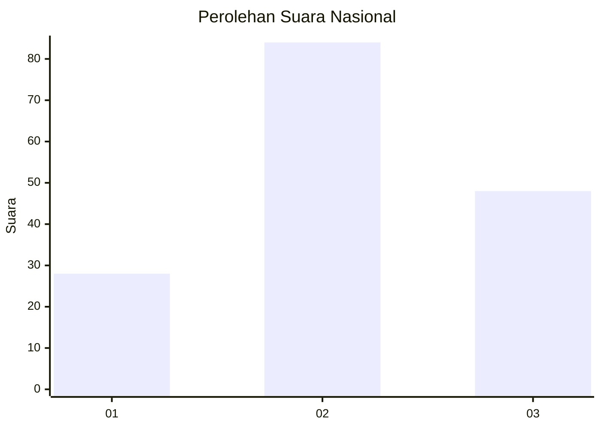
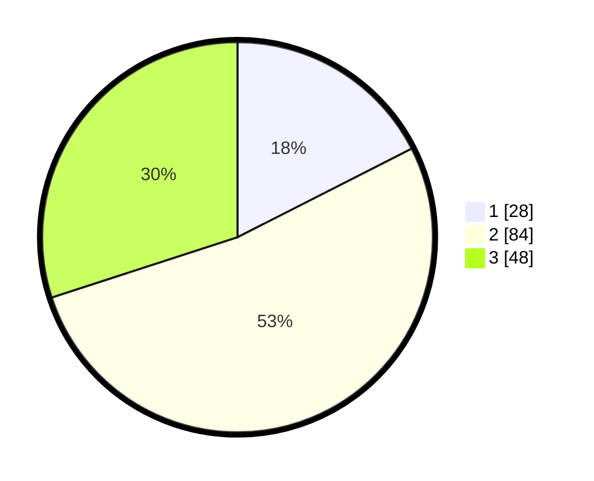

# Hasil

## Grafik

## Tabel

| No. | Nama Paslon    | Suara | Suara (raw) | Persentase |
|:--- |:-------------- | -----:| -----------:| ----------:|
| 1   | ANIES MUHAIMIN | 28    | [28][p-1]   | 17,50      |
| 2   | PRABOWO GIBRAN | 84    | [84][p-2]   | 52,50      |
| 3   | GANJAR MAHFUD  | 48    | [48][p-3]   | 30,00      |

[p-1]: https://github.com/gigit-pemilu/pemilu-2024/blob/main/pilpres/hitung-suara/sub/34-di-yogyakarta/sub/03-gunungkidul/sub/13-ngawen/sub/2002-sambirejo/sub/004-tps/sub/paslon-1.txt
[p-2]: https://github.com/gigit-pemilu/pemilu-2024/blob/main/pilpres/hitung-suara/sub/34-di-yogyakarta/sub/03-gunungkidul/sub/13-ngawen/sub/2002-sambirejo/sub/004-tps/sub/paslon-2.txt
[p-3]: https://github.com/gigit-pemilu/pemilu-2024/blob/main/pilpres/hitung-suara/sub/34-di-yogyakarta/sub/03-gunungkidul/sub/13-ngawen/sub/2002-sambirejo/sub/004-tps/sub/paslon-3.txt

## Foto C Plano

https://sirekap-obj-formc.kpu.go.id/34e8/pemilu/ppwp/34/03/13/20/02/3403132002004-20240215-205455--40efb765-f9db-4a9b-a304-a20c83ebd433.jpg

https://sirekap-obj-formc.kpu.go.id/34e8/pemilu/ppwp/34/03/13/20/02/3403132002004-20240215-001238--d5ea5888-45a4-4cf0-ad72-844c996e5650.jpg

https://sirekap-obj-formc.kpu.go.id/34e8/pemilu/ppwp/34/03/13/20/02/3403132002004-20240215-001248--ca5c01eb-1011-4ccd-97b4-24b1fd473c30.jpg

## Metadata

| Key        | Value               |
| ---------- | ------------------- |
| Time Stamp | 2024-02-15 21:01:18 |

