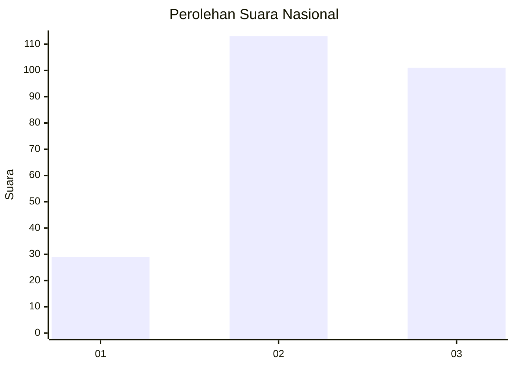
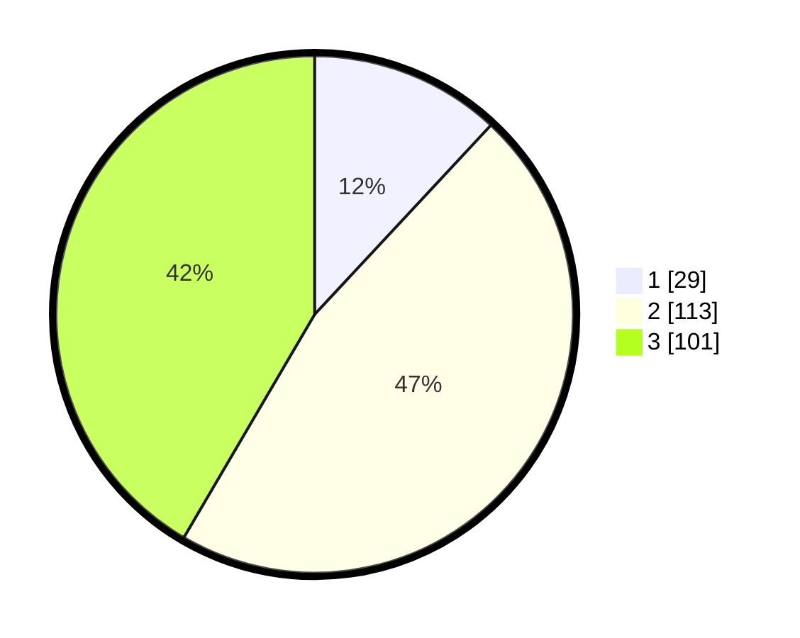

# Hasil

## Grafik

## Tabel

| No. | Nama Paslon    | Suara | Suara (raw) | Persentase |
|:--- |:-------------- | -----:| -----------:| ----------:|
| 1   | ANIES MUHAIMIN | 29    | [29][p-1]   | 11,93      |
| 2   | PRABOWO GIBRAN | 113   | [113][p-2]  | 46,50      |
| 3   | GANJAR MAHFUD  | 101   | [101][p-3]  | 41,56      |

[p-1]: https://github.com/gigit-pemilu/pemilu-2024/blob/main/pilpres/hitung-suara/sub/34-di-yogyakarta/sub/03-gunungkidul/sub/13-ngawen/sub/2002-sambirejo/sub/009-tps/sub/paslon-1.txt
[p-2]: https://github.com/gigit-pemilu/pemilu-2024/blob/main/pilpres/hitung-suara/sub/34-di-yogyakarta/sub/03-gunungkidul/sub/13-ngawen/sub/2002-sambirejo/sub/009-tps/sub/paslon-2.txt
[p-3]: https://github.com/gigit-pemilu/pemilu-2024/blob/main/pilpres/hitung-suara/sub/34-di-yogyakarta/sub/03-gunungkidul/sub/13-ngawen/sub/2002-sambirejo/sub/009-tps/sub/paslon-3.txt

## Foto C Plano

https://sirekap-obj-formc.kpu.go.id/e49e/pemilu/ppwp/34/03/13/20/02/3403132002009-20240215-100151--241387f4-8080-4014-a7e4-59158a74ff6b.jpg

https://sirekap-obj-formc.kpu.go.id/e49e/pemilu/ppwp/34/03/13/20/02/3403132002009-20240215-011520--244afc55-7915-45a8-85d4-342b54394202.jpg

https://sirekap-obj-formc.kpu.go.id/e49e/pemilu/ppwp/34/03/13/20/02/3403132002009-20240215-011549--3eb4c25f-6de5-4980-9975-9287dbd77705.jpg

## Metadata

| Key        | Value               |
| ---------- | ------------------- |
| Time Stamp | 2024-02-16 14:30:33 |

