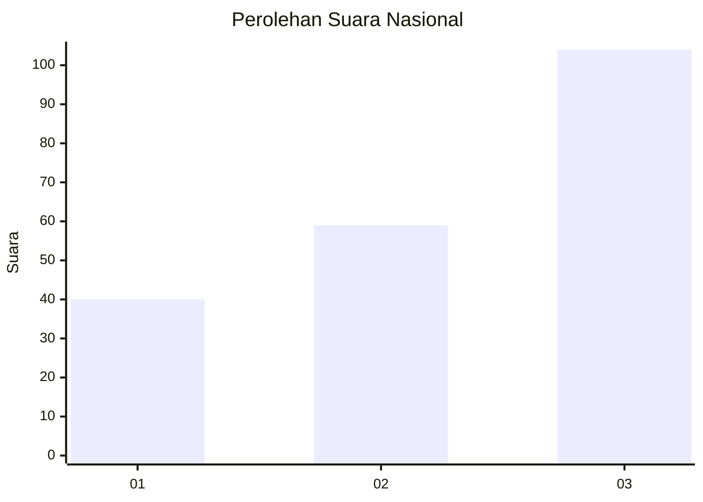
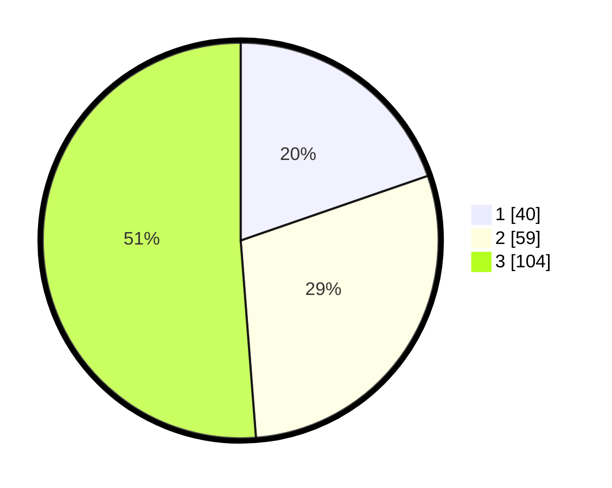

# Hasil

## Grafik

## Tabel

| No. | Nama Paslon    | Suara | Suara (raw) | Persentase |
|:--- |:-------------- | -----:| -----------:| ----------:|
| 1   | ANIES MUHAIMIN | 40    | [40][p-1]   | 19,70      |
| 2   | PRABOWO GIBRAN | 59    | [59][p-2]   | 29,06      |
| 3   | GANJAR MAHFUD  | 104   | [104][p-3]  | 51,23      |

[p-1]: https://github.com/gigit-pemilu/pemilu-2024/blob/main/pilpres/hitung-suara/sub/34-di-yogyakarta/sub/03-gunungkidul/sub/13-ngawen/sub/2002-sambirejo/sub/023-tps/sub/paslon-1.txt
[p-2]: https://github.com/gigit-pemilu/pemilu-2024/blob/main/pilpres/hitung-suara/sub/34-di-yogyakarta/sub/03-gunungkidul/sub/13-ngawen/sub/2002-sambirejo/sub/023-tps/sub/paslon-2.txt
[p-3]: https://github.com/gigit-pemilu/pemilu-2024/blob/main/pilpres/hitung-suara/sub/34-di-yogyakarta/sub/03-gunungkidul/sub/13-ngawen/sub/2002-sambirejo/sub/023-tps/sub/paslon-3.txt

## Foto C Plano

https://sirekap-obj-formc.kpu.go.id/86bd/pemilu/ppwp/34/03/13/20/02/3403132002023-20240215-214759--e1942927-7ca9-4929-a134-7724c7392fb3.jpg

https://sirekap-obj-formc.kpu.go.id/86bd/pemilu/ppwp/34/03/13/20/02/3403132002023-20240215-214823--7e631978-49e0-48dc-b31e-c3c2b05a5d11.jpg

https://sirekap-obj-formc.kpu.go.id/86bd/pemilu/ppwp/34/03/13/20/02/3403132002023-20240215-214843--2f5a4074-626b-4f1f-b83c-72f8c333c9b5.jpg

## Metadata

| Key        | Value               |
| ---------- | ------------------- |
| Time Stamp | 2024-02-16 13:30:32 |

