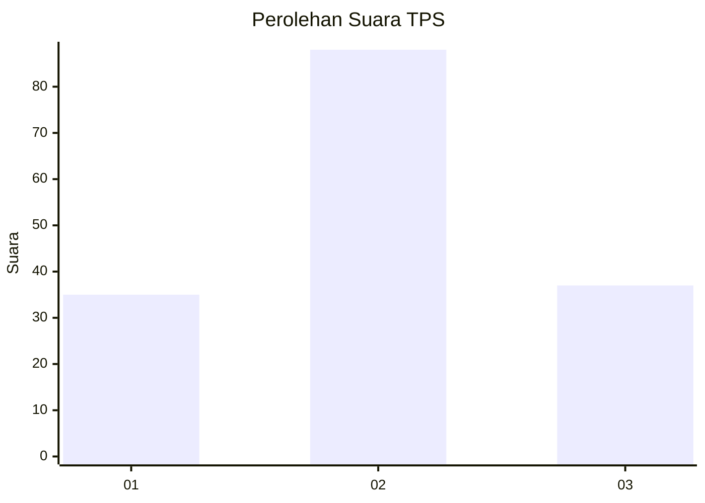
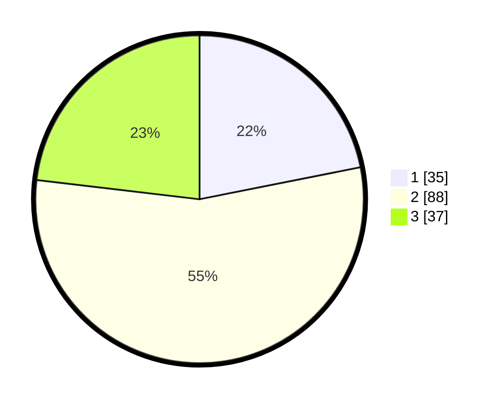

# Hasil

## Grafik

## Tabel

| No. | Nama Paslon    | Suara | Suara (raw) | Persentase |
|:--- |:-------------- | -----:| -----------:| ----------:|
| 1   | ANIES MUHAIMIN | 35    | [35][p-1]   | 21,88      |
| 2   | PRABOWO GIBRAN | 88    | [88][p-2]   | 55,00      |
| 3   | GANJAR MAHFUD  | 37    | [37][p-3]   | 23,13      |

[p-1]: https://github.com/gigit-pemilu/pemilu-2024-34-di-yogyakarta/blob/main/pilpres/hitung-suara/sub/34-di-yogyakarta/sub/03-gunungkidul/sub/13-ngawen/sub/2003-jurangjero/sub/001-tps/sub/paslon-1.txt
[p-2]: https://github.com/gigit-pemilu/pemilu-2024-34-di-yogyakarta/blob/main/pilpres/hitung-suara/sub/34-di-yogyakarta/sub/03-gunungkidul/sub/13-ngawen/sub/2003-jurangjero/sub/001-tps/sub/paslon-2.txt
[p-3]: https://github.com/gigit-pemilu/pemilu-2024-34-di-yogyakarta/blob/main/pilpres/hitung-suara/sub/34-di-yogyakarta/sub/03-gunungkidul/sub/13-ngawen/sub/2003-jurangjero/sub/001-tps/sub/paslon-3.txt

## Foto C Plano

https://sirekap-obj-formc.kpu.go.id/3ef4/pemilu/ppwp/34/03/13/20/03/3403132003001-20240216-142309--21f2519c-b6ee-410e-ab2d-1bc68a6bc0d2.jpg

https://sirekap-obj-formc.kpu.go.id/3ef4/pemilu/ppwp/34/03/13/20/03/3403132003001-20240216-084703--9547098c-c1d5-424c-be54-632ed8e0943a.jpg

https://sirekap-obj-formc.kpu.go.id/3ef4/pemilu/ppwp/34/03/13/20/03/3403132003001-20240216-142309--c1d521a2-3015-400c-89cd-50d8420f8212.jpg

## Metadata

| Key        | Value               |
| ---------- | ------------------- |
| Time Stamp | 2024-02-16 16:25:10 |

## DATA PEMILIH TETAP

Jumlah pemilih dalam DPT: **195**.
 * L: **92**.
 * P: **103**.

## DATA PENGGUNA HAK PILIH

Jumlah pengguna hak pilih dalam DPT: **150**.
 * L: **68**.
 * P: **82**.

Jumlah pengguna hak pilih dalam DPTb: **12**.
 * L: **1**.
 * P: **11**.

Jumlah pengguna hak pilih dalam DPK: **1**.
 * L: **1**.
 * P: **0**.

Jumlah pengguna hak pilih: **163**.
 * L: **70**.
 * P: **93**.

## JUMLAH SUARA SAH DAN TIDAK SAH

JUMLAH SELURUH SUARA SAH: **160**.

JUMLAH SUARA TIDAK SAH: **3**.

JUMLAH SELURUH SUARA SAH DAN SUARA TIDAK SAH: **163**.

