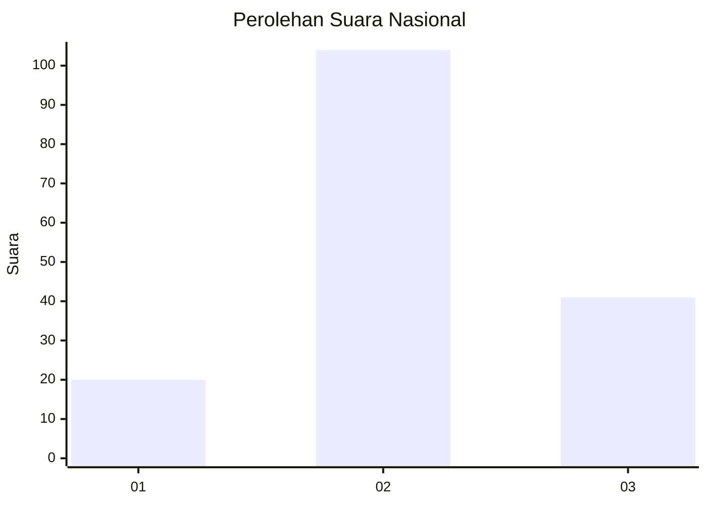
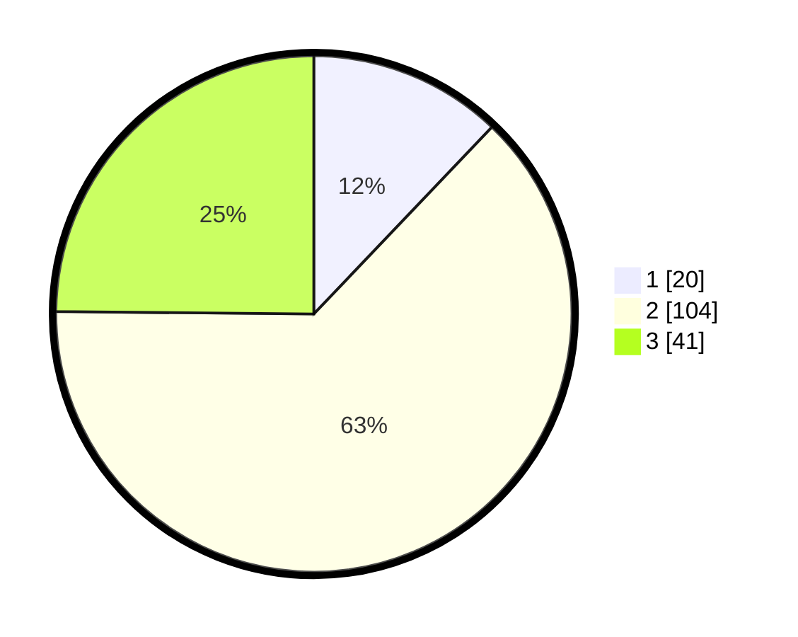

# Hasil

## Grafik

## Tabel

| No. | Nama Paslon    | Suara | Suara (raw) | Persentase |
|:--- |:-------------- | -----:| -----------:| ----------:|
| 1   | ANIES MUHAIMIN | 20    | [20][p-1]   | 12,12      |
| 2   | PRABOWO GIBRAN | 104   | [104][p-2]  | 63,03      |
| 3   | GANJAR MAHFUD  | 41    | [41][p-3]   | 24,85      |

[p-1]: https://github.com/gigit-pemilu/pemilu-2024/blob/main/pilpres/hitung-suara/sub/34-di-yogyakarta/sub/03-gunungkidul/sub/13-ngawen/sub/2003-jurangjero/sub/003-tps/sub/paslon-1.txt
[p-2]: https://github.com/gigit-pemilu/pemilu-2024/blob/main/pilpres/hitung-suara/sub/34-di-yogyakarta/sub/03-gunungkidul/sub/13-ngawen/sub/2003-jurangjero/sub/003-tps/sub/paslon-2.txt
[p-3]: https://github.com/gigit-pemilu/pemilu-2024/blob/main/pilpres/hitung-suara/sub/34-di-yogyakarta/sub/03-gunungkidul/sub/13-ngawen/sub/2003-jurangjero/sub/003-tps/sub/paslon-3.txt

## Foto C Plano

https://sirekap-obj-formc.kpu.go.id/f7a0/pemilu/ppwp/34/03/13/20/03/3403132003003-20240215-025110--830d5968-6df2-484e-9b52-8f11a740a2cd.jpg

https://sirekap-obj-formc.kpu.go.id/f7a0/pemilu/ppwp/34/03/13/20/03/3403132003003-20240215-024004--a803ca96-b77b-441e-a9c8-62b83843eac1.jpg

https://sirekap-obj-formc.kpu.go.id/f7a0/pemilu/ppwp/34/03/13/20/03/3403132003003-20240215-023641--46733bbb-086c-4459-adb0-0ae218194748.jpg

## Metadata

| Key        | Value               |
| ---------- | ------------------- |
| Time Stamp | 2024-02-15 17:30:25 |

