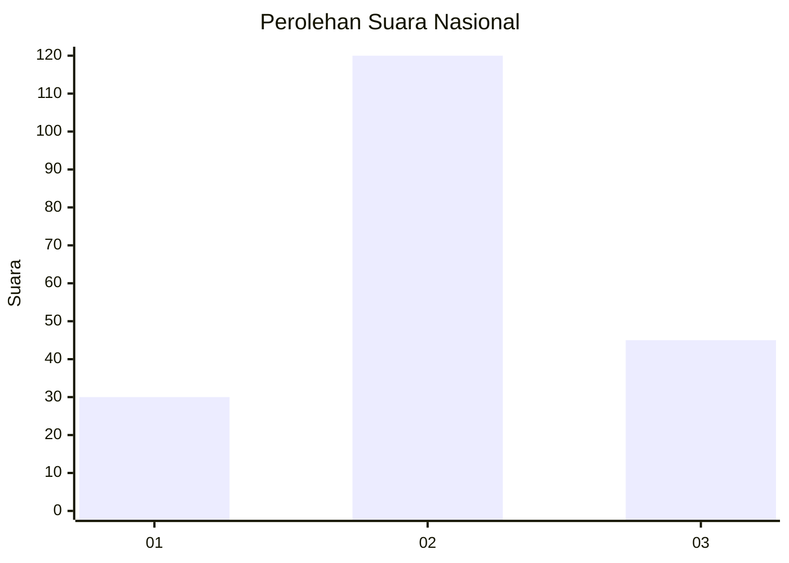
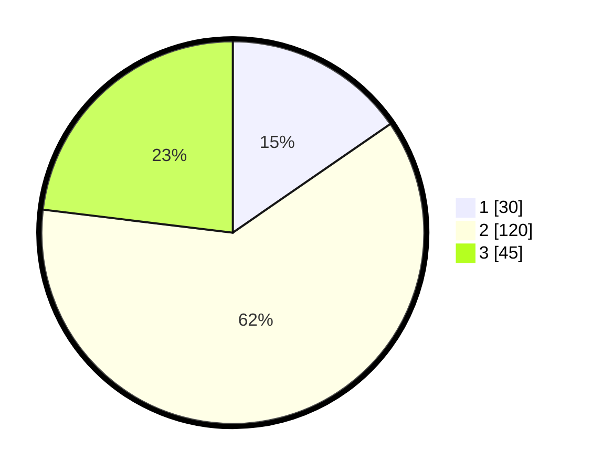

# Hasil

## Grafik

## Tabel

| No. | Nama Paslon    | Suara | Suara (raw) | Persentase |
|:--- |:-------------- | -----:| -----------:| ----------:|
| 1   | ANIES MUHAIMIN | 30    | [30][p-1]   | 15,38      |
| 2   | PRABOWO GIBRAN | 120   | [120][p-2]  | 61,54      |
| 3   | GANJAR MAHFUD  | 45    | [45][p-3]   | 23,08      |

[p-1]: https://github.com/gigit-pemilu/pemilu-2024/blob/main/pilpres/hitung-suara/sub/34-di-yogyakarta/sub/03-gunungkidul/sub/13-ngawen/sub/2003-jurangjero/sub/007-tps/sub/paslon-1.txt
[p-2]: https://github.com/gigit-pemilu/pemilu-2024/blob/main/pilpres/hitung-suara/sub/34-di-yogyakarta/sub/03-gunungkidul/sub/13-ngawen/sub/2003-jurangjero/sub/007-tps/sub/paslon-2.txt
[p-3]: https://github.com/gigit-pemilu/pemilu-2024/blob/main/pilpres/hitung-suara/sub/34-di-yogyakarta/sub/03-gunungkidul/sub/13-ngawen/sub/2003-jurangjero/sub/007-tps/sub/paslon-3.txt

## Foto C Plano

https://sirekap-obj-formc.kpu.go.id/3b42/pemilu/ppwp/34/03/13/20/03/3403132003007-20240215-061959--d53051e5-0215-4268-ba0a-02433481aa83.jpg

https://sirekap-obj-formc.kpu.go.id/3b42/pemilu/ppwp/34/03/13/20/03/3403132003007-20240215-062140--f3e387bc-42b3-45a9-97b8-ddd35c4f6d3d.jpg

https://sirekap-obj-formc.kpu.go.id/3b42/pemilu/ppwp/34/03/13/20/03/3403132003007-20240215-062419--6a1a277f-1eae-464f-88ab-734e181559f3.jpg

## Metadata

| Key        | Value               |
| ---------- | ------------------- |
| Time Stamp | 2024-02-17 19:30:00 |

