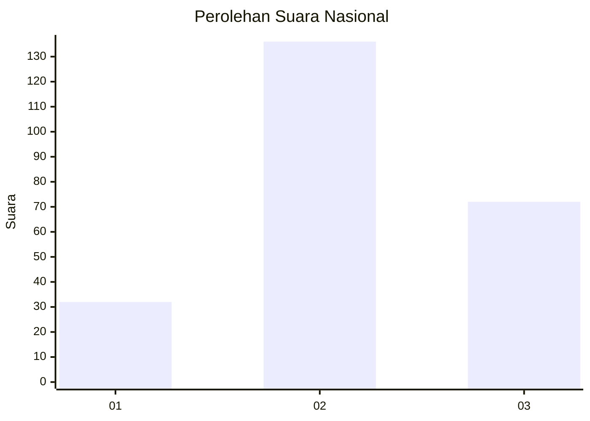
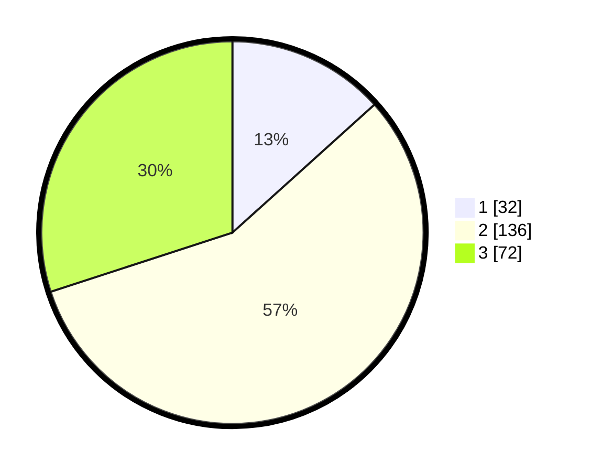

# Hasil

## Grafik

## Tabel

| No. | Nama Paslon    | Suara | Suara (raw) | Persentase |
|:--- |:-------------- | -----:| -----------:| ----------:|
| 1   | ANIES MUHAIMIN | 32    | [32][p-1]   | 13,33      |
| 2   | PRABOWO GIBRAN | 136   | [136][p-2]  | 56,67      |
| 3   | GANJAR MAHFUD  | 72    | [72][p-3]   | 30,00      |

[p-1]: https://github.com/gigit-pemilu/pemilu-2024/blob/main/pilpres/hitung-suara/sub/34-di-yogyakarta/sub/03-gunungkidul/sub/13-ngawen/sub/2004-kampung/sub/005-tps/sub/paslon-1.txt
[p-2]: https://github.com/gigit-pemilu/pemilu-2024/blob/main/pilpres/hitung-suara/sub/34-di-yogyakarta/sub/03-gunungkidul/sub/13-ngawen/sub/2004-kampung/sub/005-tps/sub/paslon-2.txt
[p-3]: https://github.com/gigit-pemilu/pemilu-2024/blob/main/pilpres/hitung-suara/sub/34-di-yogyakarta/sub/03-gunungkidul/sub/13-ngawen/sub/2004-kampung/sub/005-tps/sub/paslon-3.txt

## Foto C Plano

https://sirekap-obj-formc.kpu.go.id/24df/pemilu/ppwp/34/03/13/20/04/3403132004005-20240216-080513--4ad70dcf-076d-4324-8603-ad74c0c67e49.jpg

https://sirekap-obj-formc.kpu.go.id/24df/pemilu/ppwp/34/03/13/20/04/3403132004005-20240216-073316--fe3ce85f-a377-4188-a5cc-8ebbaad8ddfe.jpg

https://sirekap-obj-formc.kpu.go.id/24df/pemilu/ppwp/34/03/13/20/04/3403132004005-20240216-073316--3405e79f-b2a0-4357-8e0e-a69f3d08f307.jpg

## Metadata

| Key        | Value               |
| ---------- | ------------------- |
| Time Stamp | 2024-02-16 16:25:10 |

## DATA PEMILIH TETAP

Jumlah pemilih dalam DPT: **269**.
 * L: **126**.
 * P: **143**.

## DATA PENGGUNA HAK PILIH

Jumlah pengguna hak pilih dalam DPT: **232**.
 * L: **106**.
 * P: **126**.

Jumlah pengguna hak pilih dalam DPTb: **15**.
 * L: **0**.
 * P: **15**.

Jumlah pengguna hak pilih dalam DPK: **0**.
 * L: **0**.
 * P: **0**.

Jumlah pengguna hak pilih: **247**.
 * L: **106**.
 * P: **141**.

## JUMLAH SUARA SAH DAN TIDAK SAH

JUMLAH SELURUH SUARA SAH: **240**.

JUMLAH SUARA TIDAK SAH: **7**.

JUMLAH SELURUH SUARA SAH DAN SUARA TIDAK SAH: **247**.

