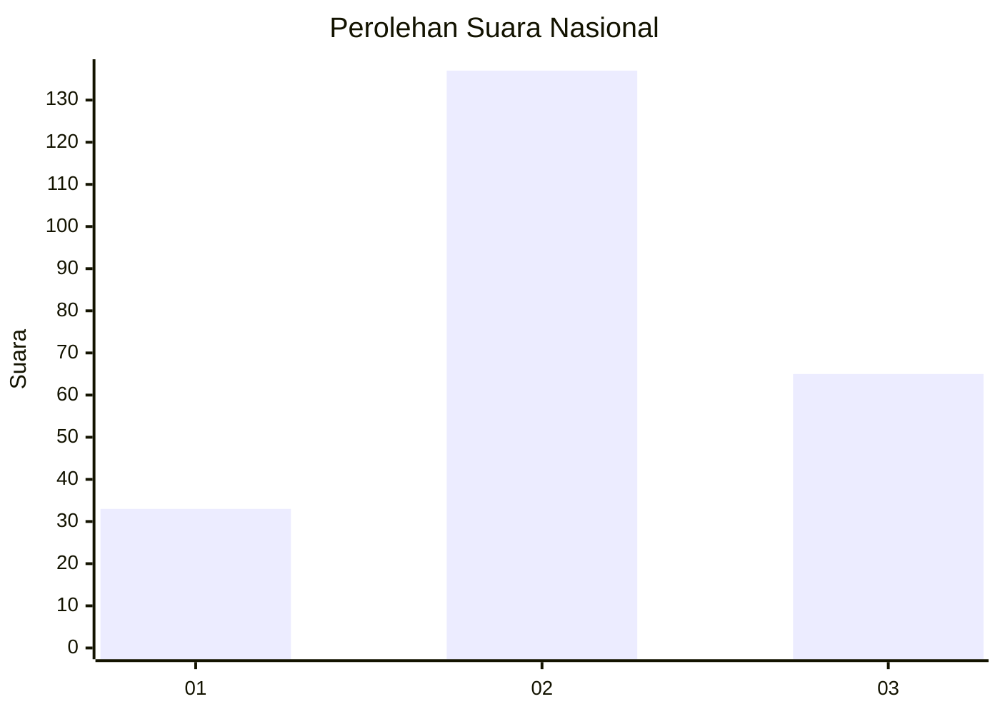
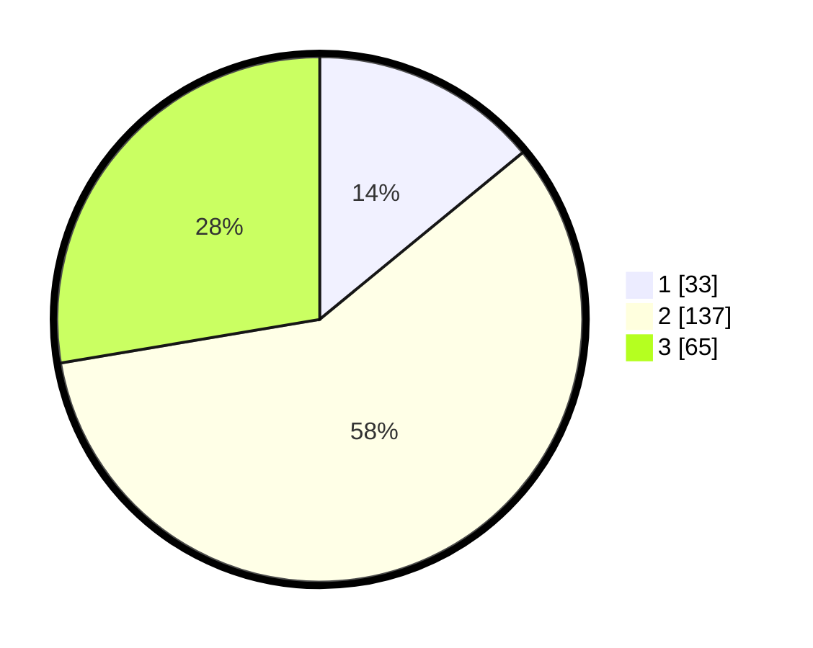

# Hasil

## Grafik

## Tabel

| No. | Nama Paslon    | Suara | Suara (raw) | Persentase |
|:--- |:-------------- | -----:| -----------:| ----------:|
| 1   | ANIES MUHAIMIN | 33    | [33][p-1]   | 14,04      |
| 2   | PRABOWO GIBRAN | 137   | [137][p-2]  | 58,30      |
| 3   | GANJAR MAHFUD  | 65    | [65][p-3]   | 27,66      |

[p-1]: https://github.com/gigit-pemilu/pemilu-2024/blob/main/pilpres/hitung-suara/sub/34-di-yogyakarta/sub/03-gunungkidul/sub/13-ngawen/sub/2004-kampung/sub/007-tps/sub/paslon-1.txt
[p-2]: https://github.com/gigit-pemilu/pemilu-2024/blob/main/pilpres/hitung-suara/sub/34-di-yogyakarta/sub/03-gunungkidul/sub/13-ngawen/sub/2004-kampung/sub/007-tps/sub/paslon-2.txt
[p-3]: https://github.com/gigit-pemilu/pemilu-2024/blob/main/pilpres/hitung-suara/sub/34-di-yogyakarta/sub/03-gunungkidul/sub/13-ngawen/sub/2004-kampung/sub/007-tps/sub/paslon-3.txt

## Foto C Plano

https://sirekap-obj-formc.kpu.go.id/ca74/pemilu/ppwp/34/03/13/20/04/3403132004007-20240216-121252--e5059959-7d1a-49eb-92eb-49ccb237c7c9.jpg

https://sirekap-obj-formc.kpu.go.id/ca74/pemilu/ppwp/34/03/13/20/04/3403132004007-20240216-121254--61945779-d05a-4106-ae88-95e03aefe444.jpg

https://sirekap-obj-formc.kpu.go.id/ca74/pemilu/ppwp/34/03/13/20/04/3403132004007-20240216-121253--4800c7ff-d170-435d-9159-b0ee09c9afc7.jpg

## Metadata

| Key        | Value               |
| ---------- | ------------------- |
| Time Stamp | 2024-02-16 16:25:10 |

## DATA PEMILIH TETAP

Jumlah pemilih dalam DPT: **259**.
 * L: **132**.
 * P: **127**.

## DATA PENGGUNA HAK PILIH

Jumlah pengguna hak pilih dalam DPT: **230**.
 * L: **121**.
 * P: **109**.

Jumlah pengguna hak pilih dalam DPTb: **12**.
 * L: **0**.
 * P: **12**.

Jumlah pengguna hak pilih dalam DPK: **0**.
 * L: **0**.
 * P: **0**.

Jumlah pengguna hak pilih: **242**.
 * L: **121**.
 * P: **121**.

## JUMLAH SUARA SAH DAN TIDAK SAH

JUMLAH SELURUH SUARA SAH: **235**.

JUMLAH SUARA TIDAK SAH: **7**.

JUMLAH SELURUH SUARA SAH DAN SUARA TIDAK SAH: **242**.

