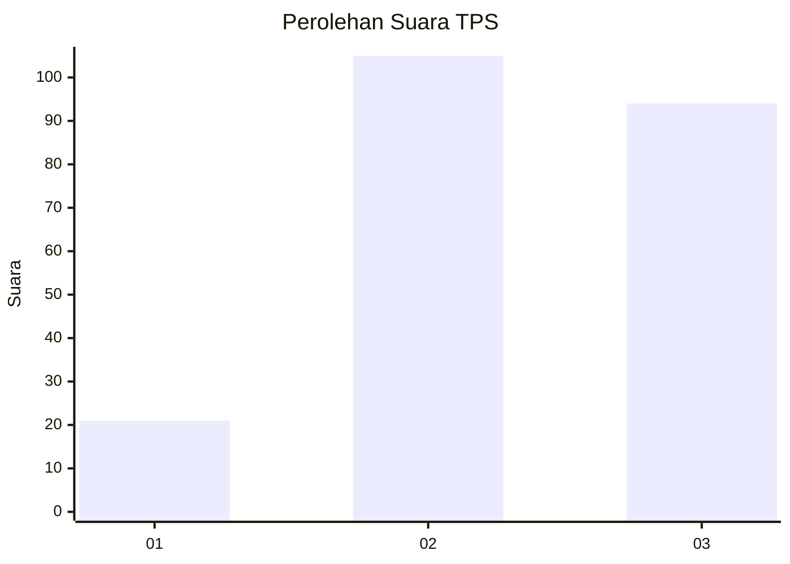
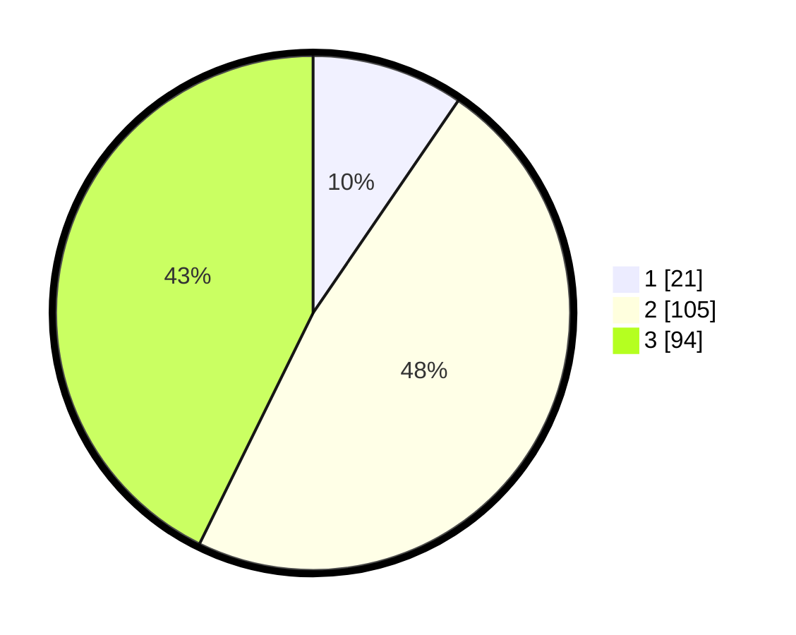

# Hasil

## Grafik

## Tabel

| No. | Nama Paslon    | Suara | Suara (raw) | Persentase |
|:--- |:-------------- | -----:| -----------:| ----------:|
| 1   | ANIES MUHAIMIN | 21    | [21][p-1]   | 9,55       |
| 2   | PRABOWO GIBRAN | 105   | [105][p-2]  | 47,73      |
| 3   | GANJAR MAHFUD  | 94    | [94][p-3]   | 42,73      |

[p-1]: https://github.com/gigit-pemilu/pemilu-2024-34-di-yogyakarta/blob/main/pilpres/hitung-suara/sub/34-di-yogyakarta/sub/03-gunungkidul/sub/13-ngawen/sub/2004-kampung/sub/014-tps/sub/paslon-1.txt
[p-2]: https://github.com/gigit-pemilu/pemilu-2024-34-di-yogyakarta/blob/main/pilpres/hitung-suara/sub/34-di-yogyakarta/sub/03-gunungkidul/sub/13-ngawen/sub/2004-kampung/sub/014-tps/sub/paslon-2.txt
[p-3]: https://github.com/gigit-pemilu/pemilu-2024-34-di-yogyakarta/blob/main/pilpres/hitung-suara/sub/34-di-yogyakarta/sub/03-gunungkidul/sub/13-ngawen/sub/2004-kampung/sub/014-tps/sub/paslon-3.txt

## Foto C Plano

https://sirekap-obj-formc.kpu.go.id/b0b9/pemilu/ppwp/34/03/13/20/04/3403132004014-20240215-082103--96f58506-6bf9-40ae-bed5-45016b9667c6.jpg

https://sirekap-obj-formc.kpu.go.id/b0b9/pemilu/ppwp/34/03/13/20/04/3403132004014-20240215-085019--0f3c63eb-09d9-409a-9f21-d02862a930d6.jpg

https://sirekap-obj-formc.kpu.go.id/b0b9/pemilu/ppwp/34/03/13/20/04/3403132004014-20240215-082248--7400f2c1-8fb0-48b5-9c30-437c0f8f56d9.jpg

## Metadata

| Key        | Value               |
| ---------- | ------------------- |
| Time Stamp | 2024-02-15 16:30:25 |

