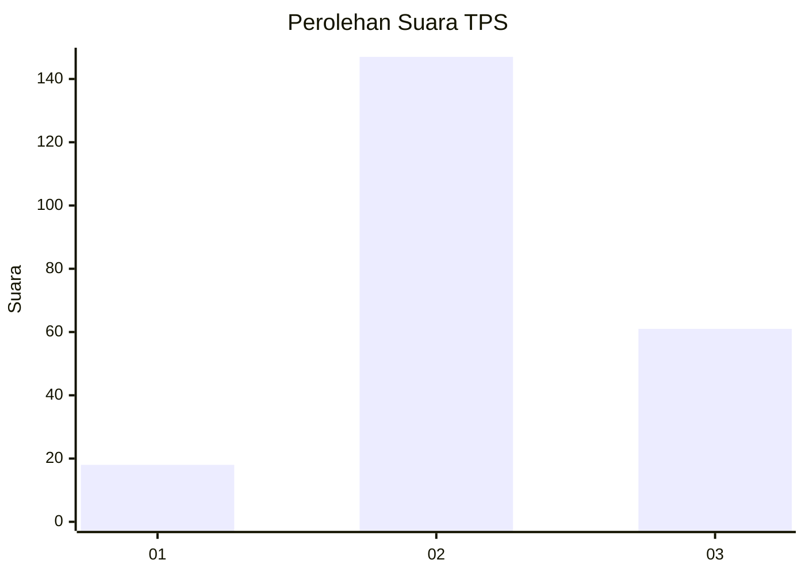

# Hasil

## Grafik

## Tabel

| No. | Nama Paslon    | Suara | Suara (raw) | Persentase |
|:--- |:-------------- | -----:| -----------:| ----------:|
| 1   | ANIES MUHAIMIN | 18    | [18][p-1]   | 7,96       |
| 2   | PRABOWO GIBRAN | 147   | [147][p-2]  | 65,04      |
| 3   | GANJAR MAHFUD  | 61    | [61][p-3]   | 26,99      |

[p-1]: https://github.com/gigit-pemilu/pemilu-2024-34-di-yogyakarta/blob/main/pilpres/hitung-suara/sub/34-di-yogyakarta/sub/03-gunungkidul/sub/13-ngawen/sub/2004-kampung/sub/019-tps/sub/paslon-1.txt
[p-2]: https://github.com/gigit-pemilu/pemilu-2024-34-di-yogyakarta/blob/main/pilpres/hitung-suara/sub/34-di-yogyakarta/sub/03-gunungkidul/sub/13-ngawen/sub/2004-kampung/sub/019-tps/sub/paslon-2.txt
[p-3]: https://github.com/gigit-pemilu/pemilu-2024-34-di-yogyakarta/blob/main/pilpres/hitung-suara/sub/34-di-yogyakarta/sub/03-gunungkidul/sub/13-ngawen/sub/2004-kampung/sub/019-tps/sub/paslon-3.txt

## Foto C Plano

https://sirekap-obj-formc.kpu.go.id/148b/pemilu/ppwp/34/03/13/20/04/3403132004019-20240217-203702--5a2c3408-da11-4289-a891-8d1aa813a5ac.jpg

https://sirekap-obj-formc.kpu.go.id/148b/pemilu/ppwp/34/03/13/20/04/3403132004019-20240217-203809--cc095bc6-57a6-4bc8-a9ad-4921b4ad6fb7.jpg

https://sirekap-obj-formc.kpu.go.id/148b/pemilu/ppwp/34/03/13/20/04/3403132004019-20240217-203945--4594ed06-d0fc-458b-8757-d7aefd0c1c78.jpg

## Metadata

| Key        | Value               |
| ---------- | ------------------- |
| Time Stamp | 2024-02-20 11:00:00 |

