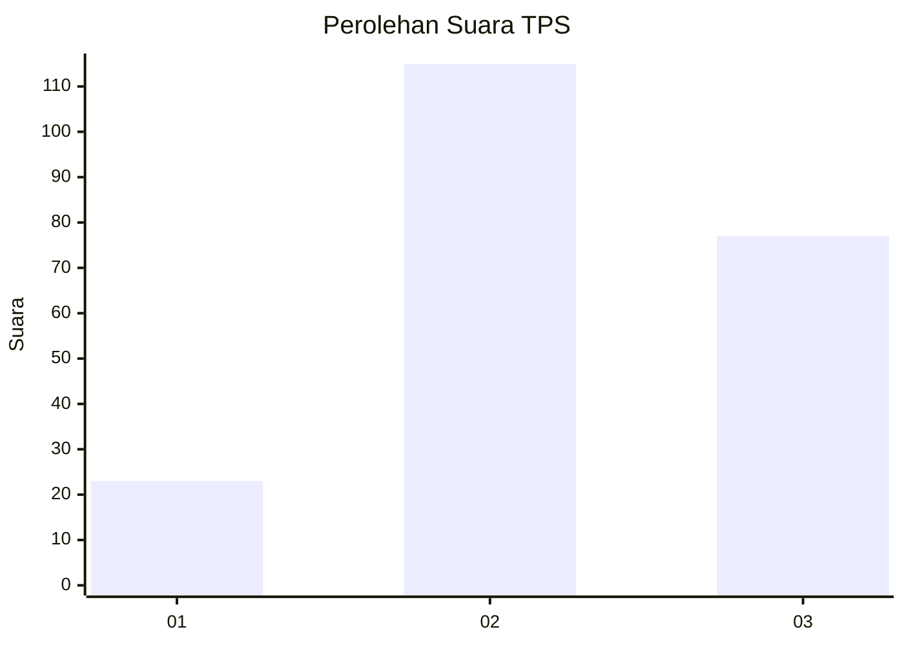
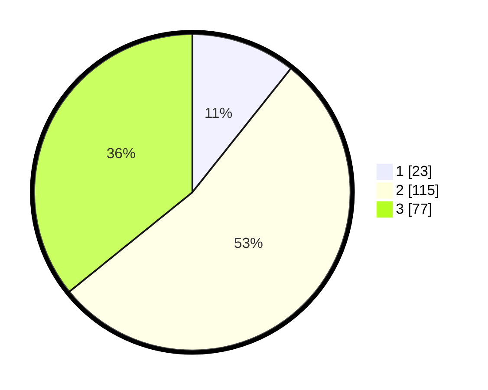

# Hasil

## Grafik

## Tabel

| No. | Nama Paslon    | Suara | Suara (raw) | Persentase |
|:--- |:-------------- | -----:| -----------:| ----------:|
| 1   | ANIES MUHAIMIN | 23    | [23][p-1]   | 10,70      |
| 2   | PRABOWO GIBRAN | 115   | [115][p-2]  | 53,49      |
| 3   | GANJAR MAHFUD  | 77    | [77][p-3]   | 35,81      |

[p-1]: https://github.com/gigit-pemilu/pemilu-2024-34-di-yogyakarta/blob/main/pilpres/hitung-suara/sub/34-di-yogyakarta/sub/03-gunungkidul/sub/14-gedangsari/sub/2001-hargomulyo/sub/001-tps/sub/paslon-1.txt
[p-2]: https://github.com/gigit-pemilu/pemilu-2024-34-di-yogyakarta/blob/main/pilpres/hitung-suara/sub/34-di-yogyakarta/sub/03-gunungkidul/sub/14-gedangsari/sub/2001-hargomulyo/sub/001-tps/sub/paslon-2.txt
[p-3]: https://github.com/gigit-pemilu/pemilu-2024-34-di-yogyakarta/blob/main/pilpres/hitung-suara/sub/34-di-yogyakarta/sub/03-gunungkidul/sub/14-gedangsari/sub/2001-hargomulyo/sub/001-tps/sub/paslon-3.txt

## Foto C Plano

https://sirekap-obj-formc.kpu.go.id/3a23/pemilu/ppwp/34/03/14/20/01/3403142001001-20240214-213307--762be8ee-897d-4ebc-be4c-27aaf2af9a7d.jpg

https://sirekap-obj-formc.kpu.go.id/3a23/pemilu/ppwp/34/03/14/20/01/3403142001001-20240214-213853--dc3bb292-f4ad-49bc-a9d5-568a5fc39ef0.jpg

https://sirekap-obj-formc.kpu.go.id/3a23/pemilu/ppwp/34/03/14/20/01/3403142001001-20240215-003800--854a4173-79c0-4795-91a9-96b54fa3bd5b.jpg

## Metadata

| Key        | Value               |
| ---------- | ------------------- |
| Time Stamp | 2024-02-15 04:00:24 |

