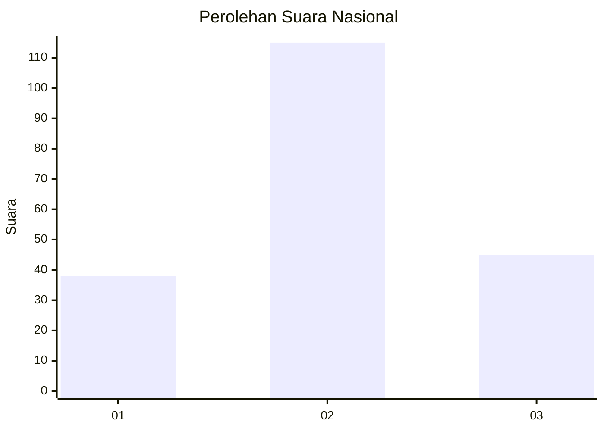
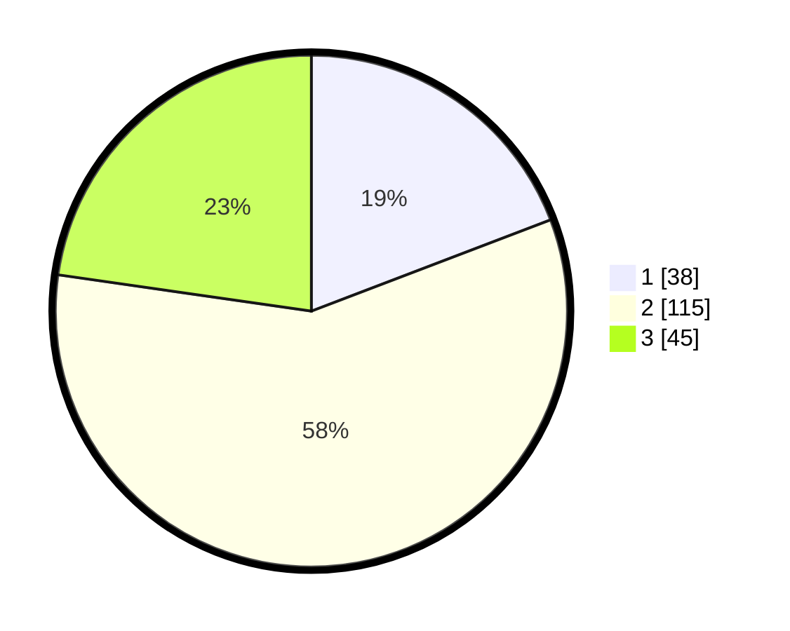

# Hasil

## Grafik

## Tabel

| No. | Nama Paslon    | Suara | Suara (raw) | Persentase |
|:--- |:-------------- | -----:| -----------:| ----------:|
| 1   | ANIES MUHAIMIN | 38    | [38][p-1]   | 19,19      |
| 2   | PRABOWO GIBRAN | 115   | [115][p-2]  | 58,08      |
| 3   | GANJAR MAHFUD  | 45    | [45][p-3]   | 22,73      |

[p-1]: https://github.com/gigit-pemilu/pemilu-2024/blob/main/pilpres/hitung-suara/sub/34-di-yogyakarta/sub/03-gunungkidul/sub/14-gedangsari/sub/2001-hargomulyo/sub/002-tps/sub/paslon-1.txt
[p-2]: https://github.com/gigit-pemilu/pemilu-2024/blob/main/pilpres/hitung-suara/sub/34-di-yogyakarta/sub/03-gunungkidul/sub/14-gedangsari/sub/2001-hargomulyo/sub/002-tps/sub/paslon-2.txt
[p-3]: https://github.com/gigit-pemilu/pemilu-2024/blob/main/pilpres/hitung-suara/sub/34-di-yogyakarta/sub/03-gunungkidul/sub/14-gedangsari/sub/2001-hargomulyo/sub/002-tps/sub/paslon-3.txt

## Foto C Plano

https://sirekap-obj-formc.kpu.go.id/3fb6/pemilu/ppwp/34/03/14/20/01/3403142001002-20240215-011351--e1f9d3f0-5d72-4ad6-825b-1e3cee040295.jpg

https://sirekap-obj-formc.kpu.go.id/3fb6/pemilu/ppwp/34/03/14/20/01/3403142001002-20240215-011511--094cd812-b4a9-4e2b-bda9-0d21f95f7c2f.jpg

https://sirekap-obj-formc.kpu.go.id/3fb6/pemilu/ppwp/34/03/14/20/01/3403142001002-20240215-012703--6dbd16c5-83b5-42f2-a105-f7974b26d723.jpg

## Metadata

| Key        | Value               |
| ---------- | ------------------- |
| Time Stamp | 2024-02-15 15:00:29 |

## DATA PEMILIH TETAP

Jumlah pemilih dalam DPT: **247**.
 * L: **126**.
 * P: **121**.

## DATA PENGGUNA HAK PILIH

Jumlah pengguna hak pilih dalam DPT: **197**.
 * L: **98**.
 * P: **99**.

Jumlah pengguna hak pilih dalam DPTb: **3**.
 * L: **1**.
 * P: **2**.

Jumlah pengguna hak pilih dalam DPK: **1**.
 * L: **1**.
 * P: **0**.

Jumlah pengguna hak pilih: **201**.
 * L: **100**.
 * P: **101**.

## JUMLAH SUARA SAH DAN TIDAK SAH

JUMLAH SELURUH SUARA SAH: **198**.

JUMLAH SUARA TIDAK SAH: **3**.

JUMLAH SELURUH SUARA SAH DAN SUARA TIDAK SAH: **201**.

