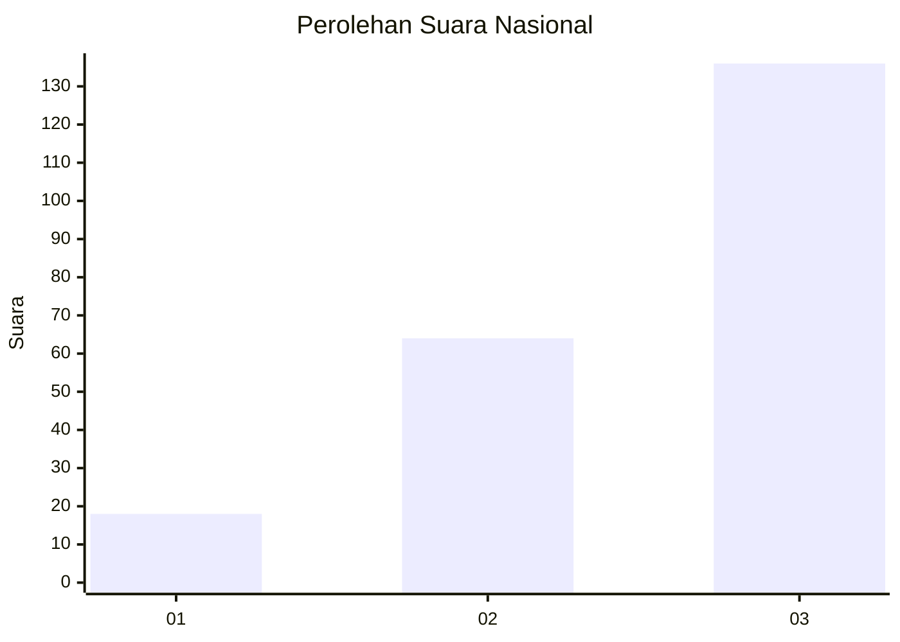
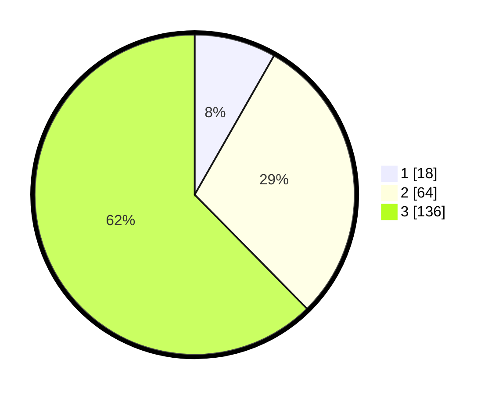

# Hasil

## Grafik

## Tabel

| No. | Nama Paslon    | Suara | Suara (raw) | Persentase |
|:--- |:-------------- | -----:| -----------:| ----------:|
| 1   | ANIES MUHAIMIN | 18    | [18][p-1]   | 8,26       |
| 2   | PRABOWO GIBRAN | 64    | [64][p-2]   | 29,36      |
| 3   | GANJAR MAHFUD  | 136   | [136][p-3]  | 62,39      |

[p-1]: https://github.com/gigit-pemilu/pemilu-2024/blob/main/pilpres/hitung-suara/sub/34-di-yogyakarta/sub/03-gunungkidul/sub/14-gedangsari/sub/2001-hargomulyo/sub/009-tps/sub/paslon-1.txt
[p-2]: https://github.com/gigit-pemilu/pemilu-2024/blob/main/pilpres/hitung-suara/sub/34-di-yogyakarta/sub/03-gunungkidul/sub/14-gedangsari/sub/2001-hargomulyo/sub/009-tps/sub/paslon-2.txt
[p-3]: https://github.com/gigit-pemilu/pemilu-2024/blob/main/pilpres/hitung-suara/sub/34-di-yogyakarta/sub/03-gunungkidul/sub/14-gedangsari/sub/2001-hargomulyo/sub/009-tps/sub/paslon-3.txt

## Foto C Plano

https://sirekap-obj-formc.kpu.go.id/b26c/pemilu/ppwp/34/03/14/20/01/3403142001009-20240215-021632--01b4ff82-7ab1-4b1d-a792-8114e43e3091.jpg

https://sirekap-obj-formc.kpu.go.id/b26c/pemilu/ppwp/34/03/14/20/01/3403142001009-20240215-015146--1106faa3-a1e1-407a-b97e-8046f3b5f270.jpg

https://sirekap-obj-formc.kpu.go.id/b26c/pemilu/ppwp/34/03/14/20/01/3403142001009-20240215-021454--b2c7a408-5d0f-49dc-92f7-05e7028e1af9.jpg

## Metadata

| Key        | Value               |
| ---------- | ------------------- |
| Time Stamp | 2024-02-15 17:00:25 |

