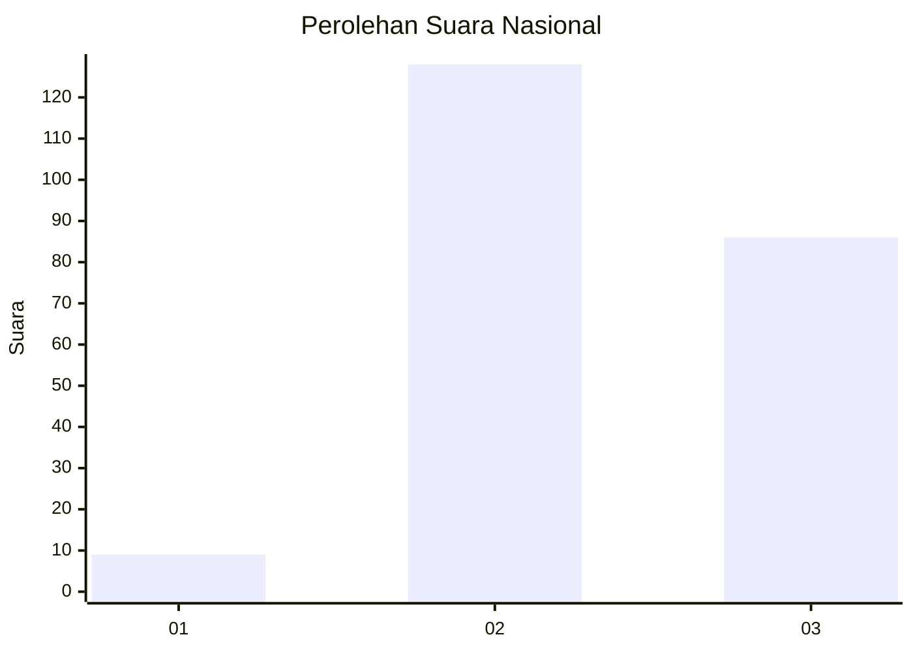
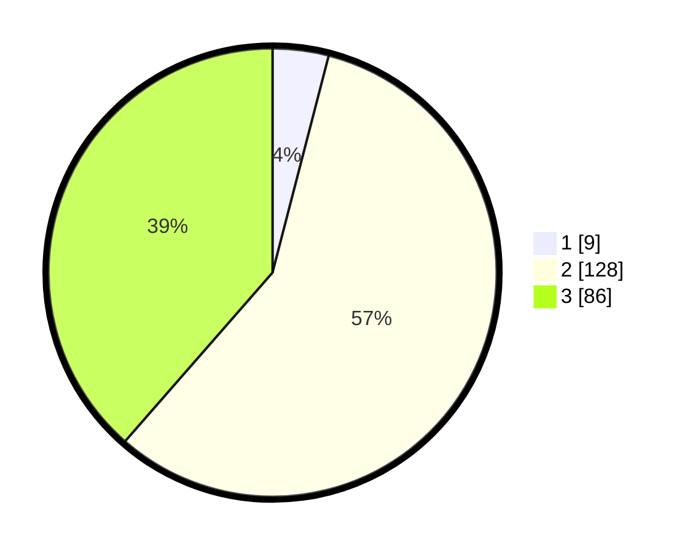

# Hasil

## Grafik

## Tabel

| No. | Nama Paslon    | Suara | Suara (raw) | Persentase |
|:--- |:-------------- | -----:| -----------:| ----------:|
| 1   | ANIES MUHAIMIN | 9     | [9][p-1]    | 4,04       |
| 2   | PRABOWO GIBRAN | 128   | [128][p-2]  | 57,40      |
| 3   | GANJAR MAHFUD  | 86    | [86][p-3]   | 38,57      |

[p-1]: https://github.com/gigit-pemilu/pemilu-2024/blob/main/pilpres/hitung-suara/sub/34-di-yogyakarta/sub/03-gunungkidul/sub/14-gedangsari/sub/2001-hargomulyo/sub/023-tps/sub/paslon-1.txt
[p-2]: https://github.com/gigit-pemilu/pemilu-2024/blob/main/pilpres/hitung-suara/sub/34-di-yogyakarta/sub/03-gunungkidul/sub/14-gedangsari/sub/2001-hargomulyo/sub/023-tps/sub/paslon-2.txt
[p-3]: https://github.com/gigit-pemilu/pemilu-2024/blob/main/pilpres/hitung-suara/sub/34-di-yogyakarta/sub/03-gunungkidul/sub/14-gedangsari/sub/2001-hargomulyo/sub/023-tps/sub/paslon-3.txt

## Foto C Plano

https://sirekap-obj-formc.kpu.go.id/cc32/pemilu/ppwp/34/03/14/20/01/3403142001023-20240214-222443--8d7f2e61-1d56-485d-9cd6-9e7cacea9cd8.jpg

https://sirekap-obj-formc.kpu.go.id/cc32/pemilu/ppwp/34/03/14/20/01/3403142001023-20240214-221736--e4b5a513-4ded-467b-9bb3-54bf0ba8089f.jpg

https://sirekap-obj-formc.kpu.go.id/cc32/pemilu/ppwp/34/03/14/20/01/3403142001023-20240214-213904--b3ce6072-1dca-47ed-8ca9-9c1c8e25d5d5.jpg

## Metadata

| Key        | Value               |
| ---------- | ------------------- |
| Time Stamp | 2024-02-17 19:30:00 |

