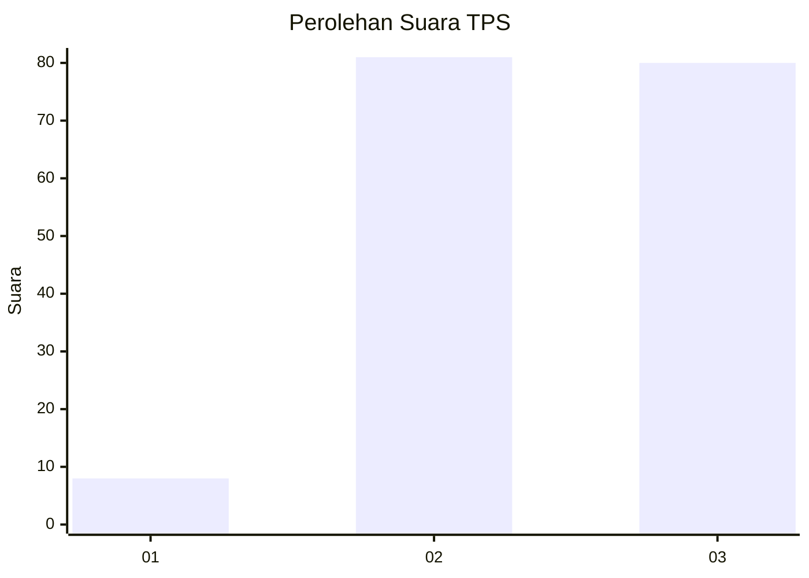
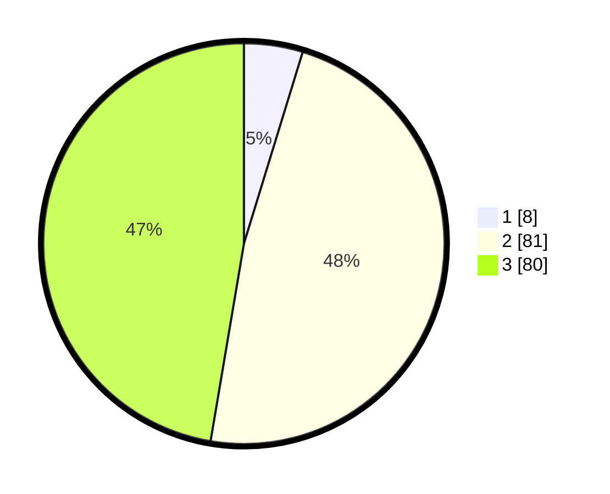

# Hasil

## Grafik

## Tabel

| No. | Nama Paslon    | Suara | Suara (raw) | Persentase |
|:--- |:-------------- | -----:| -----------:| ----------:|
| 1   | ANIES MUHAIMIN | 8     | [8][p-1]    | 4,73       |
| 2   | PRABOWO GIBRAN | 81    | [81][p-2]   | 47,93      |
| 3   | GANJAR MAHFUD  | 80    | [80][p-3]   | 47,34      |

[p-1]: https://github.com/gigit-pemilu/pemilu-2024-34-di-yogyakarta/blob/main/pilpres/hitung-suara/sub/34-di-yogyakarta/sub/03-gunungkidul/sub/14-gedangsari/sub/2001-hargomulyo/sub/024-tps/sub/paslon-1.txt
[p-2]: https://github.com/gigit-pemilu/pemilu-2024-34-di-yogyakarta/blob/main/pilpres/hitung-suara/sub/34-di-yogyakarta/sub/03-gunungkidul/sub/14-gedangsari/sub/2001-hargomulyo/sub/024-tps/sub/paslon-2.txt
[p-3]: https://github.com/gigit-pemilu/pemilu-2024-34-di-yogyakarta/blob/main/pilpres/hitung-suara/sub/34-di-yogyakarta/sub/03-gunungkidul/sub/14-gedangsari/sub/2001-hargomulyo/sub/024-tps/sub/paslon-3.txt

## Foto C Plano

https://sirekap-obj-formc.kpu.go.id/a626/pemilu/ppwp/34/03/14/20/01/3403142001024-20240214-141600--631a4fcb-5b68-4ce5-8b51-a8e48ec3c7d4.jpg

https://sirekap-obj-formc.kpu.go.id/a626/pemilu/ppwp/34/03/14/20/01/3403142001024-20240215-021039--cf8e2322-9505-43e9-8af3-9a770d1ff042.jpg

https://sirekap-obj-formc.kpu.go.id/a626/pemilu/ppwp/34/03/14/20/01/3403142001024-20240215-021043--5af5b161-99e0-4356-acbf-d44f34ec67e1.jpg

## Metadata

| Key        | Value               |
| ---------- | ------------------- |
| Time Stamp | 2024-02-15 20:30:46 |

