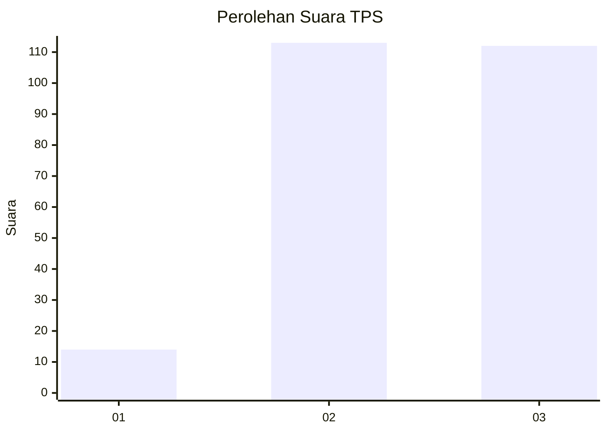
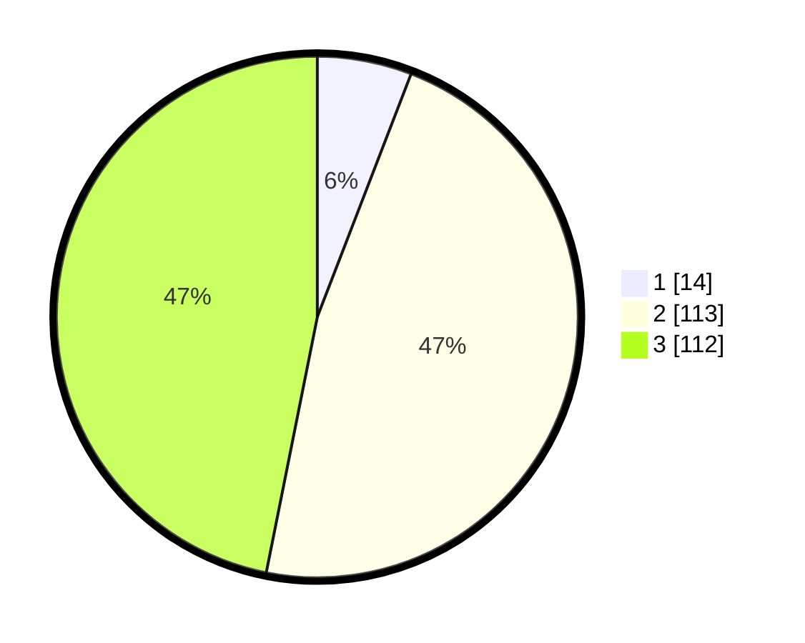

# Hasil

## Grafik

## Tabel

| No. | Nama Paslon    | Suara | Suara (raw) | Persentase |
|:--- |:-------------- | -----:| -----------:| ----------:|
| 1   | ANIES MUHAIMIN | 14    | [14][p-1]   | 5,86       |
| 2   | PRABOWO GIBRAN | 113   | [113][p-2]  | 47,28      |
| 3   | GANJAR MAHFUD  | 112   | [112][p-3]  | 46,86      |

[p-1]: https://github.com/gigit-pemilu/pemilu-2024-34-di-yogyakarta/blob/main/pilpres/hitung-suara/sub/34-di-yogyakarta/sub/03-gunungkidul/sub/14-gedangsari/sub/2003-watugajah/sub/008-tps/sub/paslon-1.txt
[p-2]: https://github.com/gigit-pemilu/pemilu-2024-34-di-yogyakarta/blob/main/pilpres/hitung-suara/sub/34-di-yogyakarta/sub/03-gunungkidul/sub/14-gedangsari/sub/2003-watugajah/sub/008-tps/sub/paslon-2.txt
[p-3]: https://github.com/gigit-pemilu/pemilu-2024-34-di-yogyakarta/blob/main/pilpres/hitung-suara/sub/34-di-yogyakarta/sub/03-gunungkidul/sub/14-gedangsari/sub/2003-watugajah/sub/008-tps/sub/paslon-3.txt

## Foto C Plano

https://sirekap-obj-formc.kpu.go.id/5c76/pemilu/ppwp/34/03/14/20/03/3403142003008-20240214-231727--6f6428f7-f2c4-4c9d-bfda-215ddd1e6093.jpg

https://sirekap-obj-formc.kpu.go.id/5c76/pemilu/ppwp/34/03/14/20/03/3403142003008-20240214-231806--1d886778-5b2b-49ac-8d48-7dff28d89a58.jpg

https://sirekap-obj-formc.kpu.go.id/5c76/pemilu/ppwp/34/03/14/20/03/3403142003008-20240215-012632--30632e92-c5f7-4bad-ac30-59dfe7080244.jpg

## Metadata

| Key        | Value               |
| ---------- | ------------------- |
| Time Stamp | 2024-02-17 19:30:00 |

